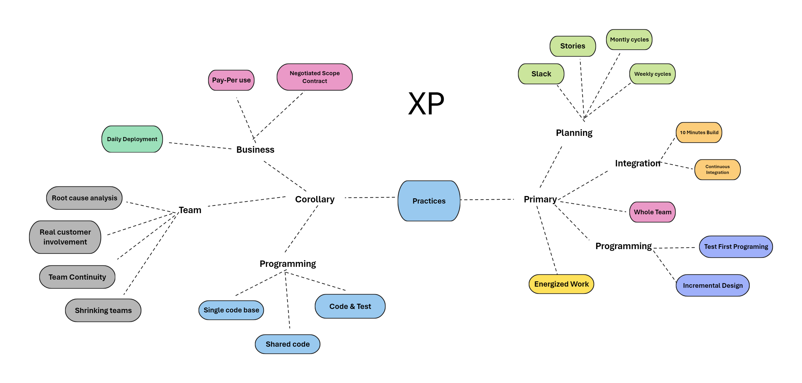
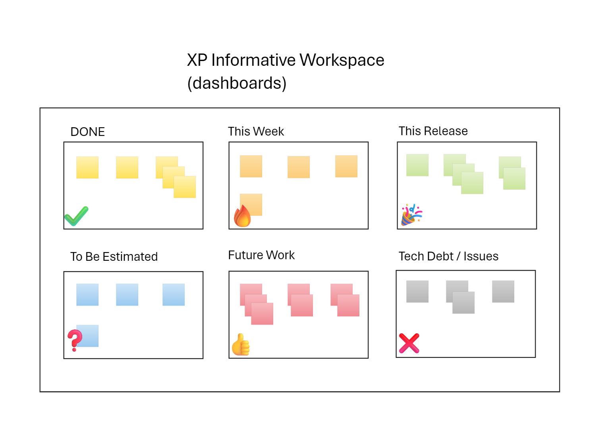
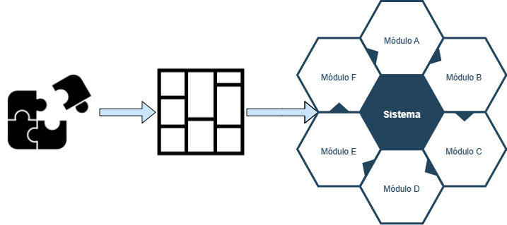
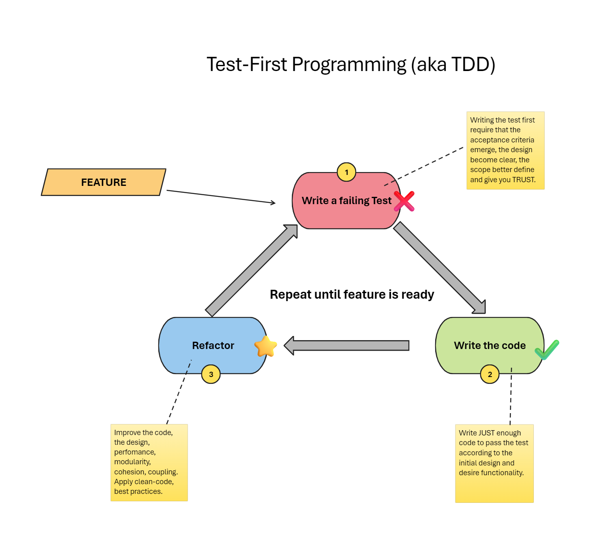

# Extreme Programming Explained by Kent Beck

<button class="back-button" onclick="window.location.href='https://matiaspakua.github.io/tech.notes.io'">All notes</button>

---

# Introduction

"Extreme Programming Explained: Embrace Change" is a book written by Kent Beck that describes the principles and practices of Extreme Programming (XP), a software development methodology. Here is a summary of the key concepts presented in the book:

1. Continuous Integration: Don't release anything until it passes all the test. XP emphasises the importance of integrating code into the main branch of the codebase as frequently as possible. This helps to catch problems early and reduce the risk of integration issues.

2. Test-Driven Development: XP promotes writing automated tests before writing code. This helps to ensure that code meets requirements and reduces the risk of bugs.

3. Refactoring: XP encourages code refactoring, which is the process of improving the design of code without changing its behaviour. This helps to keep code clean, maintainable, and scalable.

4. Pair Programming: XP involves two developers working together on a single codebase. This helps to increase collaboration, reduce bugs, and improve code quality.

5. User Stories: XP uses user stories to capture the requirements of a system. User stories are short, simple descriptions of a feature or requirement, and they help to prioritise work and ensure that the code is aligned with customer needs.

6. Continuous Feedback: XP involves seeking feedback from stakeholders and incorporating that feedback into the development process. This helps to ensure that the code meets the needs of customers and stakeholders.

7. Planning Game: XP involves regular planning sessions to prioritise work and ensure that the team is aligned on what work needs to be done.

8. Slack: XP recognises that developers need time to learn, experiment, and think about problems. The slack time is built into the schedule to allow for this learning and experimentation.

9. Sustainable Pace (no killer schedules): XP emphasises the importance of working at a sustainable pace, rather than burning out developers. This helps to ensure that the team can maintain its velocity and deliver quality code over the long term.

10. Don't put in anything that's not in the spec (no matter how temped you are to put in functionality "for the future").

11. KIS: keep it simple. Always.

## 01 What is XP?

1. Extreme Programming is about social change. It is about beign open about what we are capable of doing and then doing it and, it is about writing great code that is really good for business. Do you best and then deal with the consecuences. THAT EXTREME!!!!
2. It is reliad on oral communication, test and source code to communicate system structure and intent.
3. The more "humanely" I treated myself and others, the more productive we all became.
4. Technique also matters. We are technical people in a technical field.
5. Book recommendation: Colin Turnbull in The Mountain people and the Forest People.
6. You can do your best work even when there are constraints.
7. You can't control others expentaction.
8. How XP address the risks in the development process:
   1. Schedule slips: short release cycles, a few months at most.
   2. Project canceled.
   3. Keeps the system in deployable condition. Problems are not allowed to accumulate.
   4. Keep defect rate low.
   5. Avoid business misunderstood.
   6. Embrace business changes.
   7. Avoid "false" feature rich.
   8. Avoid staff turnover (mantains good teams together).

## 02 Learning to Drive

1. What is driving? is about constantly paying attention, making a little correction this way, a little correction that way. This is the paradigm for XP. <mark style="background: #FFF3A3A6;">Stay aware. Adapt. Change</mark>. The problem is our inability to cope with change.

## 03 Values, Principles and Practices

1. **Practices**: the kind of knowledge associated with techniques to do something.
2. **Values**: are the roots of the thinks we like and don't like in a situation. Making values explicit is important because without values, practices quickly become rote.
3. Bringing values together with practices means that the programmer can perform practice, in this case **root-cause** analysis, at effective times and for good reasons. Values bring purpose to practices.
4. Principles: are domain-specific guidelines for life.

Image from the book Extreme programming by Kent Beck

## 04 Values

1. What actually matters is not how any given person behaves as much as how the individuals behave as part of a team and as part of an organization.
2. **Communication**: when you encounter a problem, ask yourselves if the problem was caused by a lack of communication.
3. **Simplicity**: what is simplest thing that could possible work? just to bias tour thinking toward eliminating waster complexity.
4. XP team strive to generate as much feedback as they can handle as quickly as possible. They try to shorten the feedback cycle to minutes or hours instead of weeks or months. The sooner you know, the sooner you can adapt.
5. **Courage**: courage is effective action the the fact of fear. If you know what the problem is, do something about it. Period.
6. **Respect**: if members of a team don't care about each other and what are doing, XP won't work.

## 05 Principles

1. **Traceability**: In the development of safety-critical systems, the principle of traceability is at work. At any time you should be able to trace a path from the work done back to an explicit expressed need from the user.
2. **Humanity**: The magic of great teams is that after the team members develop trust they find that they are free to be more themselves as a result of their work together.
3. **Economics**: Somebody has to pay for all this. Software development that doesn't acknowledge economics risks the hollow victory of a "technical success".
4. **Mutual benefit**: this is the most important XP principle. The computer business is really a people business and maintaining working relationships is important (and HARD). XP solves the communication-with-the-future problem in mutually beneficial ways:
   a. I write automated tests that help me design and implement better today.
   b. I carefully refactor to remove accidental complexity.
   c choose names from a coherent and explicit set of metaphors which speeds my development.
5. **Self-Similarity**: try copying the structure of one solution into a new context, even at different scales.
6. **Improvement**: the cycle is to do the best you can today, striving for the awareness and understanding necessary to do better tomorrow. Put improvement to work by not waiting for perfection. Find a starting place, get started, and improve from there.
7. **Diversity**: Conflict is the inevitable companion of diversity. Two ideas about design present an opportunity, not a problem. The principle of diversity suggest that the programmers should work together on the problem and both opinions should be valued.
8. **Reflection**: good teams don't just do their work, they think about how they are working and why they are working. They analyze why they succeeded or failed. They don't try to hide their mistakes, but expose them and learn from them. Shared meals and coffee breaks provide an informal setting for shared reflection.
9. **Flow**: The principle of flow suggest that for improvement, deploy smaller increments of value ever more frequently.
10. **Opportunity**: Learn to see problems as opportunities for change. As you begin practicing XP, you will certainly encounter problems. Part of being extreme is consciously choosing to transform each problem into an opportunity.
11. **Redundancy**: What you hope to achieve is few enough defect to maintain trust both within the team and with the customer.
12. **Failure**: If you're having trouble succeeding, fail.
13. **Quality**: Sacrificing quality is not effective as a mean of control. Quality is not a control variable.Projects don't go faster by accepting lower quality. They don't go slower by demanding higher quality. Pushing quality higher often results in faster delivery; while lowering quality standard often results in later, less predictable delivery. People need to do work they are proud of.
14. **Baby Steps**: Prefer baby steps (small changes) over big, longer, complicated steps.
15. **Accepted Responsibility**: Responsibility cannot be assigned: it can only be accepted.

# Practices

## 07 Primary Practices

1. **Sit together**: no matter what the client says the problem is, it is always a people problem. Technical fixes alone are not enough. It is important to sit together, to communicate with all senses.
2. **Whole team**: include in the team people with all the skills and perspectives necessary for the project to succeed. The size of the team here is important, because we need to build trust, and trust born of collaboration.
3. **Informative Workspace**: build a workspace where the important information is visible.

4. **Energized Work**: work only as many hours as you can be productive and only as many hours as you can sustain.
5. **Pair Programming**: help you to: keep each other on task; improve the brainstorm refinements to the system; clarify ideas; take initiative when your partner is stuck; hold each other accountable to the team's practices.
6. **Stories**: plan using units of customer-visible functionality.
7. **Weekly cycles**: plan work a week at a time. Have a meeting at the beginning of every week. during this meeting:
	1. review progress to date vs expected progress, blockers and other issues.
	2. Make the customer pick this week stories.
	3. Break the stories into tasks.
	4. <mark style="background: #FFF3A3A6;">Start the week by writing automates tests that will run when the stories are completed</mark>, then work the rest of the week on code to pass the tests. the goal is to have a deployable software at the end of the week.
8. **Quarterly cycle**: Plan the work a quarter at a time.
9. **10 (Ten) minutes build**: automatically build the whole system and run all of the tests in ten minutes. An automated build becomes a stress reliever at crunch time. "Did we make a mistake?, Let's just build and see."
10. **Continuous integration**: the integration step is unpredictable but can easily take more time that the original programming. The longer you wait to integrate, the more it costs and the more unpredictable the cost become.  Waiting for the compiler and the tests is a natural time to talk about what we're just done together and how we might have done it better.

11. **Test-First Programming**:  writing a failing automated test before changing any code. But why?
	1. Avoid scope creep.
	2. Validate coupling and cohesion.
	3. Improve trust.
	4. Rhythm.

---
### Test-First programming AKA TDD 

---

# References

- Web about XP Programming: [Link](http://www.extremeprogramming.org/rules.html)
- [Book on amazon](https://www.amazon.com/Extreme-Programming-Explained-Embrace-Change/dp/0321278658)