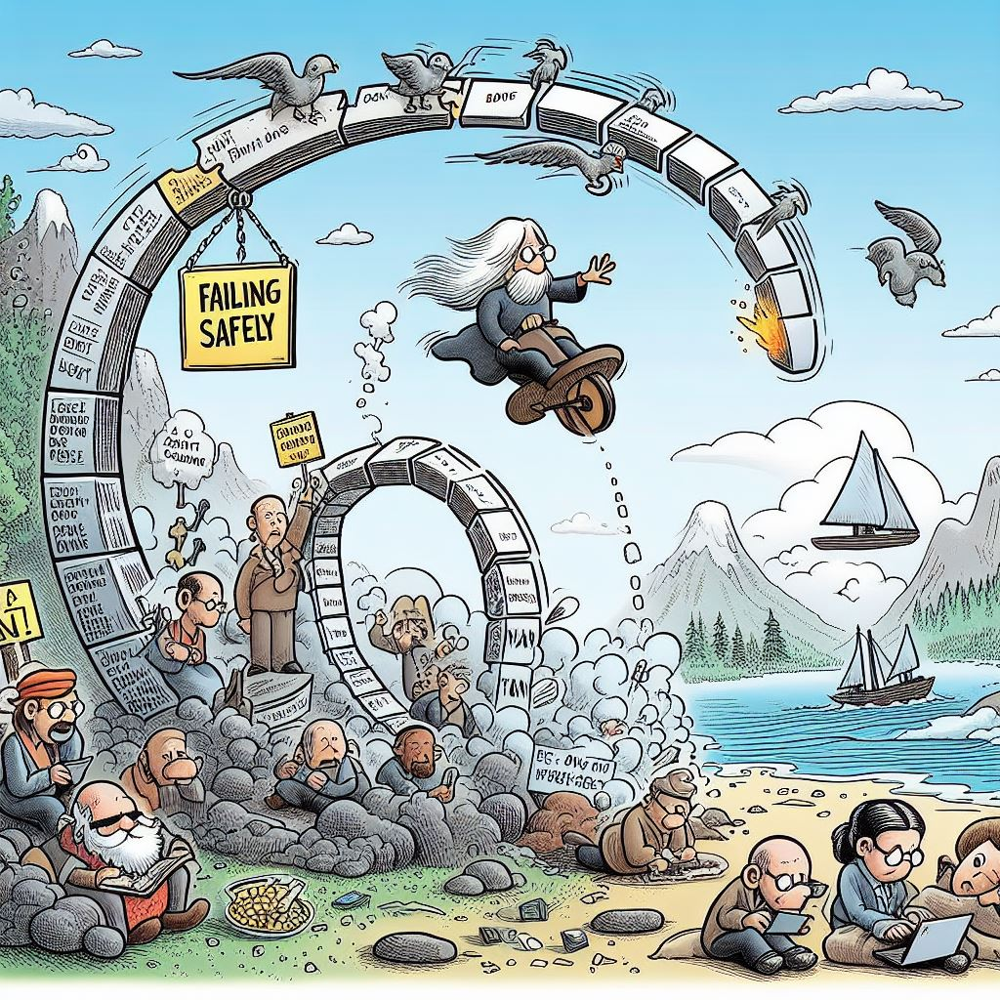

# Modern Software Engineering: Doing What Works to Build Better Software Faste

<button class="back-button" onclick="window.location.href='https://matiaspakua.github.io/tech.notes.io'">All notes</button>

## 1. Introduction

1. **Engineering**  - The practical application of science. Software engineer need to become experts at learning.
2. **What is software Engineering**? Software engineering is the application of an empirical, scientific approach to finding efficient, economic solutions to practical problems. We must become experts at learning and experts at managing complexity.
3. To become experts at "<mark style="background: #FFF3A3A6;">learning</mark>" must apply:
	1. Iteration
	2. Feedback
	3. Incrementalism
	4. Experimentation
	5. Empiricism
4. To become experts at "<mark style="background: #FFF3A3A6;">managing complexity</mark>" we need to following:
	1. Modularity
	2. cohesion
	3. separation of concerns
	4. abstraction
	5. loose coupling
5. The following are **practical tools** to drive an effective strategy:
	1. Testability
	2. Deployability
	3. Speed
	4. Controlling variables
	5. Continuos delivery

## 2. What is Engineering?

1. The first software engineer: **Margaret Hamilton**. Her approach was the focus on how thinks fail - <mark style="background: #FFF3A3A6;">the ways in which we get thinks wrong: "failing safely"</mark>. The assumption is that we can never code for every scenario, so how do we code in ways that allow our systems to cope with unexpected and still make progress?

1. **Managing complexity**: Edsger Dijkstra said: "The art of programming is the art of organizing complexity."
2. **Repeatability and Accuracy of measurement**:  engineering-focused team will use accurate measurement rather than waiting for somethings bad to happen.
3. Engineering, creativity and craft: taking an engineering approach to solving problems does not, in any way, reduce the importance of skill, creativity and innovation.
4. Design engineering is a deeply exploratory approach to gaining knowledge.
5. Trade-offs: one of the key trade-off that is vital to consider in the production of software, is "<mark style="background: #FFF3A3A6;">coupling</mark>".

## 3. Fundamentals of an Engineering Approach

1. **The important of measurements**: The most important concepts are: stability and throughput. Stability is tracked by:
	1. Change Failure Rate
	2. Recovery Failure time
2. Throughput is tracked by:
	1. Lead time: the time needed to go from idea to working software.
	2. Frequency: how often we go to production.
3. throughput is a measure of a team's efficiency at delivering ideas, in the form of working software.
4. Is importante to improve this measure to make decisions based on evidence.
5. **Foundations**: so, we need to become experts in learning and managing complexity.
6. **Expert at learning**:
	1. working iteratively
	2. Employing fast, high-quiality feedback
	3. working incrementally
	4. being experimental
	5. being empirical
7. Expert ar managing complexity:
	1. Modularity
	2. Cohesion
	3. separation of concerns
	4. information hiding/abstraction
	5. coupling

# Optimize for Learning

## 4. Working Iteratively

1. **Iteration** allows us to learn, react and adapt. It's at the heart of all exploratory learning and is fundamental to any real knowledge acquisition.
2. Working iteratively encourage us to think in smaller batches and to take modularity and separation of concerns.
3. Iterate, learn, adapt to new tech: as Kent Beck says in Extreme programming: <mark style="background: #FFF3A3A6;">"Embrace change!</mark>".

## 5. Feedback

