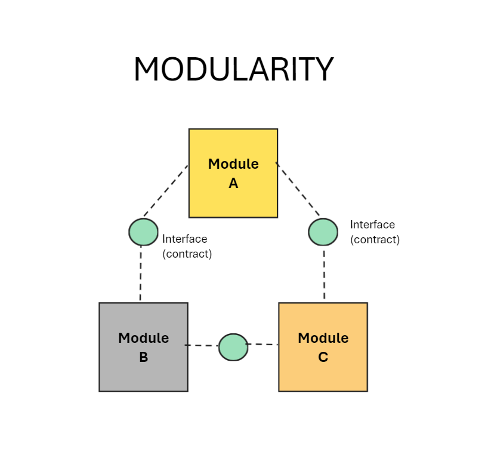
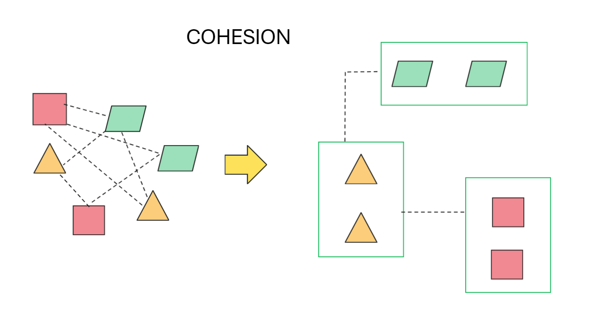
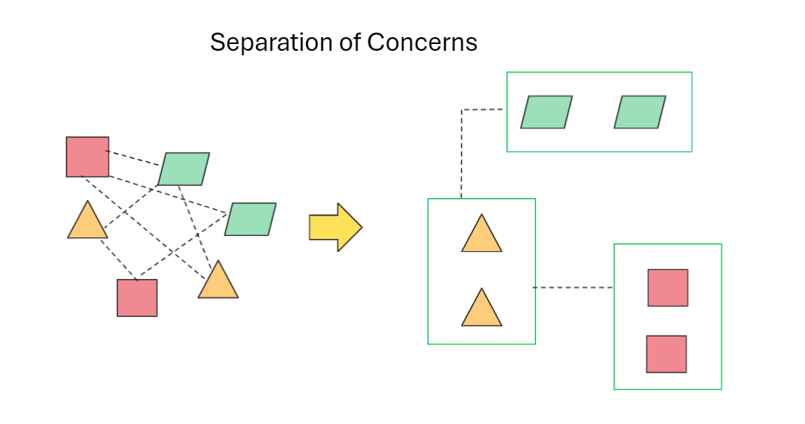
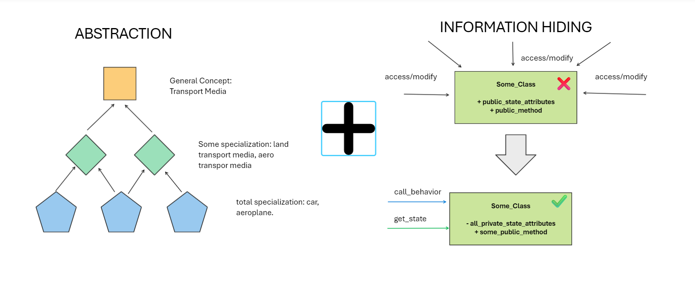

# Modern Software Engineering: Doing What Works to Build Better Software Faster

<style>
  .back-button {
    background-color: #4CAF50; /* Green */
    border: none;
    color: white;
    padding: 15px 32px;
    text-align: center;
    text-decoration: none;
    display: inline-block;
    font-size: 16px;
    margin: 4px 2px;
    cursor: pointer;
  }
</style>

<button class="back-button" onclick="window.location.href='https://matiaspakua.github.io/tech.notes.io'">All notes</button>

---


---

# Table of Contents

- [1.Introduction](#introduction)
- [2. What is Engineering?](#2_what_is_engineering)
- [3. Fundamentals of an Engineering Approach](#3_fundamentals_engineering_approach)
- [4. Working Iteratively](#4_working_iteratively)
- [5. Feedback](#5_feedback)
- [6. Incrementalism](#6_incrementalism)
- [7. Empiricism](#7_empiricism)
- [8. Being Experimental](#8_being_experimental)
- [9. Modularity](#9_modularity)
- [10. Cohesion](#10_cohesion)
- [11. Separation of concerns](#11_separation_concerns)
- [12. Information Hiding and Abstraction.(#12_information_hiding_abstraction)
- [13. Managing coupling](#13_managing_coupling)
- [References]()

<a name="introduction"></a>
# Introduction

1. **Engineering**:  The practical application of science. Software engineer need to become experts at learning.
2. **What is software Engineering**? Software engineering is the application of an empirical, scientific approach to finding efficient, economic solutions to practical problems. We must become experts at learning and experts at managing complexity.
3. To become experts at "<mark style="background: #FFF3A3A6;">learning</mark>" must apply:
	1. Iteration
	2. Feedback
	3. Incrementalism
	4. Experimentation
	5. Empiricism
4. To become experts at "<mark style="background: #FFF3A3A6;">managing complexity</mark>" we need to following:
	1. Modularity
	2. Cohesion
	3. Separation of concerns
	4. Abstraction
	5. Loose coupling
5. The following are **practical tools** to drive an effective strategy:
	1. Testability
	2. Deployability
	3. Speed
	4. Controlling variables
	5. Continuous delivery

<a name="2_what_is_engineering?"></a>
## 2. What is Engineering?

1. The first software engineer: **Margaret Hamilton**. Her approach was the focus on how thinks fail - <mark style="background: #FFF3A3A6;">the ways in which we get thinks wrong: "failing safely"</mark>. The assumption is that we can never code for every scenario, so how do we code in ways that allow our systems to cope with unexpected and still make progress?


1. **Managing complexity**: Edsger Dijkstra said: "The art of programming is the art of organizing complexity."
2. **Repeatability and Accuracy of measurement**:  engineering-focused team will use accurate measurement rather than waiting for somethings bad to happen.
3. **Engineering, creativity and craft**: taking an engineering approach to solving problems does not, in any way, reduce the importance of skill, creativity and innovation.
4. **Design engineering** is a deeply exploratory approach to gaining knowledge.
5. **Trade-offs**: one of the key trade-off that is vital to consider in the production of software, is "<mark style="background: #FFF3A3A6;">coupling</mark>".

<a name="3_fundamentals_engineering_approach"></a>
## 3. Fundamentals of an Engineering Approach

1. **The important of measurements**: The most important concepts are stability and throughput. Stability is tracked by:
	1. Change Failure Rate
	2. Recovery Failure time
2. **Throughput** is tracked by:
	1. Lead time: the time needed to go from idea to working software.
	2. Frequency: how often we go to production.
3. Throughput is a measure of a team's efficiency at delivering ideas, in the form of working software.
4. Is important to improve this measure to make decisions based on evidence.
5. **Foundations**: so, we need to become experts in learning and managing complexity.
6. **Expert at learning**:
	1. Working iteratively
	2. Employing fast, high-quiality feedback
	3. Working incrementally
	4. Being experimental
	5. Being empirical
7. Expert at managing complexity:
	1. Modularity
	2. Cohesion
	3. Separation of concerns
	4. Information hiding/abstraction
	5. Coupling

<a name="optimize_for_learning"></a>
# Optimize for Learning

<a name="4_working_iteratively"></a>
## 4. Working Iteratively

1. **Iteration** allows us to learn, react and adapt. It's at the heart of all exploratory learning and is fundamental to any real knowledge acquisition.
2. Working iteratively encourage us to think in smaller batches and to take **modularity and separation of concerns**.
3. **Iterate, learn, adapt** to new tech: as Kent's says in this book: <mark style="background: #FFF3A3A6;">"Embrace change!</mark>".

- **REFERENCE**:  my notes of Extreme Programming:  [XP](book_extreme_programming_explained.md)

<a name="5_feedback"></a>
## 5. Feedback

1. **Importance**: <mark style="background: #FFF3A3A6;">without feedback, there is no opportunity to learn</mark>. Feedback allows us to establish a source of evidence for our decisions.
2. **Feedback in coding**: with UNIT TEST!!!!
3. **Feedback in Integration**: Continuos Integration (CI) is about evaluating every change to the system along with every other change to the system as frequently as possible, as close to "continuously".
4. **Feedback in design**: TDD as a practice, is what give us most feedback in design. <mark style="background: #FFF3A3A6;">If the test are hard to write</mark>, that tells that somethings important about the quality of the code and the design.
5. **Feedback in product Design:**  adding telemetry to our systems that allows us to gather data about which features of our systems are used, and how they are used, is now the norm.
6. **Modern times**: we are going to "Business and IT" ==> "Digital Business". The telemetry can provide insights into what customer wants, needs and behaviour that event the customers themselves are not conscious of.
7. **Feedback in Organization and Culture**: All this concepts of feedback are generally not apply in the Organization and in the culture. When people apply this kind of approach they get much better result: "Lean Thinking" => The Toyoya Waty is an example of this.

<a name="6_incrementalism"></a>
## 6. Incrementalism

1. **Definition**: incremental design is directly related to any modular design application, in which components can be freely substituted if improved to ensure better performance.
2. **Importance of Modularity**: divide the problem into pieces aimed at solving a single part of the problem.
3. **Organizational incrementalism**: One of the huge benefits that modularity brings is "isolation".  Modular organizations are more flexible, mode scalable and more efficient.
4. **Tools**: Feedback, experimentation, Refactoring, Version control, testing. A test-driven approach to automated testing demand that we create  mini executable specifications for the changes that we make to our systems. Keeping the test as simple as we can and by designing our system as testeable code.
5. **Limit the impact of change**: Applying patterns as: <mark style="background: #FFF3A3A6;">Port & Adapter</mark>. At any interface point between two components of the system that we want to decouple, a port, we define a separate piece of code to translate inputs and outputs, the adapter.


- **REFERENCE**: Hexagonal Architecture: [Hexagonal architecture – Alistair Cockburn](https://alistair.cockburn.us/hexagonal-architecture/)

6. **Speed of feedback:**  the fastest, better.
7. **Incremental design**: the agile concepts is based on the premise that we can begin work before we have all the answers. Accepting the we don't know, doubting what we do know, and working to learn fast is a step from dogma toward engineering. 
8. **Avoid over-engineering**: never add code for thinks that I don't know are needed now. The important concept with code is that code need to be simple and small, that allows me to change when I learn new thinks.

<a name="7_empiricism"></a>
## 7. Empiricism

1. **Definition**: Empiricism, in the philosophy of science, is defined as "emphasizing evidence, especially as discovered in experiments".
2. **I know that Bug!**: Science works!. Make a hypothesis. Figure out how to prove or disprove it. Carry out the experiment. Observe the results and see they match your hypothesis. Repeat.
3. **Avoid Self-deception**: "<mark style="background: #FFF3A3A6;">The first principle is that you must not fool yourself and you are the easiest person to fool.</mark>"
4. **Guided by Reality**: the best way to start is to assume that what you know, and what you think, is probably wrong and then figure out how you could find our how it is wrong.

<a name="8_being_experimental"></a>
## 8. Being Experimental

1. **Definition**. Richard Feyman says "Science is the belief in the ignorance of experts". "Have no respect whatsoever for authority; forget who said it and instead look what he start with, where he ends up, and ask yourself, 'it is reasonable?'".
2. **Hypothesis, Measurement and Controlling the Variables**. To gather feedback and make useful measurements, we need to control the variables.
3. **Experiments**: we can run literally millions of experiments every second if we want, using unit tests. What I am thinking of is organizing our development around a series of iterative experiments that make tiny predictions.
4. **Creating new knowledge:** we can create a new experiment, a test, that define the new knowledge that we expect to observe, and then we can add knowledge in the form of working code that meet that needs.

<a name="optimize_managing_complexity"></a>
# Optimize for Managing Complexity

<a name="9_modularity"></a>
## 9. Modularity

1. **Good design:** the cornerstones are modularity and separation of concerns. How can we create code and systems that will grow and evolve over time but that are appropriately compartmentalized to limit damage if we make a mistake?
2. **The importance of testability**: if our test are difficult to write, it means that our design is poor.
3. **Improve modularity**: we need to be clear what it is that we are measuring, and we need to be clear of the value of our measurements. We need to identity if the system the "points of measurements." The key is to understand the scope of measurement that make sense and work to make those measurements easy to achieve and stable in terms of the results that they generate.
4. **Service and modularity**: one of the most important aspects is "information hiding", this is one the essences of design. The concept of a "service" in software terms is that it represent a boundary.
5. **Deployability and modularity**: accomplish this independence is to take the modularity of the system so seriously that each module is, in terms of build, test and deployment, independent from every other module.
6. **Modularity at different scale**: Testing when done well exposes something important and true about the nature of out code, the nature of our design, and the nature of the problem that we are solving.
7. **Modularity in Human System**: truly decouple system, we can parallelized all we want. Micro-services are an organizational scalability play; they don't really have any other advantage, but let's be clear, this is a big advantage if scalability is your problem. If we need small team to efficiently create good, high-quality work, then we need to "decouple". We need modular organizations as well as modular software. 



<a name="10_cohesion"></a>
## 10. Cohesion

1. **Modularity and cohesion**: good design in software is really about the way in which we organize the code in the system that we create.
2. <mark style="background: #FFF3A3A6;">**The primary goal of code is to communicate ideas to humans**</mark>.
3. **Context matters**: one effective tool to drive this kind of decision making is domain driven design (DDD).
4. **High-Performance Software**: to achieve this, we need to do the maximum amount of work for the smallest number of instructions.
5. **Link to coupling**: <mark style="background: #FFB86CA6;">Coupling</mark>: given two lines of code, A and B, they are coupled when B mush change behavior only because A changed. <mark style="background: #ADCCFFA6;">Cohesion</mark>: the are cohesive when change to A allows B to change so that both add new value.
6. **Cost of poor cohesion**: there is a simple, subjective way to spot poor cohesion. If you have ever read a piece of code and thought "I don't know what this code does," it is probably because the cohesion is poor.
7. **Cohesion in human system**: one of the leading predictors of high performance measured in terms of throughput and stability, is the ability of teams to make their own decisions without the need to ask permission of anyone outside the team.



<a name="11_separation_concerns"></a>
## 11. Separation of concerns

1. **Definition**: is defined as "a design principle for separating a computer program into distinct sections such that each section addresses a separate concern". Stuff that is unrelated is far apart, and the stuff that is relates is close together.
2. **Dependency Injection**: is where dependencies of a piece of code are supplied to it as parameters, rather that created by.
3. **Essential and Accidental complexity**: <mark style="background: #FFF3A3A6;">The Essential complexity </mark>of a system is the complexity that is inherent in solving the problem that you are trying to solve. <mark style="background: #FFF3A3A6;">The accidental complexity</mark> is everything else, the problems that we are forced to solve as a side effect of doing something useful with computer. 
4. **Testeability**: if we work to ensure that our code is easy to test, the we must separate the concern or our test will lack focus.
5. **Ports and adapters**: Is best fit when translade information that crosses between bounded contexts.
6. **What is an API**. Application Programming Interface (API) is all the information that is exposed to consumers of a service, or library, that expose that API. In combination with **ports and adapters** create the consistent level of abstraction. The rule is: <mark style="background: #FFF3A3A6;">always add Ports and Adapters where the code that you talk to is in different scope of evaluation.</mark> 



<a name="12_information_hiding_abstraction"></a>
## 12. Information Hiding and Abstraction.

1. **Information hiding**: its based on hiding the behavior of the code. It includes implementation details as well as any data that it may or may nor use.



2. **The Big balls of mud problem**. The first point are the Organizational and cultural problems. Here, the main and most important advice is that we need to own the responsibility for the quality of the code that we work on.


3. **Organizational and cultural problems**: we need to own the responsibility for the quality of the code that we work on. It is our **duty of care** to do a good job. Our aim should be to do whatever it takes to build better software faster. This is improve QUALITY. The foundation of a professional approach are: refactor, test, take time to create great designs, fix bugs, collaborate, communicate and learn.

4. **Technical problems and problems design and the Fear of over engineering**: We need to apply the approach that when we design our solution (code), we can return to it at any point in the future when we have learned something new and change it. Here the main problem to fix is the **FRAGILITY OF OUR CODE**. We have three approach to this: 1) the HERO-Programmer model (exist a super programmer that can do and fix everything); 2) Abstraction and 3) Testing. This is abstract = hiding the complexity and testing = validate the solution.

5. **Improve abstraction through testing**: apply testability on design, this is writing the specification (test) like an act of design. This is a practical, pragmatic, light weight approach to design by CONTRACT.

6. **Abstractions from the problem domain**: The <mark style="background: #FFF3A3A6;">"thinking like a Engineer" means: thinking about the ways in which thinks can go wrong.</mark>


7. **Isolate Third-Party systems and code**:  always insulate your code from third-party code with your own abstractions. Thinks carefully about what you allow "inside" your code. For example, inside our code only allow language concepts that are native, nothing outside this.
8. **Always prefer to hide information**. Period.

<a name="13_managing_coupling"></a>
## 13. Managing coupling

**<mark style="background: #FFF3A3A6;">Def. Coupling</mark>** is defined as "the degree of interdependence between software modules; a measure of how closely connected two routines or modules are; the strength of the relationships between modules".

1. **Cost of coupling**:  The real reason why attributes of our systems like MODULARITY, and COHESION and techniques like ABSTRACTION and SEPARATION OF CONCERNS matter is because they help us reduce the "coupling" in our systems. So, in general, we should aim to <mark style="background: #FFF3A3A6;">prefer looser coupling over tighter coupling.</mark>
2. **Scaling Up**. There is a fairly serious limit on the size of a software development team, before adding more people that only will slows down. To decrease this problems, the team needs a coordination as efficient as possible, and the best way to do this is **continuous integration**. ==> see also the Conway's law: "any organization that design a system will produce a design whose structure is a copy of the organization's communication pattern."
3. **Microservices**: the general concept is to reduce the level of coupling. To do this, the need to be:
	1. Small
	2. Focused on one task
	3. Aligned with a bounded context.
	4. Autonomous
	5. Independently deployable ==> This is the KEY defining characteristic of a microservice.
	6. Loosely coupled.
4. Also is important to mention that <mark style="background: #FFF3A3A6;">Microservices is an organizational scaling pattern</mark>.
5. **Decoupling may mean mode code**. With this in the table: we should optimize for thinking, not for typing!!!!.
6. **Loose coupling isn't the only kind that matters**: The Nygard model of coupling:


| **Type**     | **Effect**     |
| --- | --- |
| Operational    | A consumer can't run without a provider     |
| Developmental | Changes in producers and consumers must be coordinated |
| Semantic | Change together because of shared concepts |
| Functional | Change together because of shared responsibility |
| Incidental | Change together for no reason (breaking API contract) |

7. **Prefer loose coupling.** to achieve high performance, the code need to be simple. Efficient code that can be easily and, even better, predictably ,understood by our compilers and hardware.
8. **DRY is to simplistic**. DRY is short for "Don't repeat yourself". It is a short hand description of our desire to have a single canonical representation of each piece of behavior in our system. 
9. **ASYNC as a tool for loose coupling**: we prefer async where is possible, because of the great quantity of fail points in a SYNC pattern. Example: 


10. **Loose coupling human system**: CI is built on the idea of optimizing the feedback loops in development to the extend that we have, in essence, continuous feedback on the quality of our work.
11. **Summary**: high quality code can be achieve in three ways:
	1. Design more decoupled systems.
	2. Work with interfaces (contracts)
	3. Get feedback quickly to identify problems early.

# Tools to support Engineering in Software

## 14. The tools of an engineering discipline

1. **What is software development?** Solve problems, and build some checks into our process before dive into production. This checks are the <mark style="background: #FFF3A3A6;">"test"</mark>.
2. **Testability as a tool**. if we are going to test our software, then the it makes sense that, to make out lives easier, <mark style="background: #FFF3A3A6;">we should make out software easy to test</mark>.
3. **Designing to improve the testability** of our code makes us design higher quality code.
4. **Measurement points**: If the want out code to be testeable, we need to be able to control the variables. This is, a measurement point is a place where we can examine the behavior of out system without compromising its integrity.

**Example**: calculator.

```java
public class Calculator {
    
    public int add(int a, int b) {
        return a + b;
    }

    public int subtract(int a, int b) {
        return a - b;
    }

    public int multiply(int a, int b) {
        return a * b;
    }

    public double divide(int a, int b) {
        if (b == 0) {
            throw new IllegalArgumentException("Cannot divide by zero");
        }
        return (double) a / b;
    }
}

```

Let's break down why this code is easy to test:

1. **Modularity**: Each method in the `Calculator` class performs a specific operation (addition, subtraction, multiplication, and division). This makes it easier to isolate and test individual behaviors.
    
2. **Clear Input and Output**: Each method takes input parameters and returns a result. This makes it straightforward to provide inputs and verify outputs during testing.
    
3. **No External Dependencies**: The methods in this class do not rely on external resources or dependencies, such as databases or network connections. This simplifies testing because you don't need to set up complex environments for testing.
    
4. **Error Handling**: The `divide` method includes error handling to handle division by zero. This ensures that the method behaves predictably in all scenarios and allows for testing of edge cases.

Now, let's write some unit tests using JUnit to verify the behavior of these methods:

```java
import org.junit.Test;
import static org.junit.Assert.*;

public class CalculatorTest {

    @Test
    public void testAdd() {
        Calculator calculator = new Calculator();
        int result = calculator.add(3, 5);
        assertEquals(8, result);
    }

    @Test
    public void testSubtract() {
        Calculator calculator = new Calculator();
        int result = calculator.subtract(10, 4);
        assertEquals(6, result);
    }

    @Test
    public void testMultiply() {
        Calculator calculator = new Calculator();
        int result = calculator.multiply(2, 3);
        assertEquals(6, result);
    }

    @Test
    public void testDivide() {
        Calculator calculator = new Calculator();
        double result = calculator.divide(10, 2);
        assertEquals(5.0, result, 0.0001); // delta is set to account for floating point precision
    }

    @Test(expected = IllegalArgumentException.class)
    public void testDivideByZero() {
        Calculator calculator = new Calculator();
        calculator.divide(10, 0);
    }
}
	 
```

In this test code, we can identify the measurements points:

- Input: `a` and `b` are the input parameters.
- Output: The quotient of `a` divided by `b` is returned as the output.
- Exception Handling: If `b` is zero, an `IllegalArgumentException` is thrown.

5. **Problems with achieving testability**. technical difficulties, cultural problems, difficult at the edges of our system. The most difficult problem always ends to be: <mark style="background: #FFF3A3A6;">"people"</mark>.
6. **How to improve Testability**. If the test before you is difficult to write, the design of the code that you are working with is poor and needs to be improved.
7. **Deployability**. CD is on the idea of working so that our software is always in a releasable state. The other concept here is "releasebility", which implies some features completeness and utility to users. The difference is that "deployability" means that the software is safe to release into production, even if some features are not yet ready for use and are hidden in some ways.
8. **Controlling the Variables**. this means that we want the same result every time that we deploy our software.

## 15. The modern software Engineer.

1. **What's make a modern software engineer?** Testability, deployability, speed, controlling the variables and continuous delivery.

---

<mark style="background: #FFF3A3A6;">**Engineering as a human process**. Engineering is the application of an empirical , scientific approach to finding efficient, economic solutions to practical problems.
</mark>

---

2. **Digitally disruptive organizations**. Control the variables, keep relates ideas close together with cohesion, and keep unrelated ideas apart with modularity, separation of concerns, abstraction, and reductions in coupling.


# References

[Amazon.com: Modern Software Engineering: Doing What Works to Build Better Software Faster: by Farley, David](https://www.amazon.com/Modern-Software-Engineering-Discipline-Development/dp/0137314914)
