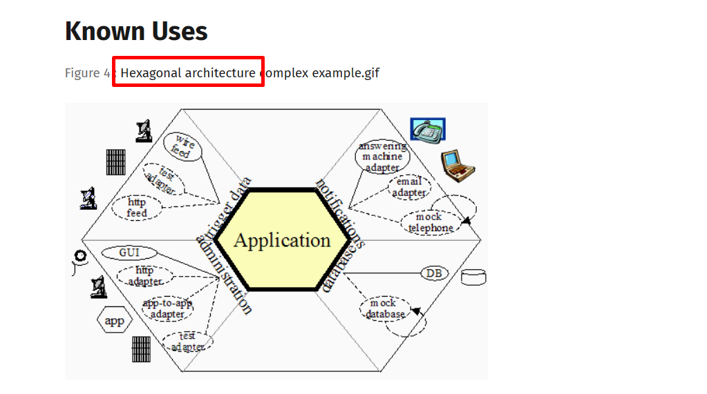

# Modern Software Engineering: Doing What Works to Build Better Software Faste

<button class="back-button" onclick="window.location.href='https://matiaspakua.github.io/tech.notes.io'">All notes</button>

## 1. Introduction

1. **Engineering**  - The practical application of science. Software engineer need to become experts at learning.
2. **What is software Engineering**? Software engineering is the application of an empirical, scientific approach to finding efficient, economic solutions to practical problems. We must become experts at learning and experts at managing complexity.
3. To become experts at "<mark style="background: #FFF3A3A6;">learning</mark>" must apply:
	1. Iteration
	2. Feedback
	3. Incrementalism
	4. Experimentation
	5. Empiricism
4. To become experts at "<mark style="background: #FFF3A3A6;">managing complexity</mark>" we need to following:
	1. Modularity
	2. cohesion
	3. separation of concerns
	4. abstraction
	5. loose coupling
5. The following are **practical tools** to drive an effective strategy:
	1. Testability
	2. Deployability
	3. Speed
	4. Controlling variables
	5. Continuos delivery

## 2. What is Engineering?

1. The first software engineer: **Margaret Hamilton**. Her approach was the focus on how thinks fail - <mark style="background: #FFF3A3A6;">the ways in which we get thinks wrong: "failing safely"</mark>. The assumption is that we can never code for every scenario, so how do we code in ways that allow our systems to cope with unexpected and still make progress?

1. **Managing complexity**: Edsger Dijkstra said: "The art of programming is the art of organizing complexity."
2. **Repeatability and Accuracy of measurement**:  engineering-focused team will use accurate measurement rather than waiting for somethings bad to happen.
3. Engineering, creativity and craft: taking an engineering approach to solving problems does not, in any way, reduce the importance of skill, creativity and innovation.
4. Design engineering is a deeply exploratory approach to gaining knowledge.
5. Trade-offs: one of the key trade-off that is vital to consider in the production of software, is "<mark style="background: #FFF3A3A6;">coupling</mark>".

## 3. Fundamentals of an Engineering Approach

1. **The important of measurements**: The most important concepts are: stability and throughput. Stability is tracked by:
	1. Change Failure Rate
	2. Recovery Failure time
2. Throughput is tracked by:
	1. Lead time: the time needed to go from idea to working software.
	2. Frequency: how often we go to production.
3. throughput is a measure of a team's efficiency at delivering ideas, in the form of working software.
4. Is importante to improve this measure to make decisions based on evidence.
5. **Foundations**: so, we need to become experts in learning and managing complexity.
6. **Expert at learning**:
	1. working iteratively
	2. Employing fast, high-quiality feedback
	3. working incrementally
	4. being experimental
	5. being empirical
7. Expert ar managing complexity:
	1. Modularity
	2. Cohesion
	3. separation of concerns
	4. information hiding/abstraction
	5. coupling

# Optimize for Learning

## 4. Working Iteratively

1. **Iteration** allows us to learn, react and adapt. It's at the heart of all exploratory learning and is fundamental to any real knowledge acquisition.
2. Working iteratively encourage us to think in smaller batches and to take modularity and separation of concerns.
3. Iterate, learn, adapt to new tech: as Kent Beck says in Extreme programming: <mark style="background: #FFF3A3A6;">"Embrace change!</mark>".

Reference to my notes of Extreme Programming:  [XP](book_extreme_programming_explained.md)

## 5. Feedback

1. **Importance** of: <mark style="background: #FFF3A3A6;">without feedback, there is no opportunity to learn</mark>. Feedback allows us to establish a source of evidence for our decisions.
2. **Feedback in coding**: with UNIT TEST!!!!
3. **Feedback in Integration**: Continuos Integration (CI) is about evaluating every change to the system along with every other change to the system as frequently as possible, as close to "continuously".
4. **Feedback in design**: TDD as a practice, is what give us most feedback in design. <mark style="background: #FFF3A3A6;">If the test are hard to write</mark>, that tells that somethings important about the quality of the code and the design.
5. **Feedback in product Design:**  adding telemetry to our systems that allows us to gather data about which features of our systems are used, and how they are used, is now the norm.
6. Modern times: we are going to "Business and IT" ==> "Digital Business". The telemetry can provide insights into what customer wants, needs and behaviour that event the customers themselves are not conscious of.
7. **Feedback in Organization and Culture**: All this concepts of feedback are generally not apply in the Organization and in the culture. When people apply this kind of approach they get much better result: "Lean Thinking" => The Toyoya Waty is an example of this.

## 6. Incrementalism

1. **Definition**: "incremental design is directly related to any modular design application, in which components can be freely substituted if improved to ensure better performance."
2. **Importance of Modularity**: divide the problem into pieces aimed at solving a single part of the problem.
3. **Organizational incrementalism**: One of the huge benefits that modularity brings is "isolation".  Modular organizations are more flexible, mode scalable and more efficient.
4. Tools: Feedback, experimentation, Refactoring, Version control, testing. A test-driven approach to automated testing demand that we create  mini executable specifications for the changes that we make to our systems. Keeping the test as simple as we can and by designing our system as testeable code.
5. **Limit the impact of change**: Applying patterns as: <mark style="background: #FFF3A3A6;">Port & Adapter</mark>. At any interface point between two components of the system that we want to decouple, a port, we define a separate piece of code to translate inputs and outputs, the adapter.

Hexagonal Architecture: [Hexagonal architecture – Alistair Cockburn](https://alistair.cockburn.us/hexagonal-architecture/)

6. **Speed of feedback:**  the fast, better.
7. **Incremental design**: the agile concepts is based on the premise that we can begin work before we have all the answers. Accepting the we don't know, doubting what we do know, and working to learn fast is a step from dogma toward engineering. 
8. **Avoid over-engineering**: never add code for thinks that I don't know are needed now. The important concept with code is that code need to be simple and small, that allows me to change when I learn new thinks.

## 7. Empiricism

1. **Definition**: Empiricism, in the philosophy of science, is defined as "emphasizing evidence, especially as discovered in experiments".
2. **I know that Bug!**: Science works!. Make a hypothesis. Figure out how to prove or disprove it. Carry out the experiment. Observe the results and see they match your hypothesis. Repeat.
3. **Avoid Self-deception**: "<mark style="background: #FFF3A3A6;">The first principle is that you must not fool yourself and you are the easiest person to fool.</mark>"
4. **Guided by Reality**: the best way to start is to assume that what you know, and what you think, is probably wrong and then figure out how you could find our how it is wrong.

## 8. Being Experimental

1. **Definition**. Richard Feyman: "Science is the belief in the ignorance of experts". "Have no respect whatsoever for authority; forget who said it and instead look what he start with, where he ends up, and ask yourself, 'it is reasonable?'".
2. **Hypothesis, Measurement and Controlling the Variables**. To gather feedback and make useful measurements, we need to control the variables.
3. **Experiments**: we can run literally millions of experiments every second if we want, using unit tests. What I am thinking of is organizing our development around a series of iterative experiments that make tiny predictions.
4. **Creating new knowledge:** we can create a new experiment, a test, that define the new knowledge that we expect to observe, and then we can add knowledge in the form of working code that meet that needs.

# Optimize for Managing Complexity

## 9. Modularity

1. **Good design:** the cornerstones are: modularity and separation of concerns. How can we create code and systems that will grow and evolve over time but that are appropriately compartmentalized to limit damage if we maje a mistake?
2. **The importance of testability**: if our test are difficult to write, it means that our design is poor.
3. **Improve modularity**: we need to be clear what it is that we are measuring, and we need to be crear of the value of our measurements. We need to identity if the system the "points of measurements." The key is to understand the scope of measurement that make sense and work to make those measurements easy to achieve and stable in terms of the results that they generate.
4. **Service and modularity**: one of the most important aspects is: "information hiding", this is one the essences of design. The concept of a "service" in software terms is that it represent a boundary.
5. **Deployability and modularity**: accomplish this independence is to take the modularity of the system so seriously that each module is, in terms of build, test and deployment, independent from every other module.
6. **Modularity at different scale**: Testing when done well exposes something important and true about the nature of out code, the nature of our design, and the nature of the problem that we are solving.
7. **Modularity in Human System**: truly decouple system, we can parallelised all we want. Micro-services are an organizational scalability play; they don't really have any other advantage, but let's be clear, this is a big advantage if scalability is your problem. If we need small team to efficiently create good, high-quality work, then we need to "decouple". We need modular organizations as well as modular software. 

## 10. Cohesion

1. **Modularity and cohesion**: good design in software is really about the way in which we organize the code in the system that we create.
2. <mark style="background: #FFF3A3A6;">**The primary goal of code is to communicate ideas to humans**</mark>.
3. Context matters: one effective tool to drive this kind of decision making is domain driven design (DDD).
4. **High-Performance Software**: to achieve this, we need to do the maximum amount of work for the smallest number of instructions.
5. **Link to coupling**: <mark style="background: #FFB86CA6;">Coupling</mark>: given two lines of code, A and B, they are coupled when B mush change behavior only because A changed. <mark style="background: #ADCCFFA6;">Cohesion</mark>: the are cohesive when change to A allows B to change so that both add new value.
6. **Cost of poor cohesion**: there is a simple, subjetive way to spot poor cohesion. If you have ever read a piece of code and thought "I don't know what this code does," it is probably because the cohesion is poor.
7. **Cohesion in human system**: one of the leading predictors of high performance measured in terms of throughput and stability, is the ability of teams to make their own decisions without the need to ask permission of anyone outside the team.
