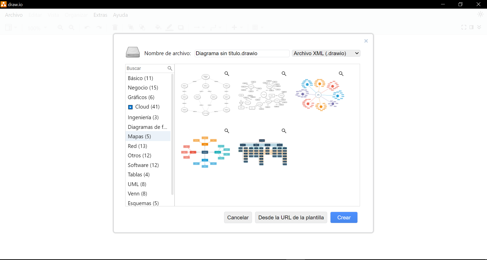
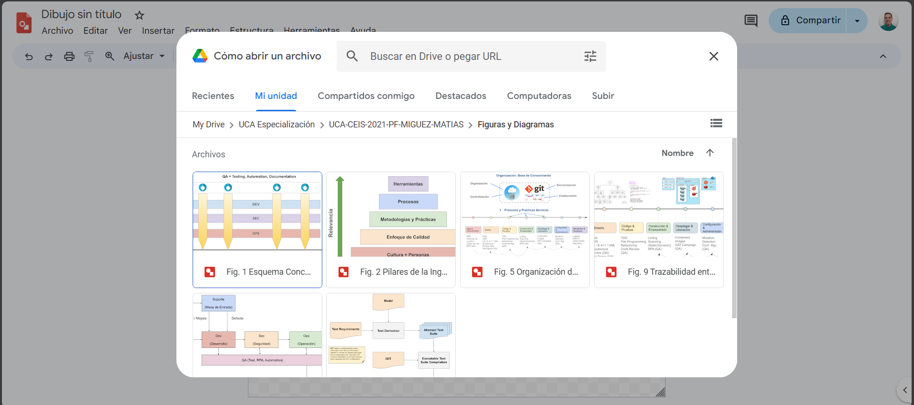
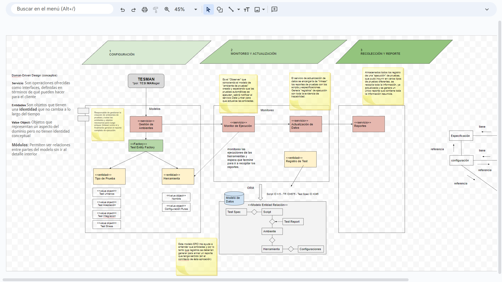
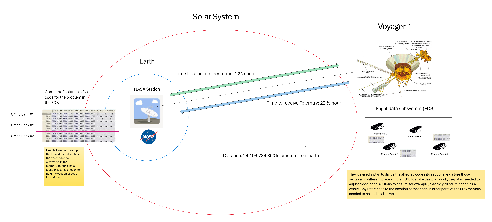

# Visual Thinking

---

## Introducción

**¿Que es Visual Thinking?**

Visual Thinking es como cuando usas dibujos para <mark style="background: #FFF3A3A6;">entender</mark> y <mark style="background: #BBFABBA6;">explicar</mark> cosas. Imagina que tienes un problema, como armar un rompecabezas. En lugar de solo hablar de cómo hacerlo, <mark style="background: #ADCCFFA6;">dibujas las piezas</mark> y cómo se <mark style="background: #FFF3A3A6;">conectan</mark>. Así, puedes **ver el problema** más claramente y **encontrar la solución** más fácilmente. Es como usar tus ojos y tus manos para pensar mejor, no solo tu cabeza.

---

## Componentes del Visual Thinking

- **Imágenes** 🖼️: Dibujos o símbolos que representan ideas o conceptos. Ayudan a visualizar lo que estás pensando.

---

- **Palabras** 📝: Usar texto corto y claro junto con las imágenes para explicar mejor las ideas.

---

- **Mapas y Diagramas** 🗺️: Organizar la información de manera que se vea cómo las ideas se conectan entre sí.

---

- **Esquemas y Flujos** 🔄: Mostrar procesos o secuencias de pasos de forma visual, como un mapa de ruta.

---

- **Colores y Formas** 🎨: Usar diferentes colores y formas para destacar lo importante y diferenciar ideas.

---

## Herramientas

- [Draw.io](https://www.drawio.com/)

---

## Google Drawings

- [Google Drawing](https://docs.google.com/drawings)

---

## Ejemplo Google Drawing

Link: https://docs.google.com/drawings/d/1cBOqUlmJ5NF0shSbG3enm4T4eSLA-ZV8o2X1yrFvIJ4/edit?usp=sharing

---

## Microsoft Whiteboard

- [Microsoft Whiteboard](https://www.microsoft.com/es-es/microsoft-365/microsoft-whiteboard/digital-whiteboard-app)

---

## Ejemplo de Whiteboard: Voyager Bugfix NASA

=> [Link](https://wbd.ms/share/v2/aHR0cHM6Ly93aGl0ZWJvYXJkLm1pY3Jvc29mdC5jb20vYXBpL3YxLjAvd2hpdGVib2FyZHMvcmVkZWVtLzZjODBmYTcyNzkzYzQxNDBiNjk5ODM4M2NhODFmYzFjX0JCQTcxNzYyLTEyRTAtNDJFMS1CMzI0LTVCMTMxRjQyNEUzRF8wZjY4NzliYy1jM2ZmLTRlMmEtYjFlOC1kYTY0NzAwZDkxYWI=)

---

## Visual Storytelling

==> <mark style="background: #FFF3A3A6;">"The Back of the Napkin" de Dan Roam</mark>

**Link**: https://www.youtube.com/watch?v=XEnrQqOHx3I

<iframe width="560" height="315" src="https://www.youtube.com/embed/XEnrQqOHx3I?si=9SS4xMQaYWtpwMMv" title="YouTube video player" frameborder="0" allow="accelerometer; autoplay; clipboard-write; encrypted-media; gyroscope; picture-in-picture; web-share" referrerpolicy="strict-origin-when-cross-origin" allowfullscreen></iframe>

---

## Doodlers, Unite! 

  - "Doodlers, Unite!" de Sunni Brown

Link: https://youtu.be/7fx0QcHyrFk?si=c6a7xIhEi-zl7-fA

<iframe width="560" height="315" src="https://www.youtube.com/embed/7fx0QcHyrFk?si=j0sw22rApoDVZibu" title="YouTube video player" frameborder="0" allow="accelerometer; autoplay; clipboard-write; encrypted-media; gyroscope; picture-in-picture; web-share" referrerpolicy="strict-origin-when-cross-origin" allowfullscreen></iframe>