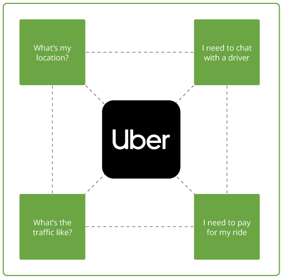
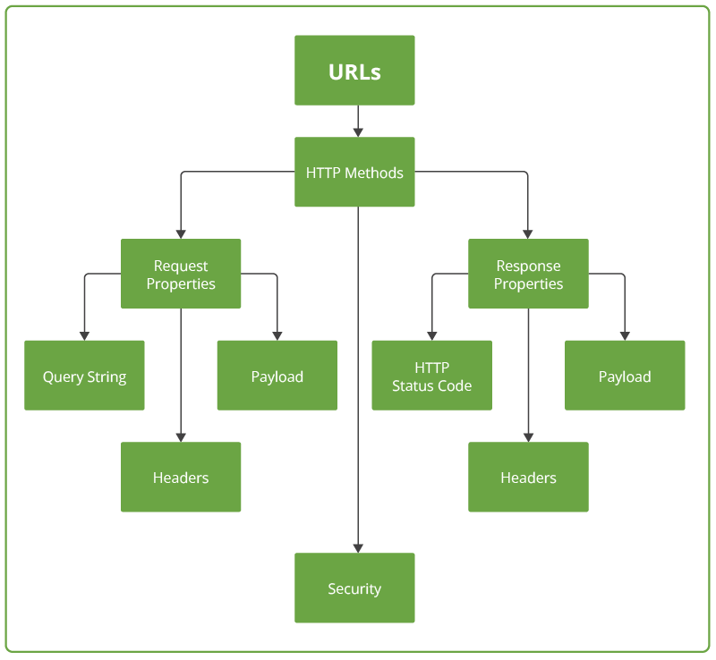

# OpenApi foundations

Definición: es un lenguaje de descripción de API

## API Economy

Nuestro mundo digital es posible gracias a la Economía API ( #APIEconomy ), una colección cada vez más amplia de productos y servicios que tienen algo en común: su <mark style="background: #FFF3A3A6;">presencia en el mercado se ve facilitada por la provisión de una API</mark>. Las API se han convertido en un mecanismo natural para permitir la comunicación entre sistemas distribuidos, proporcionando operaciones y funciones que permiten a las organizaciones construir plataformas descentralizadas, que pueden escalar y crecer de manera más eficaz.

De esa ecosistema de API hay pagar y libres. Tener una forma de describir esas API es un aspecto fundamental de los proveedores.

## El Rol de las API's

El software lleva más de una década devorando al mundo. En esta metáfora culinaria, las API son las herramientas del chef para elaborar la comida y los cubiertos que utilizamos para devorarla. Las <mark style="background: #FFF3A3A6;">API son fundamentales para la forma en que hacemos negocios en muchas industrias diferentes</mark> y son un elemento fundamental en muchas otras tendencias tecnológicas, incluidas las criptomonedas, la banca abierta y la inteligencia artificial.

## Apis-as-products

Cada vez es más común que las organizaciones tomen un aproach de APIs como productos (por ejemplos, existen API Products Managers). 

La evolución de la visión de las API como producto es sorprendente, ya que, en esencia, las API son un tipo de interfaz de software que ha desempeñado la misma función desde los albores de la informática, es decir, la invocación de servicios y el intercambio de datos. Las API permiten el desarrollo de sistemas distribuidos y descentralizados, y las organizaciones han crecido para aprovechar la oportunidad comercial de proporcionar acceso pago a las API que exponen productos comerciales.

Ser un proveedor de API se ha vuelto casi fundamental para hacer negocios en las industrias y verticales.

## Desafíos

Uno de los desafíos más fundamentales es también uno de los más simples: ¿cómo podemos describir nuestras API de una manera que permita a los desarrolladores externos crear clientes de software y también comprender las operaciones y la funcionalidad de la API?

<mark style="background: #BBFABBA6;">Los lenguajes de descripción de API ayudan a enfrentar este desafío.</mark>

## Describir las Interfaces de Software (IDL)

El primer ejemplo es WSDL (Web Service Description Language) => usado en arquitecturas orientadas a software. El problema de este esquema es que están muy acoplados al stack tecnológico, estilo de arquitectura, etc.

El segundo y orientado a la tecnología HTTP es REST.

## Que son los lenguajes de descripción de API's?

Es una forma de comunicar, estandarizar y poner un estructura en común para la definición de las API.s

