## Advance Your Spring Development Skills

<style>
  .back-button {
    background-color: #4CAF50; /* Green */
    border: none;
    color: white;
    padding: 15px 32px;
    text-align: center;
    text-decoration: none;
    display: inline-block;
    font-size: 16px;
    margin: 4px 2px;
    cursor: pointer;
  }
</style>

<button class="back-button" onclick="window.location.href='https://matiaspakua.github.io/tech.notes.io'">All notes</button>
---

This are the notes for the 6 courses Specialization PATH on Linkedin Learning.

## Table of Content

1. [Spring Cloud Load Balancing](#01)
2. [Performance Tuning in Spring Apps](#02)
3. [Spring Boot Observability: Deep Dive into Logging, Metrics, and Tracing](#03)
4. [Advanced Spring: Spring Boot Actuator](#04)
5. [Advanced Spring: Application Events](#05)
6. [Advanced Spring: Effective Integration Testing with Spring Boot](#06)

---
<a name="01"></a>
# Spring Cloud Load Balancing

## Introduction

In software engineering, **Load Balancing** is the practice of <mark style="background: #FFF3A3A6;">distributing</mark> computational workloads across multiple servers. This process ensures that no single server bears too much demand. By spreading the work evenly, load balancing improves application responsiveness. It also increases the <mark style="background: #FFF3A3A6;">availability</mark> of applications and websites for users. Load balancers evaluate client requests by examining application-level characteristics (the IP address, the HTTP header, and the contents of the request). The load balancer then looks at the servers and determines which server to send the request to.

Load balancing has a significant impact on **user experience**. By dividing user requests among multiple servers, user wait time is vastly cut down. This results in a better user experience. Long page load times, and poor response times to user actions, create a bad user experience. Waiting for content to load becomes frustrating for users and may provoke them into leaving the site or application altogether. Load balancers handle traffic spikes by moving data efficiently, optimizing application delivery resource usage, and preventing server overloads. That way, the website performance stays high, and users remain satisfied.

With Google Cloud Platform (GCP), load balancing is a software cloud-based offering to automatically facilitate shift of traffic from one instance to another when traffic or load is increased.

- GCP has eight load balancer offerings that vary by flow of traffic, traffic type, and global or regional support.
- **Flow of traffic** can be external (from the internet) or internal (from within the network).


- **Traffic type** can be HTTP, HTTPS, TCP, or UDP.
- **Global or regional** support means whether the load balancer can route traffic to instances in different regions or only in one region.


Google Cloud Platform (GCP) offer two types of internal load balancers:

- **Internal TCP and UDP Load Balancer**: This type is ideal for serving TCP traffic, which is suitable for data that needs to be retransmitted if dropped, like photos. It also serves UDP traffic, which is ideal for video streaming.

- **Internal HTTP and HTTPS Load Balancer**: This type serves HTTP and HTTPS traffic, which is typically seen with Java backend APIs.

Both load balancers are internal, meaning they serve traffic between internal instances and not from the external internet. They are assigned an internal IP address used for internal instances or clients to forward traffic to. Both types only support instances deployed in a single region. The choice between the two depends on the type of traffic and the application's requirements.

## External Load Balancer

- **External TCP/UDP Network Load Balancer**: Supports network traffic for TCP, UDP, ESP, and ICMP. It's a regional load balancer, ideal for instances in one region expecting external TCP, UDP, ESP, or ICMP type traffic.
- **TCP Proxy Balancer**: Distributes TCP traffic from the external internet across regional or global instances. It proxies TCP traffic, meaning it creates two connections - one from the client to the load balancer, and another from the load balancer to the instance.
- **SSL Proxy Load Balancer**: Similar to the TCP Proxy, but serves encrypted or secure SSL traffic instead.

 - **Documentation**: [Cloud Load Balancing overview  |  Google Cloud](https://cloud.google.com/load-balancing/docs/load-balancing-overview)


<a name="02"></a>
# Performance Tuning in Spring Apps

## Introduction

Repository: [Performance Tuning in Spring Apps](https://github.com/matiaspakua/performance-spring-tools))

## Tools

 * VisualVM: [VisualVM: Download](https://visualvm.github.io/download.html)
 * Java Flight Recorder [JDK Mission Control (JMC) 8 ](https://www.oracle.com/java/technologies/javase/products-jmc8-downloads.html)
 * Glowroot: [Glowroot](https://glowroot.org/)
 * Prometheus: [Prometheus - Monitoring system & time series database](https://prometheus.io/)
 * Micrometer: [Micrometer Application Observability](https://micrometer.io/)


**<mark style="background: #FF5582A6;">IMPORTANT</mark>**: to run the project, a link to the quoting service must be updated according to: https://github.com/spring-guides/gs-consuming-rest/issues/47#issuecomment-1079698023


## Understanding Performance

The big question: "<mark style="background: #FFF3A3A6;">How does your application perform?</mark>"

The selected text discusses the importance of understanding performance in Spring-based applications. Here are the key points:

- Understanding performance is crucial for Spring developers. It involves deconstructing and understanding the complexity of the question, “How does your application perform?”.
- As a Spring developer, you likely have direct influence only over a small portion of your application, mainly the Java components.
- It’s important to understand how to manage and measure the runtime JVM performance of your Java Spring project. Proficiency with JVM profiling and runtime parameters is an essential part of a Spring developer’s toolkit.
- The Spring framework provides internal performance reporting metrics that allow a developer to gain more Spring specific insights into their application. These topics will be addressed in other portions of the course.


 * **Performance Measurement**: It’s crucial to measure and make informed runtime configurations based on the anticipated performance of the systems your application depends on.
 * **Infrastructure Understanding**: A Spring developer often has limited control over the virtual and physical infrastructure that the application is deployed on, and the networks it communicates over.
 * **Resource Management**: Boosting the computing resources that host your application can enhance its performance. However, it’s essential to understand what your application needs in terms of computing resources.
 * **Performance Profiling**: An accurate and holistic understanding of your application’s performance profile is the ultimate goal. This knowledge allows you to explain, improve, and extend the resilience of your application over its entire life cycle. 


## JVM Perfomance

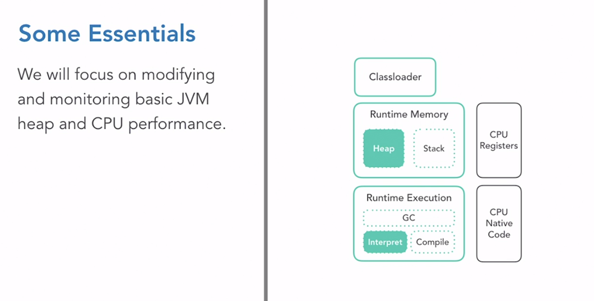

 * **JVM Performance**: Understanding JVM performance is crucial for a Spring developer. The JVM is complex but approachable, and even basic knowledge can be beneficial.
 * **Heap Performance**: The heap holds all objects in your application. Memory management and garbage collection occur here. You can influence heap behavior by setting max and min heap sizes.
 * **CPU Performance**: This refers to the use of the host computer’s processing resources to execute your Java code. While developers have limited influence over CPU performance, understanding your needs and limitations can help make informed decisions about application design.
 * **VisualVM Tool**: This tool is used to gain insight into an application and explore heap and CPU performance. It is bundled with JDK through Java 8 and is also available as a standalone download from a GitHub-hosted site.

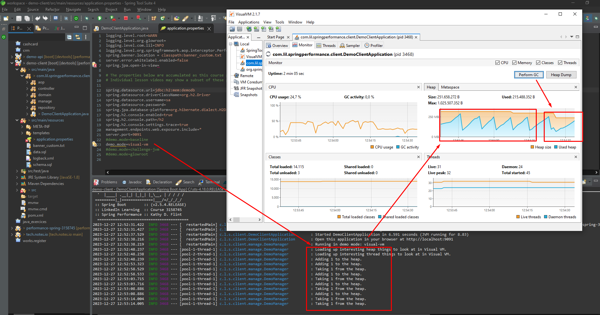

## Transaction Profiling

- **Application Runtime Monitoring**: This is a type of monitoring that provides a holistic view of your application’s performance. It offers insights into the transactions between your Java application and the external systems it depends on.
 
- **Transactions**: These could be HTTP requests to APIs, database performances, or other service calls like to messaging platforms.

- **Alerting**: This is another feature of application runtime monitoring frameworks.

- **Glowroot**: An open-source Application Performance Monitoring (APM) solution that is easy to run locally. It’s a useful tool for understanding the possibilities for APM monitoring and what you can learn about your application’s performance. A demonstration of the application using Glowroot is mentioned to provide insight into its performance.

 * Example of typical Glowroot dashboard:


 * Example of a Query details:


## Challenge JVM OutOfMemory

To start, we need to confgure the proper profile in the Run SpringBootApp:

*  application.properties: "demo.mode=challenge-jvm"

Then, modify the run configuration for the JVM to change the heap size and do a Heap Dump for further analysis:

```bash
-Xmx100M 
-Xms100M
-XX:+HeapDumpOnOutOfMemoryError
-javaagent:C:\Users\matia\workspace\perf_tools\glowroot\glowroot.jar
```

After the application crashes, a memory dump is generated and we can open and analyze it with the VisualVM tool:

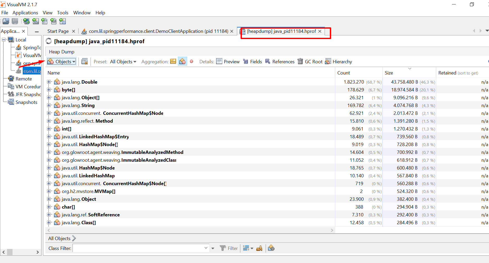

Heap Analysis:


Code:


## Spring Actuators

Spring Boot Actuator is a sub-project of the Spring Boot Framework. It brings production-ready features to our application. The main benefit of using this library is that we get health and monitoring metrics from production-ready applications. 

Here are some key points about Spring Boot Actuator:

- **Operational Information**: The actuator mainly exposes operational information about the running application — health, metrics, info, dump, env, etc. It uses HTTP endpoints or JMX beans to enable us to interact with it.

- **Endpoints**: Once this dependency is on the classpath, several endpoints are available for us out of the box. As with most Spring modules, we can easily configure or extend it in many ways.

- **Production-Grade Tools**: With Actuator, you can get production-grade tools without having to actually implement these features yourself. You can expose detailed information about the running application, for example, its health, detailed metrics, JVM dump, environment variables, etc.

- **Getting Started**: To enable the Spring Boot Actuator, you need to add the `spring-boot-actuator` dependency to your package manager. Here is how you can do it in Maven:


    ```xml
    <dependency>
        <groupId> org.springframework.boot </groupId>
        <artifactId> spring-boot-starter-actuator </artifactId>
    </dependency>
    ```

- **Spring Boot 2.x Actuator**: In 2.x, the Actuator keeps its fundamental intent but simplifies its model, extends its capabilities, and incorporates better defaults. This version becomes technology-agnostic. It also simplifies its security model by merging it with the application one. The latest version now supports the CRUD model as opposed to the old read/write model.

In essence, the Spring Boot Actuator is used for monitoring our app, gathering metrics, and understanding traffic or the state of our database. It becomes trivial with this dependency.

 Spring Boot Actuator: Production-ready Features. https://docs.spring.io/spring-boot/docs/2.5.6/reference/html/actuator.html.


To enable and disabled this configuration, go to the "application.properties" and add:

```bash
management.endpoints.web.exposure.include=*
management.endpoints.jmx.exposure.include=*
management.endpoint.health.show-details=always
management.endpoint.health.show-components=always
management.endpoint.health.status.order=out-of-service,down,up
```

## Actuators configuration

Actuator can be customize extending from classes that are provided by the Actuators package as in this example:

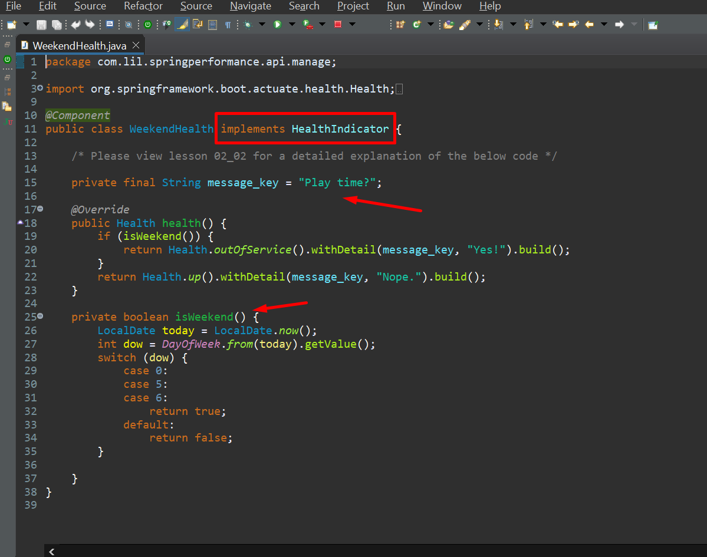

Then when you call the /actuator/health endpoint, a custom check is executed that validate is the current day is "weekend" (Saturday or Sunday):

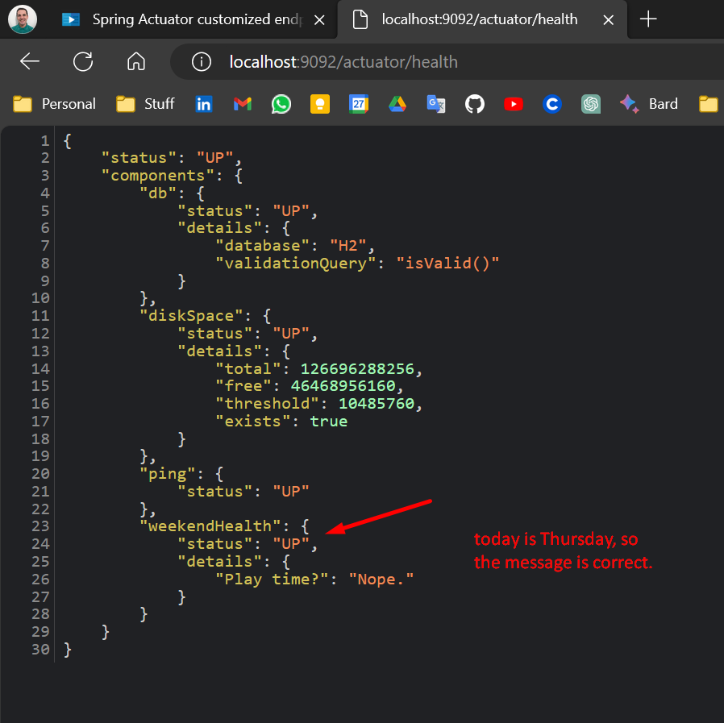


## Spring Actuator Micrometer Metrics

- **Micrometer Library**: This is the key to interfacing Spring applications with state-of-the-art runtime monitoring platforms. It provides an application metrics facade that supports numerous runtime monitoring systems, such as Prometheus and DataDog.

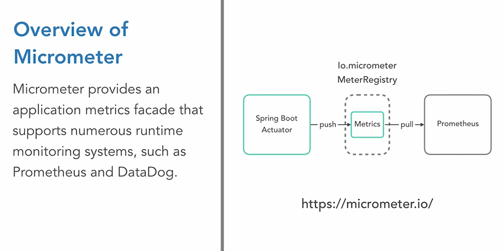

- **Prometheus**: This is an application runtime monitoring tool that specializes in fine-grained and customizable event alerting, trending over time, and multi-application management.
- **Integration**: When Spring leverages the Micrometer library to publish its metrics, it publishes them in formats that other runtime monitoring systems can consume and make actionable to the end user.

After running the Demo API with the new metric variable to registry, we run Prometheus and configure the TARGET using the YML file given:

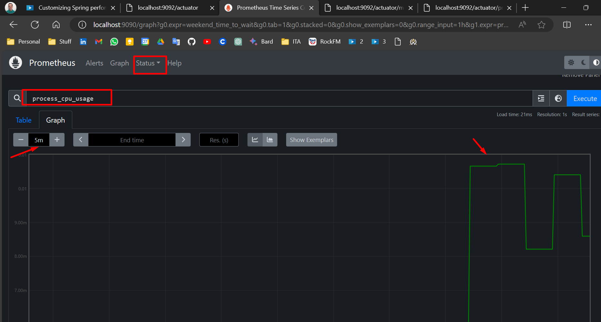

### Types of metrics

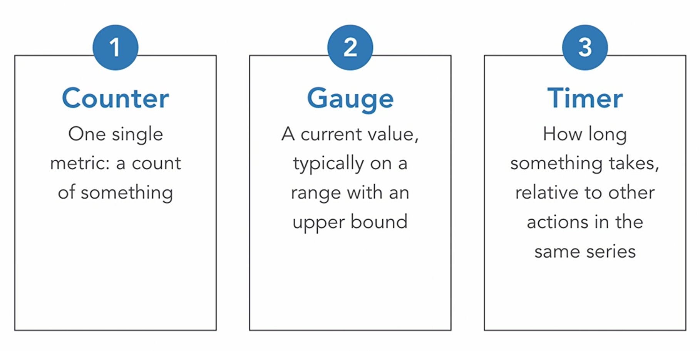

## Spring Performance Monitor Interceptor

- **Performance Monitor Interceptor**: It provides easy-to-configure targeted performance logging. It’s an aspect-oriented functionality within the org.spring.framework.AOP.interceptor package.
- **Integration**: The Performance Monitor Interceptor integrates seamlessly with Log4j or your existing logging infrastructure to track specific performance concerns unique to your application.
 - **Aspect-Oriented Solution**: The solution involves creating an aspect class that declares advices and pointcuts. An advice is a bit of externalized behavior, a pointcut is an expression that describes points in the execution of your application where you want advice to be applied.
 - **Application**: It’s useful when there’s a method or a service call that you want to track carefully or have some reason to be concerned about.

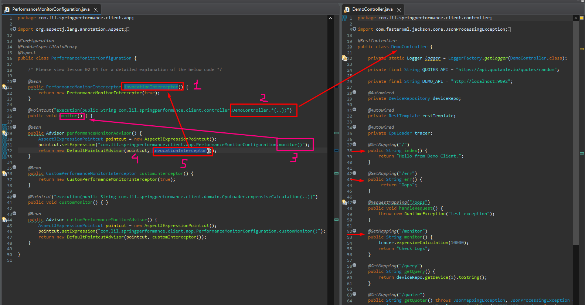

- **Pairing with Monitor Method**: The demo controller entry points are paired with a monitor method, which is linked to the performance monitor interceptor. This results in log outputs and generic timings for each endpoint invocation.
- **Stopwatch Instance**: Each endpoint invocation triggers the performance monitor interceptor, which initiates a stopwatch instance. This stopwatch measures the running time of the invoked method in nanoseconds.
- **Customization**: You can create a custom performance monitor interceptor. This custom class extends the abstract monitoring interceptor from the Spring framework’s AOP package.
- **Invoke Under Trace Method**: The custom class overrides the ‘invoke under trace’ method to capture additional metrics about the traced method. This customization requires some coding, which is not detailed in the selected text.

Documentation: [Aspect Oriented Programming with Spring :: Spring Framework](https://docs.spring.io/spring-framework/reference/core/aop.html)

### When to use Interceptors

Interceptors that can be applied before, after, or around method executions. Here are some scenarios where you might consider using it:

1. **Targeted Performance Logging**: If you need to log performance metrics for specific methods in your application.
2. **Aspect-Oriented Solutions**: If you're implementing aspect-oriented solutions, this interceptor can be used to declare advices and pointcuts.
3. **Intercepting Client Requests**: Spring Interceptors can be used to intercept client requests before they are handled by the controller. They can also be used to intercept the response before it is sent back to the client.
4. **Execution Chain Processing**: You can use this method to break or continue the processing of the execution chain.

However, it's important to note that target objects should not normally know about Spring AOP, as this creates a dependency on Spring API. Target objects should be plain POJOs (Plain Old Java Objects) as far as possible. If used, this interceptor will normally be the first in the interceptor chain. 

### Example of intercepting a client request

```java
@Configuration
public class RestClientConfig {
    @Bean
    public RestTemplate restTemplate() {
        RestTemplate restTemplate = new RestTemplate();
        List<ClientHttpRequestInterceptor> interceptors = restTemplate.getInterceptors();
        if (CollectionUtils.isEmpty(interceptors)) {
            interceptors = new ArrayList<>();
        }
        interceptors.add(new RestTemplateHeaderModifierInterceptor());
        restTemplate.setInterceptors(interceptors);
        return restTemplate;
    }
}

public class RestTemplateHeaderModifierInterceptor implements ClientHttpRequestInterceptor {
    @Override
    public ClientHttpResponse intercept(HttpRequest request, byte[] body, ClientHttpRequestExecution execution) throws IOException {
        ClientHttpResponse response = execution.execute(request, body);
        response.getHeaders().add("Internal Payment Gateway", "Payment");
        return response;
    }
}
```

In this example, `RestTemplateHeaderModifierInterceptor` is an interceptor that adds a custom header "<mark style="background: #FFF3A3A6;">Internal Payment Gateway</mark>" to every response. This interceptor will be invoked for every incoming request for a payment.

Interceptors are useful for several reasons:
1. **Cross-cutting concerns**: Interceptors are often used to implement cross-cutting concerns such as transaction management, security, or logging.
2. **Global application of logic**: Interceptors provide a quick and easy way to apply the same logic globally (or to a set of pages) without needing to mess around with individual controllers.
3. **Modifying requests and responses**: Interceptors allow you to modify requests and responses. For example, you can add or modify headers, or even deny the request based on certain conditions.
4. **Logging**: Interceptors can be used to log requests and responses for every HTTP request.

## AOP Performance

- **AOP vs OOP**: AOP introduces modularity into systems by means of the aspect, while Object-Oriented Programming (OOP) does so by means of the object.
- **Cross-Cutting Concerns**: <mark style="background: #FFF3A3A6;">AOP modularizes cross-cutting concerns like logging and security, which are important but can muddy up good OOP design</mark>.
- **Spring Framework and AOP**: The Spring framework simplifies the configuration of AOP behaviors using annotations. Spring practitioners often depend on the Spring AOP and/or the AspectJ libraries.
- **Weaving**: An AOP-aware system combines native code with aspect code to produce a running application, a process called weaving. Weaving can be done at compile time, post-compile time, or runtime.
- **Performance Concerns**: The overhead introduced by weaving is generally not a concern for most Spring applications, as per many academic studies on AOP.
  
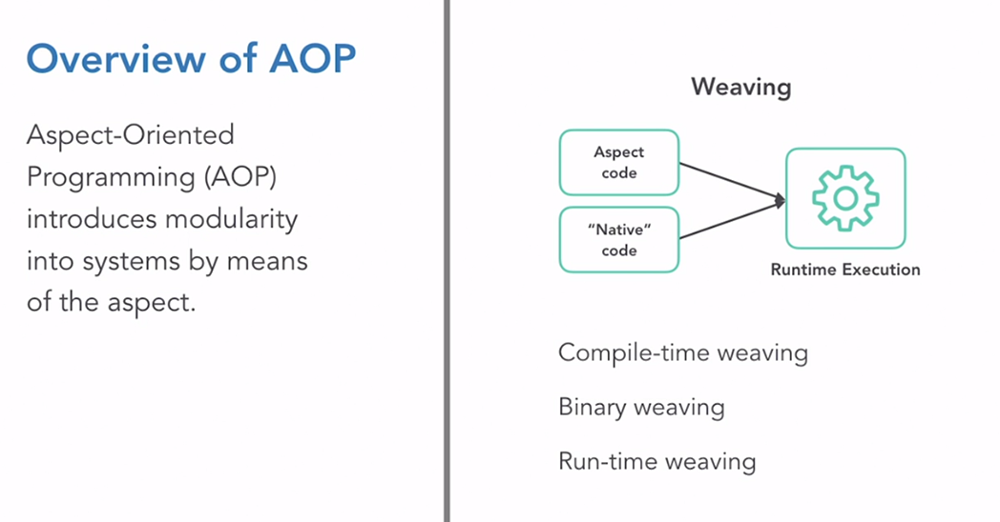

### Weaving in deep

Weaving is a crucial process in Aspect-Oriented Programming (AOP). It's the process where the aspect code (additional behavior) is combined with the main application code.

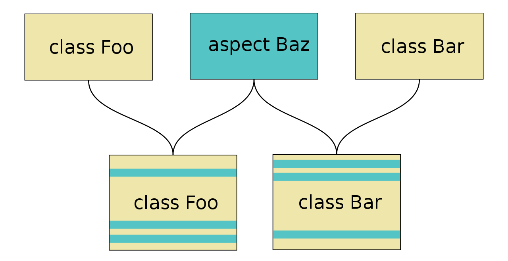

1. **Aspect Weaver**: An aspect weaver is a metaprogramming utility for aspect-oriented languages. It takes instructions specified by aspects (isolated representations of significant concepts in a program) and generates the final implementation code.

2. **Weaving Process**: The weaver integrates aspects into the locations specified by the software as a pre-compilation step. By merging aspects and classes (representations of the structure of entities in the program), the weaver generates a woven class.

3. **Advice, Pointcuts, and Join Points**: Aspect weavers take instructions known as advice specified through the use of pointcuts and join points, special segments of code that indicate what methods should be handled by aspect code. The implementation of the aspect then specifies whether the related code should be added before, after, or throughout the related methods.

4. **Weaving Time**: Weaving can be done at compile time, post-compile time, or runtime. Compile-time weaving modifies the byte code before the program runs. Post-compile weaving (also known as binary weaving) modifies the byte code after the program has been compiled but before it runs. Load-time weaving modifies the byte code as the program runs.

5. **Benefits of Weaving**: By doing this, aspect weavers improve modularity, keeping code in one place that would otherwise have been interspersed throughout various, unrelated classes. This ensures that any existing object-oriented code will still be valid aspect-oriented code and that development will feel like a natural extension of the object-oriented language.

Remember, the choice of using weaving and its type depends on your specific use case and requirements. Always consider the trade-offs in terms of complexity, maintainability, and performance.

- [Aspect weaver](https://en.wikipedia.org/wiki/Aspect_weaver)


### Important concepts

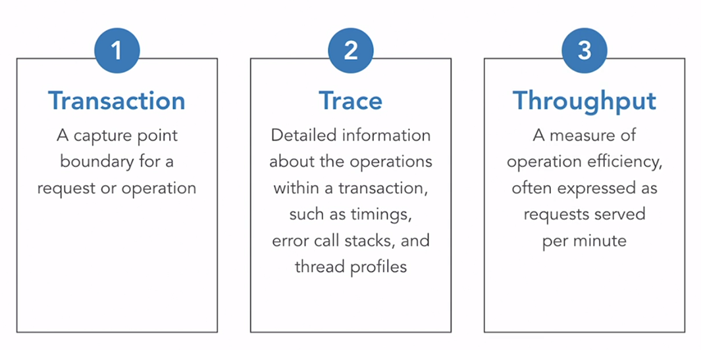

## Hibernate Performance

- **Hibernate**: It's a prevalent solution for connecting applications to data stores, allowing configuration-based mapping of database tables, rows, and columns directly to Java objects. This is known as Object-Relational Mapping (ORM).
- **Performance**: While Hibernate often performs well, the actual database interactions can become invisible and may not be fully understood by developers or support teams.
- **Connection Pooling**: This is a technique that saves the expense of making a new database connection every time data is needed. It maintains a pool of JDBC connections that an application can borrow from, use, and then return to the pool for reuse.
- **Pool Properties**: The size of the pool and the timeout of the connections are important properties to consider. Monitoring these metrics is crucial for maintaining a high-performing and resilient application.

### Connection pooling

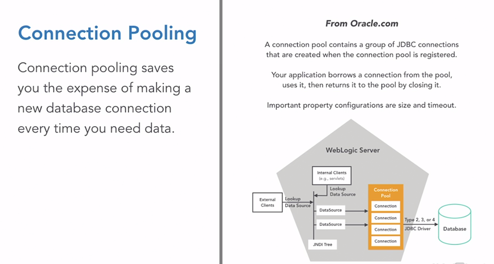


### Hibernate Caching

- **What is the second-level cache**: The second-level cache is a mechanism that allows JPA and Hibernate to store the entity loaded state array, which is an array of Java objects representing the entity attributes, in a cache that can be shared by multiple concurrent requests1.
- **Why use the second-level cache**: The second-level cache can help you improve the performance of your data access layer by reducing the query load on the database, especially for read-write transactions that need to be executed on the Primary node.
- **How the second-level cache works**: When fetching an entity, Hibernate first checks the first-level cache, which is bound to the current Thread. If the entity is not found there, Hibernate checks the second-level cache, which is enabled by configuration. If the entity is not found in the second-level cache either, Hibernate loads it from the database using an SQL query.
- **How to scale the second-level cache**: The second-level cache can be scaled by using a distributed system, such as Redis, to store the cached data. This way, the cache size is not limited by the memory of a single node, and the cache is not cold when new application nodes are added.

The JPA and Hibernate second-level cache - Vlad Mihalcea. https://vladmihalcea.com/jpa-hibernate-second-level-cache/.
The JPA and Hibernate first-level cache - Vlad Mihalcea. https://vladmihalcea.com/jpa-hibernate-first-level-cache/.


### Metrics in prometheus

 * Example: connection pool


 * Example: hibernate query execution:
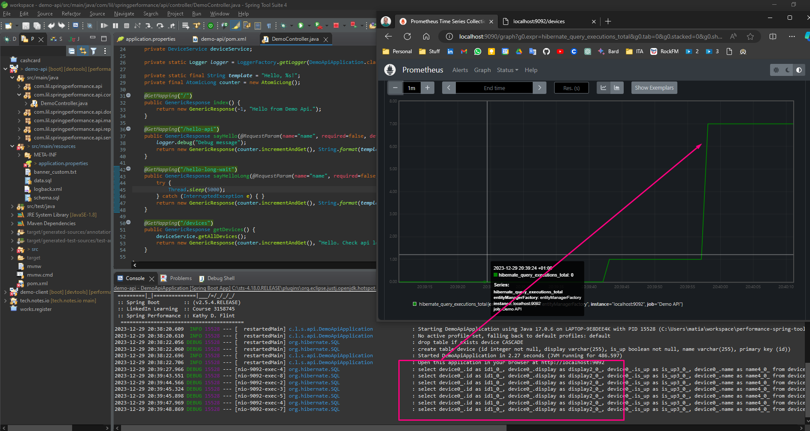

## Application StartUP time

- **Startup Activities**: Spring applications involve many activities during startup, including loading context and initializing beans. This can sometimes lead to slower startup times.
- **Impact of Long Startup Time**: A long startup time can hinder continuous integration and deployment automated testing. It can also be inconvenient for developers, especially when multiple restarts are required throughout the day.
- **Indicator of Bloated Dependencies**: A long startup time can indicate bloated dependencies in a Spring Boot application. It's important to keep an eye on startup time and remove unnecessary dependencies.
- **Observability**:  Once an application is deemed to take too long to start, it's crucial to understand what's happening under the hood to make decisions about streamlining processes.

In this example, we add a "BufferingApplicationStartup" class to the context of the spring project to get metrics:

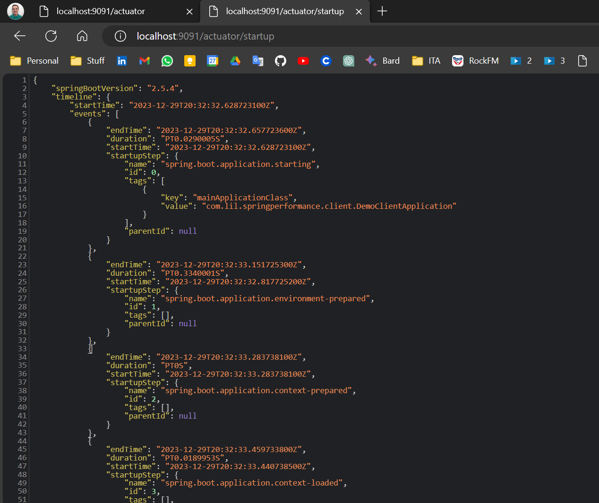

On this metrics we can filter by some criteria:

```java
public static void main(String[] args) {

AbstractApplicationContext context = new ClassPathXmlApplicationContext("/META-INF/spring/application.xml",

DemoClientApplication.class);

DemoProperties props = (DemoProperties) context.getBean("appProperties");

SpringApplication demoApplication = new SpringApplication(DemoClientApplication.class);

// Below lines require JVM parameters in order to run. This is covered in lesson

BufferingApplicationStartup bas = new BufferingApplicationStartup(10000);

// Adding FILTER
bas.addFilter(startupStep -> startupStep.getName().startsWith("spring.beans.instantiate"));

demoApplication.setApplicationStartup(bas);

demoApplication.run(args);

logger.info("Open this application in your browser at http://localhost:"

+ props.getRuntimeProperties().getProperty("server.port", ""));

demoManager = new DemoManager(props);

context.close();

}
```

### Java Flight Recorder

In this example we use the Flight Recorder functionality to record the Spring Boot Startup process and view its metrics in the Flight Recorder Application:

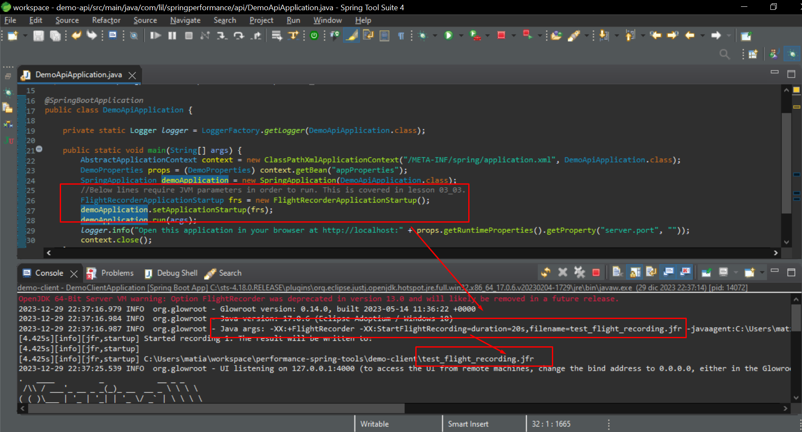

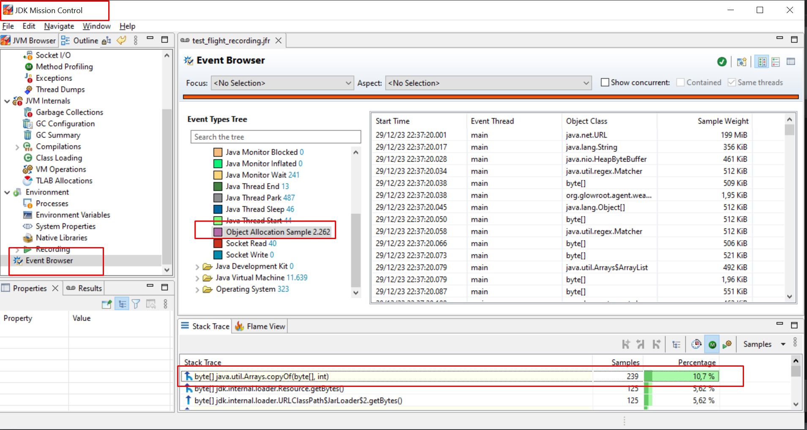

Blog with documentation: [Monitoring Java Applications with Flight Recorder | Baeldung](https://www.baeldung.com/java-flight-recorder-monitoring)


## Compiling a performance profile

- **Performance Measuring**: Gather all the evidence and procedures to generate the metrics.
- **Translating Skills into Action**: translate the metrics into action, making performance work a practical part of everyday development workflow.
- **Living Compilation of Metrics**: Teams are encouraged to generate and maintain a living compilation of metrics that are specific and useful to their application. This allows them to capture impactful decisions and decision trees, and surface the impacts of those decisions to their performance over time.
- **Narrowing Down Metrics**: One of the challenges is narrowing down the field of possible things to measure, to things that are useful and relevant.
- **Describing Application**: The first step is to describe your application in words, and also as a component diagram. This prepares you to identify the essential performance impacting parts of your system.

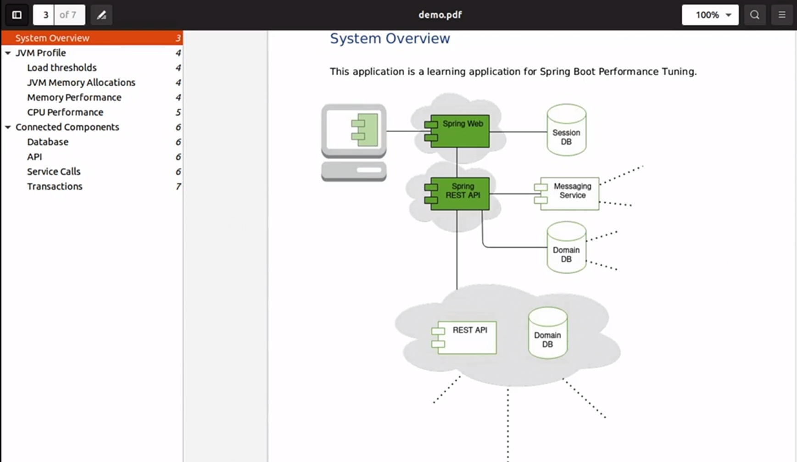

- **Breaking Out Metrics**: Once that step is done, metrics are suggested to be broken out into two categories: JVM metrics, and connected components. This is where the specifics of your Spring application become very relevant.
- **Describing the loads** under which you need to operate. If these conversations have not yet taken place with your stakeholders in an official way, make some good guesses. Don't let this lack of direction or information stop you from taking the first steps to organizing your profile. 

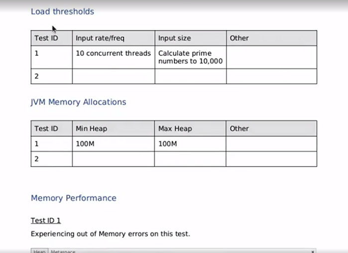

 - **Capture a baseline set of metrics**. Basic metrics are okay to start with. In this example, we took a baseline load test, 10 concurrent threads, calculating prime numbers to 10,000, and snagged a screenshot of JVM performance, JVM memory, CPU performance, and also key indicators of our database and service calls, and transaction metrics. 

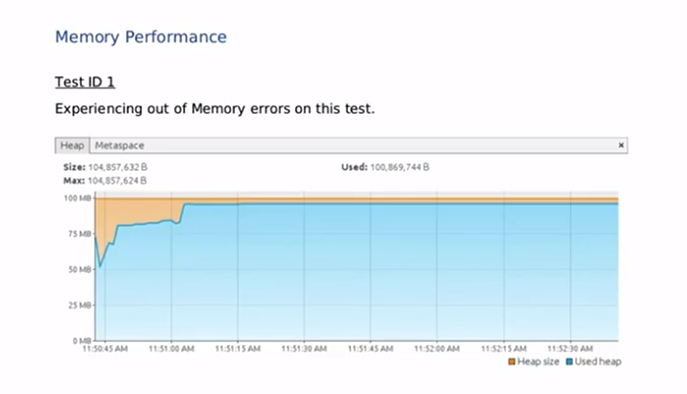)

 - **Identify and communicate** areas in need of attention, such as our memory issues, or we can expand our test scenarios to cover a wider range of conditions. The main point here is to start simple and go from there.

## Presenting your Work

- **Importance of Presentation**: No matter what stage of your career you are in, presenting your work is an important part of the life of any developer.
- **Challenges**: Communication is hard work, and application performance is a nuanced, multi-faceted discipline dependent on many variables.
- **Four Principles**: 
    - **Avoid Technical Jargon**: Use simple language that gets the point across quickly and keeps the audience engaged.
    - **Use Visuals**: Utilize pictures and graphs as much as possible to aid in your presentations.
    - **Summarize and Go Deeper**: Start with a summary of what's important and be prepared to delve into more details if necessary.
    - **Explain Trade-offs**: Equip your audience to ask more questions by explaining the trade-offs of different solutions. 

This recommendations are particularly useful for formal and semi-formal events such as iteration demos or architectural reviews.

---

<a name="03"></a>
# Spring Boot Observability: Deep Dive into Logging, Metrics, and Tracing

---

<a name="04"></a>
# Advanced Spring: Spring Boot Actuator

---

<a name="05"></a>
# Advanced Spring: Application Events


<a name="06"></a>
# Advanced Spring: Effective Integration Testing with Spring Boot