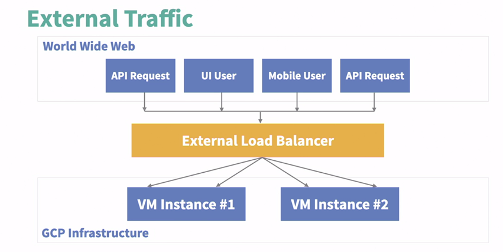
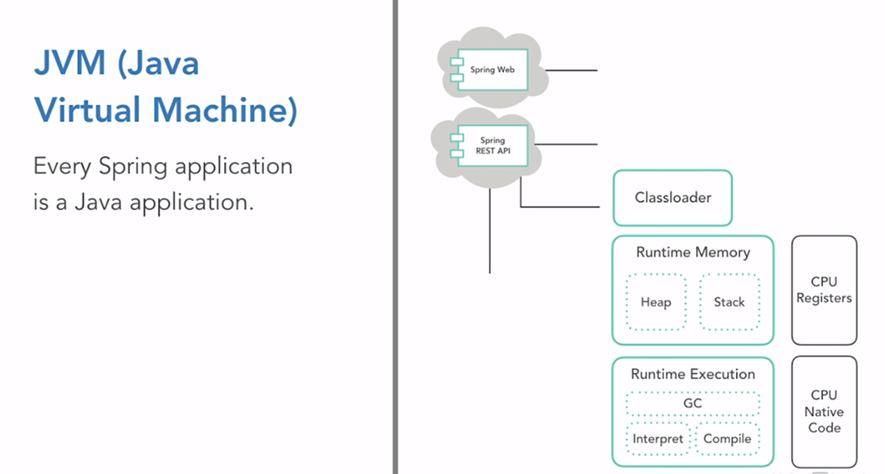
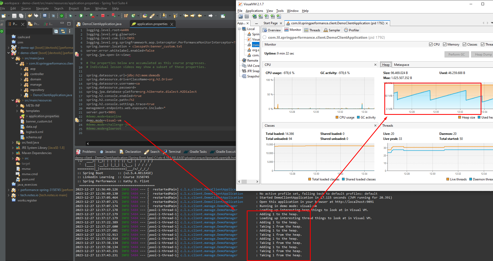
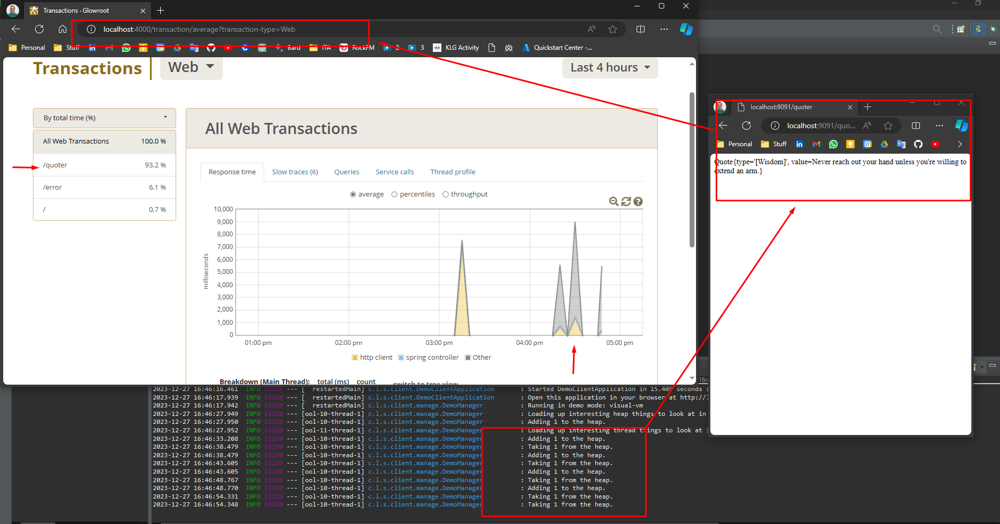
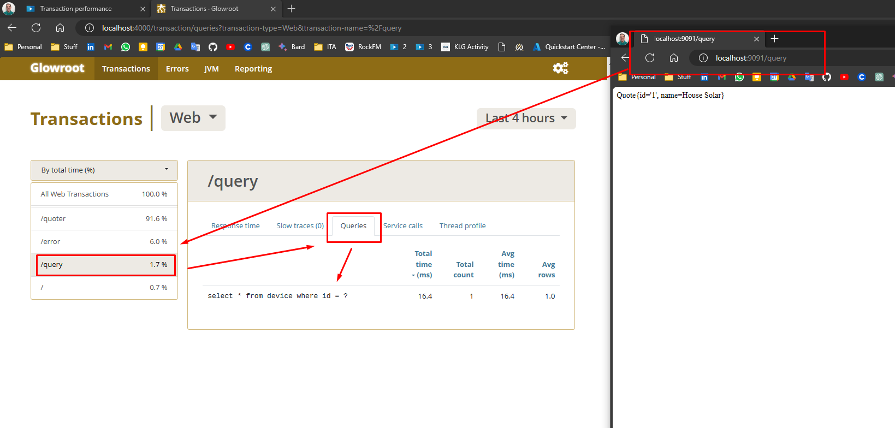
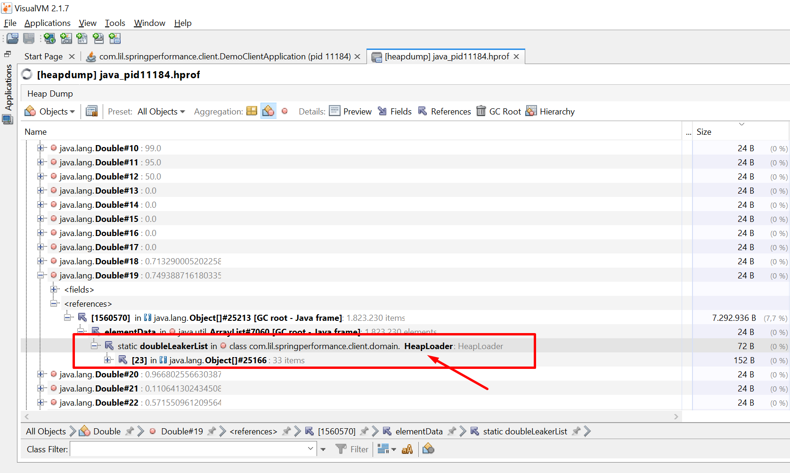
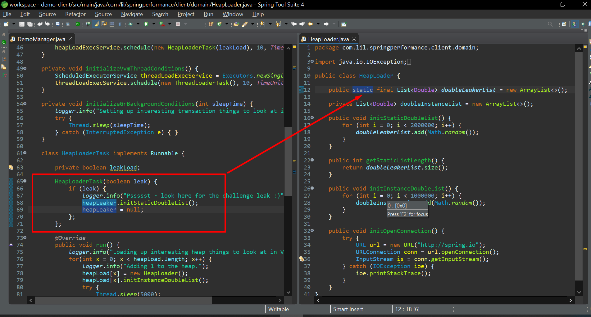
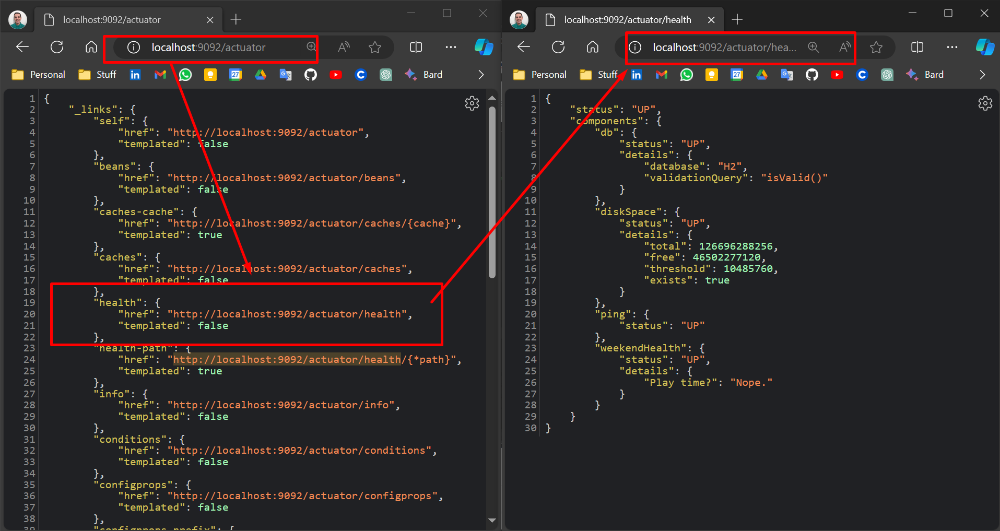

## Advance Your Spring Development Skills

<style>
  .back-button {
    background-color: #4CAF50; /* Green */
    border: none;
    color: white;
    padding: 15px 32px;
    text-align: center;
    text-decoration: none;
    display: inline-block;
    font-size: 16px;
    margin: 4px 2px;
    cursor: pointer;
  }
</style>

<button class="back-button" onclick="window.location.href='https://matiaspakua.github.io/tech.notes.io'">All notes</button>

This are the notes for the 6 courses Specialization PATH on Linkedin Learning.

## Table of Content

1. [Spring Cloud Load Balancing](#01)
2. [Performance Tuning in Spring Apps](#02)
3. [Spring Boot Observability: Deep Dive into Logging, Metrics, and Tracing](#03)
4. [Advanced Spring: Spring Boot Actuator](#04)
5. [Advanced Spring: Application Events](#05)
6. [Advanced Spring: Effective Integration Testing with Spring Boot](#06)

---
<a name="01"></a>
# Spring Cloud Load Balancing

## Introduction

In software engineering, **Load Balancing** is the practice of <mark style="background: #FFF3A3A6;">distributing</mark> computational workloads across multiple servers. This process ensures that no single server bears too much demand. By spreading the work evenly, load balancing improves application responsiveness. It also increases the <mark style="background: #FFF3A3A6;">availability</mark> of applications and websites for users. Load balancers evaluate client requests by examining application-level characteristics (the IP address, the HTTP header, and the contents of the request). The load balancer then looks at the servers and determines which server to send the request to.

Load balancing has a significant impact on **user experience**. By dividing user requests among multiple servers, user wait time is vastly cut down. This results in a better user experience. Long page load times, and poor response times to user actions, create a bad user experience. Waiting for content to load becomes frustrating for users and may provoke them into leaving the site or application altogether. Load balancers handle traffic spikes by moving data efficiently, optimizing application delivery resource usage, and preventing server overloads. That way, the website performance stays high, and users remain satisfied.

With Google Cloud Platform (GCP), load balancing is a software cloud-based offering to automatically facilitate shift of traffic from one instance to another when traffic or load is increased.

- GCP has eight load balancer offerings that vary by flow of traffic, traffic type, and global or regional support.
- **Flow of traffic** can be external (from the internet) or internal (from within the network).



- **Traffic type** can be HTTP, HTTPS, TCP, or UDP.
- **Global or regional** support means whether the load balancer can route traffic to instances in different regions or only in one region.


Google Cloud Platform (GCP) offer two types of internal load balancers:

- **Internal TCP and UDP Load Balancer**: This type is ideal for serving TCP traffic, which is suitable for data that needs to be retransmitted if dropped, like photos. It also serves UDP traffic, which is ideal for video streaming.

- **Internal HTTP and HTTPS Load Balancer**: This type serves HTTP and HTTPS traffic, which is typically seen with Java backend APIs.

Both load balancers are internal, meaning they serve traffic between internal instances and not from the external internet. They are assigned an internal IP address used for internal instances or clients to forward traffic to. Both types only support instances deployed in a single region. The choice between the two depends on the type of traffic and the application's requirements.

## External Load Balancer

- **External TCP/UDP Network Load Balancer**: Supports network traffic for TCP, UDP, ESP, and ICMP. It's a regional load balancer, ideal for instances in one region expecting external TCP, UDP, ESP, or ICMP type traffic.
- **TCP Proxy Balancer**: Distributes TCP traffic from the external internet across regional or global instances. It proxies TCP traffic, meaning it creates two connections - one from the client to the load balancer, and another from the load balancer to the instance.
- **SSL Proxy Load Balancer**: Similar to the TCP Proxy, but serves encrypted or secure SSL traffic instead.

 - **Documentation**: [Cloud Load Balancing overview  |  Google Cloud](https://cloud.google.com/load-balancing/docs/load-balancing-overview)


<a name="02"></a>
# Performance Tuning in Spring Apps

## Introduction

Repository: [Performance Tuning in Spring Apps](https://github.com/matiaspakua/performance-spring-tools))

Tools: 
 * VisualVM: [VisualVM: Download](https://visualvm.github.io/download.html)
 * Java Flight Recorder (JDK mission control)
 * Glowroot: [Glowroot](https://glowroot.org/)
 * Prometheus: [Prometheus - Monitoring system & time series database](https://prometheus.io/)


IMPORTANT: to run the project, a link to the quoting service must be updated according to: https://github.com/spring-guides/gs-consuming-rest/issues/47#issuecomment-1079698023


## Understanding Performance

The big question: "<mark style="background: #FFF3A3A6;">How does your application perform?</mark>"

The selected text discusses the importance of understanding performance in Spring-based applications. Here are the key points:

- Understanding performance is crucial for Spring developers. It involves deconstructing and understanding the complexity of the question, “How does your application perform?”.
- As a Spring developer, you likely have direct influence only over a small portion of your application, mainly the Java components.
- It’s important to understand how to manage and measure the runtime JVM performance of your Java Spring project. Proficiency with JVM profiling and runtime parameters is an essential part of a Spring developer’s toolkit.
- The Spring framework provides internal performance reporting metrics that allow a developer to gain more Spring specific insights into their application. These topics will be addressed in other portions of the course.




 * **Performance Measurement**: It’s crucial to measure and make informed runtime configurations based on the anticipated performance of the systems your application depends on.
 * **Infrastructure Understanding**: A Spring developer often has limited control over the virtual and physical infrastructure that the application is deployed on, and the networks it communicates over.
 * **Resource Management**: Boosting the computing resources that host your application can enhance its performance. However, it’s essential to understand what your application needs in terms of computing resources.
 * **Performance Profiling**: An accurate and holistic understanding of your application’s performance profile is the ultimate goal. This knowledge allows you to explain, improve, and extend the resilience of your application over its entire life cycle. 



## JVM Perfomance


 * **JVM Performance**: Understanding JVM performance is crucial for a Spring developer. The JVM is complex but approachable, and even basic knowledge can be beneficial.
 * **Heap Performance**: The heap holds all objects in your application. Memory management and garbage collection occur here. You can influence heap behavior by setting max and min heap sizes.
 * **CPU Performance**: This refers to the use of the host computer’s processing resources to execute your Java code. While developers have limited influence over CPU performance, understanding your needs and limitations can help make informed decisions about application design.
 * **VisualVM Tool**: This tool is used to gain insight into an application and explore heap and CPU performance. It is bundled with JDK through Java 8 and is also available as a standalone download from a GitHub-hosted site.


## Transaction Profiling

- **Application Runtime Monitoring**: This is a type of monitoring that provides a holistic view of your application’s performance. It offers insights into the transactions between your Java application and the external systems it depends on.
 
- **Transactions**: These could be HTTP requests to APIs, database performances, or other service calls like to messaging platforms.

- **Alerting**: This is another feature of application runtime monitoring frameworks.

- **Glowroot**: An open-source Application Performance Monitoring (APM) solution that is easy to run locally. It’s a useful tool for understanding the possibilities for APM monitoring and what you can learn about your application’s performance. A demonstration of the application using Glowroot is mentioned to provide insight into its performance.

 * Example of typical Glowroot dashboard:



 * Example of a Query details:



## Challenge JVM OutOfMemory

To start, we need to confgure the proper profile in the Run SpringBootApp:

*  application.properties: "demo.mode=challenge-jvm"

Then, modify the run configuration for the JVM to change the heap size and do a Heap Dump for further analysis:

```bash
-Xmx100M 
-Xms100M
-XX:+HeapDumpOnOutOfMemoryError
-javaagent:C:\Users\matia\workspace\perf_tools\glowroot\glowroot.jar
```

After the application crashes, a memory dump is generated and we can open and analyze it with the VisualVM tool:


Heap Analysis:



Code:




## Spring Actuators

Spring Boot Actuator is a sub-project of the Spring Boot Framework. It brings production-ready features to our application. The main benefit of using this library is that we get health and monitoring metrics from production-ready applications. 

Here are some key points about Spring Boot Actuator:

- **Operational Information**: The actuator mainly exposes operational information about the running application — health, metrics, info, dump, env, etc. It uses HTTP endpoints or JMX beans to enable us to interact with it.

- **Endpoints**: Once this dependency is on the classpath, several endpoints are available for us out of the box. As with most Spring modules, we can easily configure or extend it in many ways.

- **Production-Grade Tools**: With Actuator, you can get production-grade tools without having to actually implement these features yourself. You can expose detailed information about the running application, for example, its health, detailed metrics, JVM dump, environment variables, etc.

- **Getting Started**: To enable the Spring Boot Actuator, you need to add the `spring-boot-actuator` dependency to your package manager. Here is how you can do it in Maven:


    ```xml
    <dependency>
        <groupId> org.springframework.boot </groupId>
        <artifactId> spring-boot-starter-actuator </artifactId>
    </dependency>
    ```

- **Spring Boot 2.x Actuator**: In 2.x, the Actuator keeps its fundamental intent but simplifies its model, extends its capabilities, and incorporates better defaults. This version becomes technology-agnostic. It also simplifies its security model by merging it with the application one. The latest version now supports the CRUD model as opposed to the old read/write model.

In essence, the Spring Boot Actuator is used for monitoring our app, gathering metrics, and understanding traffic or the state of our database. It becomes trivial with this dependency.

 Spring Boot Actuator: Production-ready Features. https://docs.spring.io/spring-boot/docs/2.5.6/reference/html/actuator.html.



To enable and disabled this configuration, go to the "application.properties" and add:

```bash
management.endpoints.web.exposure.include=*
management.endpoints.jmx.exposure.include=*
management.endpoint.health.show-details=always
management.endpoint.health.show-components=always
management.endpoint.health.status.order=out-of-service,down,up
```

<a name="03"></a>
# Spring Boot Observability: Deep Dive into Logging, Metrics, and Tracing


<a name="04"></a>
# Advanced Spring: Spring Boot Actuator


<a name="05"></a>
# Advanced Spring: Application Events


<a name="06"></a>
# Advanced Spring: Effective Integration Testing with Spring Boot