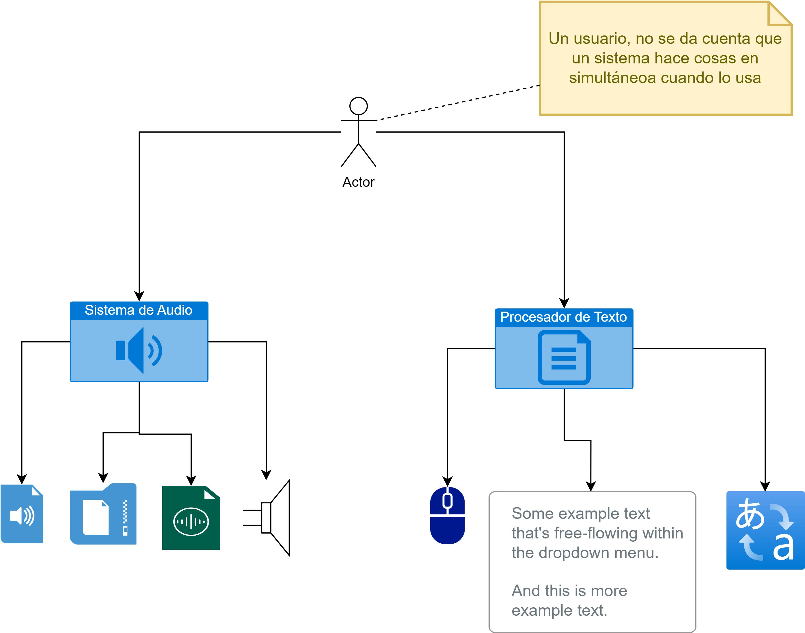

# Concurrencia en Java

<button class="back-button" onclick="window.location.href='https://matiaspakua.github.io/tech.notes.io'">All notes</button>

---

## Que es la concurrencia?

Los usuarios de ordenadores dan por sentado que sus sistemas pueden hacer más de una cosa a la vez. Suponen que pueden seguir trabajando en un procesador de textos mientras otras aplicaciones descargan archivos, gestionan la cola de impresión y transmiten audio. Incluso <mark style="background: #FFF3A3A6;">se espera que una sola aplicación haga más de una cosa a la vez.</mark> Por ejemplo, esa aplicación de transmisión de audio debe leer simultáneamente el audio digital de la red, descomprimirlo, gestionar la reproducción y actualizar su pantalla. Incluso el procesador de textos debería estar siempre preparado para responder a los eventos del teclado y del ratón, sin importar lo ocupado que esté reformateando el texto o actualizando la pantalla. El software que puede hacer estas cosas se conoce como<mark style="background: #BBFABBA6;"> software concurrente</mark>.

## Procesos e hilos

En la programación concurrente, hay dos unidades básicas de ejecución: procesos e hilos. En el lenguaje de programación Java, la programación concurrente se ocupa principalmente de los hilos. Sin embargo, los procesos también son importantes.

Un sistema informático normalmente tiene muchos procesos e hilos activos. Esto es así incluso en sistemas que solo tienen un único núcleo de ejecución y, por lo tanto, solo tienen un hilo ejecutándose en un momento dado. El tiempo de procesamiento de un solo núcleo se comparte entre los procesos e hilos a través de una característica del sistema operativo llamada <mark style="background: #FFF3A3A6;">división de tiempo (time slicing)</mark>.

Cada vez es más común que los sistemas informáticos tengan varios procesadores o procesadores con varios núcleos de ejecución. Esto mejora enormemente la capacidad de un sistema para la ejecución concurrente de procesos e hilos, pero la concurrencia es posible incluso en sistemas simples, sin varios procesadores o núcleos de ejecución.

## Procesos

Un proceso tiene un <mark style="background: #BBFABBA6;">entorno de ejecución autónomo.</mark> Un proceso generalmente tiene un conjunto completo y privado de recursos básicos de tiempo de ejecución; en particular, cada proceso tiene su propio espacio de memoria.

Los procesos suelen considerarse sinónimos de programas o aplicaciones. Sin embargo, lo que el usuario ve como una única aplicación puede ser en realidad un conjunto de procesos cooperativos. Para facilitar la comunicación entre procesos, la mayoría de los sistemas operativos admiten <mark style="background: #FFF3A3A6;">recursos de comunicación entre procesos (IPC</mark>), como tuberías y conectores. Los  **IPC** se utiliza no solo para la comunicación entre procesos del mismo sistema, sino también para procesos de diferentes sistemas.

La mayoría de las implementaciones de la máquina virtual Java se ejecutan como un único proceso. Una aplicación Java puede crear procesos adicionales utilizando un objeto **ProcessBuilder**.

## Hilos

A veces, los hilos se denominan procesos ligeros. Tanto los procesos como los hilos proporcionan un entorno de ejecución, pero la creación de un nuevo hilo requiere menos recursos que la creación de un nuevo proceso.

Los <mark style="background: #FFF3A3A6;">hilos existen dentro de un proceso</mark>: cada proceso tiene al menos uno. Los hilos comparten los recursos del proceso, incluida la memoria y los archivos abiertos. Esto permite una comunicación eficiente, pero potencialmente problemática.

La ejecución multiproceso es una característica esencial de la plataforma Java. Cada aplicación tiene al menos un hilo, o varios, si se cuentan los hilos del "sistema" que hacen cosas como la gestión de la memoria y el manejo de señales. Pero desde el punto de vista del programador de aplicaciones, se comienza con un solo hilo, llamado hilo principal. Este hilo tiene la capacidad de crear hilos adicionales, como demostraremos en la siguiente sección.

## Acceso a Memoria en java y sus problemas

- **Modelo de memoria Java**: Los subprocesos en Java tienen su propia memoria del **stack**, pero comparten la memoria del **heap**. El **stack** contiene variables locales y de referencia, mientras que el **heap** contiene objetos.
- **Data Race**: cuando varios subprocesos acceden a datos compartidos simultáneamente, puede dar lugar a incoherencias, lo que se conoce como carrera de datos.
- **Race Condition**: La falta de un orden de ejecución garantizado entre subprocesos puede causar resultados inesperados, especialmente con operaciones no atómicas como .

# Referencias

 - [Lesson: Concurrency (The Java™ Tutorials > Essential Java Classes) (oracle.com)](https://docs.oracle.com/javase/tutorial/essential/concurrency/)
 - [JobRunr](https://github.com/jobrunr/jobrunr?tab=readme-ov-file) / [Official Web](https://www.jobrunr.io/en/)
 - [Java Concurrency Video Tutorial](https://www.youtube.com/playlist?list=PLL8woMHwr36EDxjUoCzboZjedsnhLP1j4)
