## Getting Started In Spring Development

<style>
  .back-button {
    background-color: #4CAF50; /* Green */
    border: none;
    color: white;
    padding: 15px 32px;
    text-align: center;
    text-decoration: none;
    display: inline-block;
    font-size: 16px;
    margin: 4px 2px;
    cursor: pointer;
  }
</style>

<button class="back-button" onclick="window.location.href='https://matiaspakua.github.io/tech.notes.io'">All notes</button>

This are the notes for the 6 courses Specialization PATH on Linkedin Learning.

## Table of Content

1. [Learning Spring with Spring Boot](#01)
2. [Creating your First Spring Boot Microservice](#02)
3. [Extending, Securing and Dockerizing Spring Boot Microservices](#03)
4. [Spring DATA](#04)
5. [Spring Security](#05)
6. [Building Full-Stack Apps with React and Spring](#06)
7. [Example project: Card Cash Application Spring training](#07)

---
<a name="01"></a>
# 01. Learning Spring with Spring Boot

The Spring framework is built and designed such that it provides <mark style="background: #FFF3A3A6;">comprehensive support</mark> for developing applications for the JVM, including abstractions for some of the most powerful and common enterprise systems integrations, specifically around common infrastructure. 

<mark style="background: #FFF3A3A6;">Spring essentially is designed to provide the plumbing</mark> for using these enterprise offerings and common components used in both internet and enterprise application development. This plumbing allows you to easily consume these offerings while focusing on your business logic, instead of the copy paste scaffolding code to use these integrations that many developers rely on. 

Spring is designed using solid Object Oriented Programming practices and its style promotes you to do the same thing when consuming the framework. Things like <mark style="background: #FFF3A3A6;">coding to an interface</mark>, instead of an implementation are paramount in Spring. 

Now, back to the plumbing idea, Spring promotes <mark style="background: #FFF3A3A6;">Don't Repeat Yourself or DRY principles</mark> by leveraging the powerful abstractions of the framework instead of rebuilding the scaffolding over and over again, you reduce your risk of copy paste errors, and instead focus on the actual needs of your application. 

**POJO or Plain old Java Object**. In Spring, this is any class file that contains both attributes and methods. And those methods are not just getters and setters. This is a common deviation for many Java developers who often concern the concept of POJO with Java Beans. In the Spring world we take the more correct definition of a POJO. 

**Java Beans**. These two are POJOs in practice, but they're only methods are accessor methods, often called getters and setters. This definition is heavily used when using EJBs, for instance. Spring Beans, however, are POJOs that are configured and managed by the application context. 

**DTOs, or Data Transfer Objects** are Java Beans with the specific purpose of moving state between logical layers of your application. There are times when you don't want to expose the details of your working classes and instead translate to a DTO, which often is written as an immutable object before setting the state data out of the logical layer. 

**Inversion of Control** is a central pattern to the Spring framework and, in fact, much of Spring is built around the central design pattern. It can be said that if you fully understand how Spring utilizes IoC, you understand Spring fully. Inversion of Control provides a mechanism for dependency injection, however, it's more than just dependency injection because with Spring's use of Inversion of Control, the framework itself controls all operations of the lifecycle of those dependencies, not just the injection. 

**The Application Context** <mark style="background: #FFF3A3A6;">wraps the Bean Factory</mark>, which is the Inversion of Control container itself. The Bean Factory serves the Beans during runtime of your application. Now we, as users and developers, never really interact with the IoC container itself. Instead we interact with its wrapper or the application context. There are several implementations of the application context itself.

One of the most powerful aspects of Spring Boot is that it provides <mark style="background: #FFF3A3A6;">auto-configuration</mark> of the application context so that you, as the developer, can leverage simple properties and conventions to configure the Beans loaded into the Bean Factory and used by the IoC container. 

More information in: [spring_framework_notes](spring_framework_notes.md)


## Annotations

- **<mark style="background: #FFF3A3A6;">Annotations</mark>** are a core component of the Java language and are used to provide metadata for code.
- Spring uses annotations to provide **additional functionality** to code, often through proxy classes.
- Proxy classes are created by Spring and provide the added behavior, such as transaction management or security.
- Annotations are also used for **component scanning**, which allows Spring to automatically detect and configure beans.
- When calling methods on a proxy class, the proxy behavior is applied.
- Private method calls and class local method calls are not proxied, so the proxy behavior does not apply to them.

Here are some additional points to note:

- **Annotations are a powerful way to extend the Spring framework.**
- **Annotations are widely used in Spring applications.**
- **It is important to be aware of how annotations work in order to use them effectively.**

## Data Access

* Spring Data is a framework that <mark style="background: #FFF3A3A6;">simplifies data access</mark> in Java applications using the repository pattern and JPA.
* It provides a common set of interfaces based on JPA that automatically generate data access behavior.
* You can still use raw JDBC code if needed, but it is not recommended.
* Spring Data is useful for <mark style="background: #FFF3A3A6;">removing boilerplate code</mark>, reducing data access complexity, and making data migration easier.
* The key components of Spring Data are the repository interface, the entity object, and the data source.
* The repository interface provides CRUD methods for data access.
* The entity object is the data transfer object (DTO) for the data layer.
* The data source is the connection to the database.
* Spring Data can use local or embedded data sources for prototyping and then switch to a production data source.
* Spring Data makes it easier to focus on business logic rather than data access code.

For testing purposes you can use embedded database such as H2 o if you are in production, a remote database. Everything can be easy configure thought properties in Spring Data.

## Service Tier 

### IoC (inversion of control)

* IoC (Inversion of Control) is a design pattern that allows a program to request the creation of objects from an external factory rather than creating them itself.
* Spring <mark style="background: #FFF3A3A6;">uses IoC to manage the lifecycle of objects</mark> and their dependencies.
* When using Spring, a developer only has access to the application context, not the raw BeanFactory.
* The BeanFactory is the component of Spring that manages the **lifecycle of beans**.
* The BeanFactory starts up by creating an initialization method for each bean and registering it.
* Spring then builds a graph of the dependencies between beans and constructs them in the order they are needed.
* **IMPORTANT**: <mark style="background: #FFB86CA6;">Singleton instances</mark> of beans are created and injected into other beans as needed.
* Spring maintains the lifecycle of beans from start to finish.
* **Thread safety** is important when using Spring, as Singleton instances of beans are shared between threads.
* The BeanFactory is not typically used directly by developers, as the application context provides a higher-level abstraction.

## API and Controllers

* The MVC (Model-View-Controller) pattern is a common pattern for web application development.
* The model contains all of the dynamic data for the page.
* The view is the visual display that is populated from the model.
* The controller is the logic portion of the MVC pattern.
* The controller takes the initial web request, assembles the model, and selects the view.
* Spring does not provide a template engine for you as a default selection.
* Spring supports several template engines, such as Thymeleaf.
* A Spring controller is a Spring bean that defines the methods that will handle web requests.
* The controller can respond with a view or raw data.
* The controller is the entry point for the web call itself as far as the code that you write.

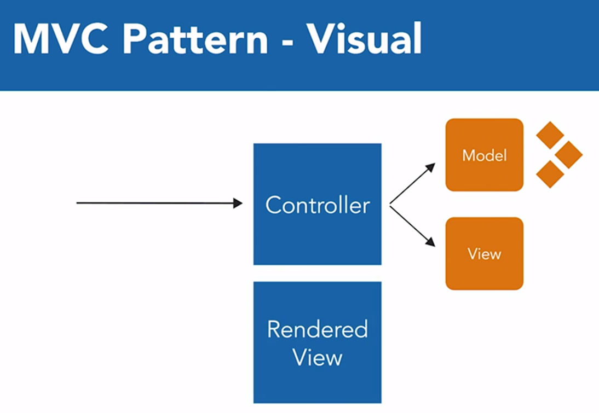

## Exposing REST endpoints

* Spring has a specialized controller called @RestController for creating RESTful web services.
* @RestController is a stereotype of controller that adds response body to each method that exposes a request mapping.
* Spring uses controllers in general for all RESTful web service endpoints.
* The view is the JSON payload by default in RESTful web services.
* Spring does all of the marshaling and unmarshaling for you into a JSON object or from JSON into a Java object.
* You can convert JSON to XML or other content types with appropriate marshaling on the configuration of the application context.
* Spring can even respond to the accepts header if you need to support multiple content types within your application.
* Writing RESTful web services using Spring and Spring Boot is very straightforward.

---
<a name="02"></a>
# 02. Creating your First Spring Boot Microservice

- Setting up the project
- Building, deploying, and launching the microservice
- Declaring Spring Data JPA repository interfaces
- Invoking repositories
- Using Spring Data query methods
- Exposing RESTful APIs with Spring Data REST
- Using the /search resource to invoke query methods
- Paging and sorting
- Declaring a new RESTController
- Creating HTTP methods for updating and deleting data
- Migrating microservices to a MongoDB repository

---
<a name="03"></a>
# 03. Extending, Securing and Dockerizing Spring Boot Microservices

* Enhancing a Spring Boot microservice
* Hardening the microservice
* Configuring security with JSON web tokens
* Leveraging Docker for MySQL database access
* Dockerizing your microservice

---
<a name="04"></a>
# 04. Spring DATA

### Repository Code

Link: [This repo is for the Linkedin Learning course: Spring: Spring Data 2](https://github.com/LinkedInLearning/spring-spring-data-2-2508603)

## Mission and modules

Hibernate eliminated manually mapping logical objects to physical databases, asynchronous JavaScript and XML. Also known as Ajax. Websites


More than an inversion of control framework, Spring now comprises a vast collection of enterprise solutions. One of the solutions is the Spring Data Project. <mark style="background: #FFF3A3A6;">Spring Data's mission is to provide a familiar, and consistent Spring-based programming model for data access while still retaining the special traits of the underlying data store</mark>. 

**Spring Data** is actually an umbrella of several sub-projects. There are several modules, and they all specialize in various data sources, but they all depend on commons. <mark style="background: #FFF3A3A6;">Commons</mark> abstracts away from any particular data source. No matter which data source, the goal is always the same. Have a way to convert Java object entities into target data source records and persist them, as well as convert the records back to entities. It can create entities which are then persisted as records to the data store. It can look up data source records by citing the entity attributes. It can update data source records by updating the entity and finally, delete the data source records by deleting the entity. 

**The repository pattern** is an abstraction that is used by Spring Data Commons to accomplish these goals. It is followed throughout the Spring Data Project for creating, reading, updating, and deleting records by citing entities. A module for a particular data source has a repository that extends from the base one. So for example, Spring Data JPA, has a JPA repository. Spring Data MongoDB has a Mongo repository. Spring Data GemFire has a GemFire repository, and so on. Spring Data JPA is the most popular module. 

## CRUD Repository and JPA Repository

In Spring Data, both `CrudRepository` and `JpaRepository` are interfaces that provide convenient methods for performing CRUD (Create, Read, Update, Delete) operations on entities. However, there are subtle differences between them.

1. **`CrudRepository` Interface:**
    
    - **Role:** This is the most basic repository interface in Spring Data.
    - **Key Methods:**
        - `save(S entity)`: Saves the given entity.
        - `findById(ID id)`: Retrieves an entity by its ID.
        - `findAll()`: Returns all entities.
        - `deleteById(ID id)`: Deletes an entity by its ID.
    - **Usage:** Suitable for basic CRUD operations.

2. **`JpaRepository` Interface:**
    
    - **Extension of `CrudRepository`:** `JpaRepository` extends `CrudRepository` and adds additional JPA-specific methods.
    - **Key Methods (In addition to `CrudRepository`):**
        - `getOne(ID id)`: Returns a reference to the entity with the given identifier. (Lazily loaded)
        - `findAll(Sort sort)`: Returns all entities sorted by the given options.
        - `flush()`: Flushes the persistence context, ensuring changes are synchronized with the database.
    - **Usage:** Preferred when working with JPA (Java Persistence API) as it provides JPA-specific features.

**Key Differences:**

- **Additional Methods:** `JpaRepository` includes additional methods specific to JPA, like `getOne` and `flush`.
- **Suitability:** `CrudRepository` is more general-purpose, while `JpaRepository` is tailored for JPA-related scenarios.
- **Lazy Loading:** `getOne` in `JpaRepository` returns a reference to the entity that is lazily loaded, which can be useful in certain situations.

**Choosing Between Them:**

- If you need basic CRUD operations and want to stay agnostic to the underlying persistence technology, you can use `CrudRepository`.
- If you are specifically working with JPA and want access to JPA-specific methods, `JpaRepository` is a better choice.

But, beside all this, be aware of the Anti-Patterns: [The Spring Data JPA findById Anti-Pattern - Vlad Mihalcea](https://vladmihalcea.com/spring-data-jpa-findbyid/))

## Property expression query methods

**Query method** refers to a method signature in a Spring Data repository interface that follows a specific naming convention. Spring Data uses these method names to automatically generate queries based on the method's name, allowing you to perform database operations without writing explicit queries.

The naming convention for query methods is derived from the method name itself, and Spring Data JPA translates it into a corresponding SQL or JPQL query. This mechanism is often referred to as "<mark style="background: #FFF3A3A6;">query derivation.</mark>"

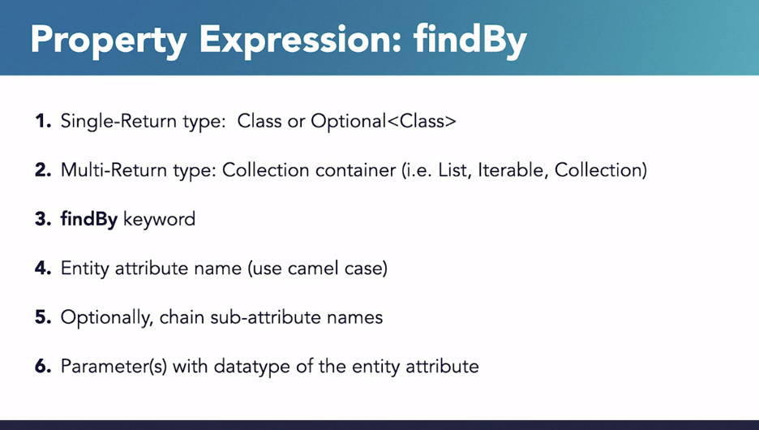

Spring Data facilitates fast failure. Query methods are verified at Bootstrap. 
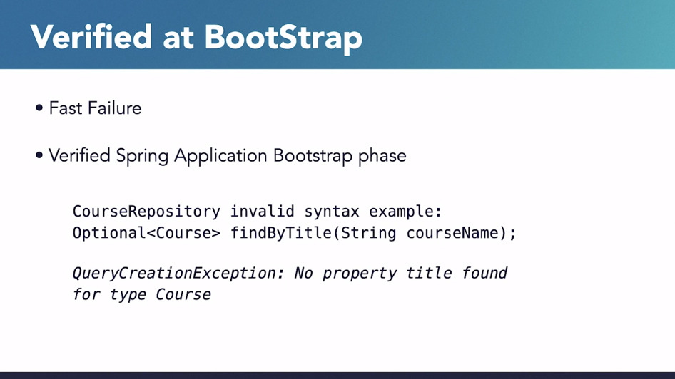
Here, course has not attributed named title. Spring Data throws a Spring Data query creation exception at startup. Without Spring Data, you would not know there was a syntax error until the query is actually invoked which is amazing.

Even is possible to add other clauses that are shown in the official documentation:

[Spring Data Commons - Reference Documentation](https://docs.spring.io/spring-data/commons/docs/3.0.0/reference/html/#repository-query-keywords)

## Query-Annotated Method

One reason to use query annotation is to encouraged to use non-native queries, because they are verified at Bootstrap. Native queries are only verified when invoked.

Another reason to use @Query is that the query is just too complex for property expressions.

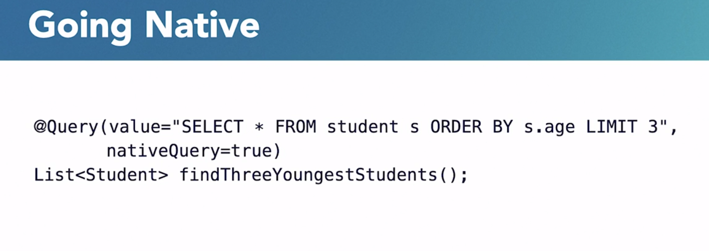

## Paging and Sorting

Paging and sorting are features that allow you to retrieve a subset of data from a larger dataset. These features are particularly useful when dealing with large result sets, as they enable efficient retrieval of only the necessary data.

### Paging:

Paging refers to dividing a large result set into smaller, manageable chunks or pages. It is useful when you don't need to load the entire dataset at once but rather load it incrementally.

  
In Spring Data, paging and sorting are features that allow you to retrieve a subset of data from a larger dataset. These features are particularly useful when dealing with large result sets, as they enable efficient retrieval of only the necessary data.

### Paging:

Paging refers to dividing a large result set into smaller, manageable chunks or pages. It is useful when you don't need to load the entire dataset at once but rather load it incrementally.

1. **Method Declaration:**
    
    - To enable paging, your repository method should return a `Page` or `Slice` instead of a simple `List`.
    - You need to provide a `Pageable` parameter to your method.
    
    
    ```java 
    Page<User> findAll(Pageable pageable);
    ```
    
2. **Usage:**
    
    - When invoking this method, you can create a `PageRequest` to specify the page number, the number of items per page (page size), and optional sorting.
    
    ```java 
    Pageable pageable = PageRequest.of(0, 10, Sort.by("lastName").descending());      Page<User> resultPage = userRepository.findAll(pageable);
    ```
    
    In this example, the code fetches the first page with 10 items, sorted by the `lastName` attribute in descending order.
    
3. **Accessing Results:**
    
    - The `Page` object contains information about the current page, total number of pages, total number of items, and the actual content.
    
    
    ```java 
    List<User> users = resultPage.getContent();
    ```

### Sorting:

Sorting allows you to specify the order in which the data should be retrieved.

1. **Method Declaration:**
    
    - To enable sorting, you can provide a `Sort` parameter to your repository method.
    
    
    ```java
    List<User> findAll(Sort sort);
    ```
    
2. **Usage:**
    
    - When invoking this method, you can create a `Sort` object to specify the sorting order.
    
    
    ```java 
    Sort sort = Sort.by("lastName").descending(); 
    List<User> sortedUsers = userRepository.findAll(sort);
    ```
    
    In this example, the code fetches all users and sorts them by the `lastName` attribute in descending order.
    
3. **Combining with Paging:**
    
    - You can combine paging and sorting by using a `Pageable` parameter that includes sorting information.
    
    
    ```java
    Pageable pageable = PageRequest.of(0, 10, Sort.by("lastName").descending()); 
    Page<User> resultPage = userRepository.findAll(pageable);
    ```
    
    This example fetches the first page with 10 items, sorted by the `lastName` attribute in descending order.
    

Spring Data automatically translates these method signatures into appropriate SQL queries, making it convenient for developers to work with paged and sorted data.

## Specifications

Specifications provide a way to define complex queries by encapsulating them in reusable components. Specifications are particularly useful when you need to dynamically build queries based on varying criteria. Spring Data JPA supports Specifications as a powerful abstraction for building queries.

```java
@Service
public class DynamicQueryService {

    private CourseRepo courseRepo;

    public DynamicQueryService(CourseRepo courseRepo) {
        this.courseRepo = courseRepo;
    }

    public List<Course> filterBySpecification(CourseFilter filter) {
        Specification<Course> courseSpecification =
                (root, query, criteriaBuilder) -> {
                    List<Predicate> predicates = new ArrayList<>();
                    filter.getDepartment().ifPresent(d ->
                            predicates.add(criteriaBuilder.equal(root.get("department"), d)));
                    filter.getCredits().ifPresent(c ->
                            predicates.add(criteriaBuilder.equal(root.get("credits"), c)));
                    filter.getInstructor().ifPresent(i ->
                            predicates.add(criteriaBuilder.equal(root.get("instructor"), i)));
                    return criteriaBuilder.and(predicates.toArray(new Predicate[0]));
                };
        return courseRepo.findAll(courseSpecification);
    }
}
```

Documentation on: [Specifications :: Spring Data JPA](https://docs.spring.io/spring-data/jpa/reference/jpa/specifications.html)

## QueryDSL

From the documentation: [Querydsl - Unified Queries for Java](https://querydsl.com/) is a framework that provides a type-safe and expressive DSL for building queries in Java. It allows developers to define queries using a fluent and statically-typed API rather than relying on string-based queries. QueryDSL is often used with JPA (Java Persistence API), Hibernate, and other database access technologies.
### Key Features of QueryDSL:

1. **Type-Safe Queries:**
    - QueryDSL uses a type-safe API, which means that queries are checked at compile time. This reduces the likelihood of runtime errors in the query construction process.
2. **Fluent API:**
    - The API is designed to be fluent, making it easy to read and construct complex queries. QueryDSL leverages method chaining to create a concise and expressive syntax.
3. **Domain-Specific Language:**
    -  QueryDSL is designed to be a domain-specific language for querying databases. It provides a set of classes and methods that closely align with the concepts of SQL and database queries.
4. **Integration with JPA and Hibernate:**
     - QueryDSL seamlessly integrates with JPA and Hibernate, allowing developers to use it in conjunction with these popular Java persistence technologies. It works with JPA entities and supports the JPA query language.
5. **Support for Different Query Types:**
      - QueryDSL supports various types of queries, including SELECT, UPDATE, and DELETE queries. It covers a broad range of use cases for interacting with relational databases.

### How QueryDSL Works:

1. **Entity Mapping:**
    
    - Define JPA entities that represent your data model. These entities are typically annotated with JPA annotations.
    
    javaCopy code
    
    ```java 
    @Entity public class User {
    @Id     
    @GeneratedValue(strategy = GenerationType.IDENTITY)     
    private Long id;      
    private String firstName;     
    private String lastName;     
    // ... }
    ```
    
2. **QueryDSL Integration:**
    
    - Include QueryDSL as a dependency in your project. For example, if you're using Maven:
    
    xmlCopy code
    
    ```xml
    <dependency>
         <groupId>com.querydsl</groupId>     
         <artifactId>querydsl-core</artifactId>     
         <version>4.4.0</version> 
	 </dependency>
	 ```
    
3. **QueryDSL Annotation Processor:**
    
    - Use the QueryDSL annotation processor to generate Q-classes. These Q-classes represent query entities and provide a statically-typed way to reference entity properties.
4. **Building Queries:**
    
    - Use QueryDSL to construct queries using the generated Q-classes. The API allows you to build queries for various operations, such as filtering, sorting, and joining.
    
    javaCopy code
    
    ```java
    QUser qUser = QUser.user; 
    List<User> users = queryFactory
         .selectFrom(qUser)
			  .where(qUser.firstName.eq("John"))       
			  .orderBy(qUser.lastName.asc())     
			  .fetch();
    ```
    
    In this example, `qUser.firstName.eq("John")` represents a condition where the first name is equal to "John."
    
5. **Executing Queries:**
    
    - Execute the constructed queries using JPA or other database access technologies. QueryDSL provides the flexibility to work with different query execution mechanisms.

## Query By Example

Query by Example (QBE) is a user-friendly querying technique with a simple interface. It allows dynamic query creation and does not require you to write queries that contain field names. In fact, Query by Example does not require you to write queries by using store-specific query languages at all.

Documentation: [Query by Example :: Spring Data Relational](https://docs.spring.io/spring-data/relational/reference/query-by-example.html)

### Key Concepts and How It Works:

1. **Example Entity:**
    
    - You create an instance of the entity you want to query (the example entity). Set the properties with the values you want to use as filters for the query.
    
    ```java
    User exampleUser = new User(); 
    exampleUser.setFirstName("John"); 
    exampleUser.setLastName("Doe");
    ```
    
2. **ExampleMatcher:**
    
    - Define an `ExampleMatcher` that specifies how the matching should be performed. The matcher allows you to configure options such as case sensitivity, string matching mode, and more.
    
    
    ```java
    ExampleMatcher matcher = ExampleMatcher.matching()
         .withIgnoreCase()
              .withMatcher("firstName",
               ExampleMatcher.GenericPropertyMatchers.startsWith())     
               
               .withMatcher("lastName",  
               ExampleMatcher.GenericPropertyMatchers.endsWith());
               ```
    
    In this example, `withIgnoreCase()` makes the matching case-insensitive, and `withMatcher` configures specific matching criteria for individual properties.
    
3. **Example:**
    
    - Create an `Example` object using the example entity and the matcher.
    
    ```java
    Example<User> example = Example.of(exampleUser, matcher);
    ```
    
4. **Query Execution:**
    
    - Use the `Example` object in a Spring Data repository method. Spring Data repositories provide methods like `findAll(Example<T> example)` that accept an `Example` as a parameter.        
    
    ```java
    List<User> result = userRepository.findAll(example);
    ```
    
    The repository method dynamically constructs a query based on the provided example, and it retrieves entities that match the specified criteria.
    

### Example:

Let's say you have a `User` entity:

```java
@Entity 
public class User {
	@Id     
	@GeneratedValue(strategy = GenerationType.IDENTITY)     
	private Long id;      
	private String firstName;     
	private String lastName;     
	// getters and setters }
```

You can use Query by Example to find users with a specific first name and last name:

```java
User exampleUser = new User(); exampleUser.setFirstName("John"); 
exampleUser.setLastName("Doe");
ExampleMatcher matcher = ExampleMatcher
	.matching()
	.withIgnoreCase()
	.withMatcher("firstName",ExampleMatcher.GenericPropertyMatchers.startsWith()) 
	.withMatcher("lastName", ExampleMatcher.GenericPropertyMatchers.endsWith());  
	
	Example<User> example = Example.of(exampleUser, matcher);  
	List<User> result = userRepository.findAll(example);
```

In this example, the query will find all users whose first name starts with "John" (case-insensitive) and last name ends with "Doe."

## Spring Data REST

Spring Data REST is part of the umbrella Spring Data project and makes it easy to build hypermedia-driven REST web services on top of Spring Data repositories.

Spring Data REST builds on top of Spring Data repositories, analyzes your application’s domain model and exposes hypermedia-driven HTTP resources for aggregates contained in the model.

As you can see, when Data Rest is configured, Spring add to the endpoints names an "s" to denote standard API notation.

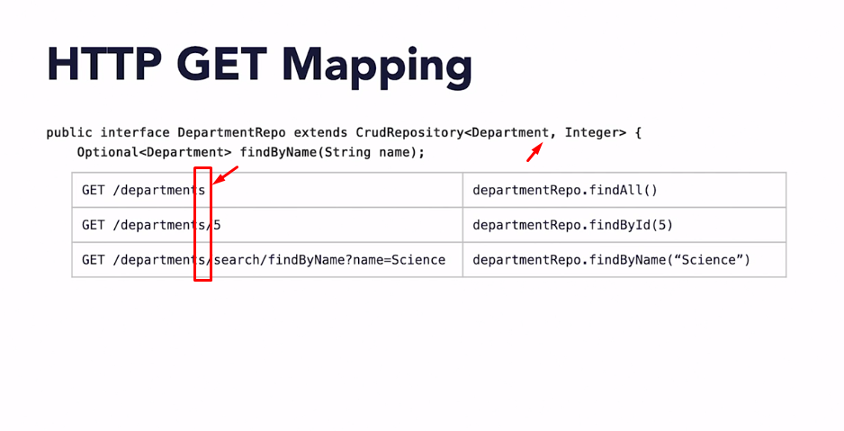

Documentation: [Spring Data REST](https://spring.io/projects/spring-data-rest)

### Projections in Spring Data REST

<mark style="background: #FFF3A3A6;">Projections in Spring Data REST allow you to shape the response of your API</mark> by defining a subset of the entity's properties that should be included. This is particularly useful when you don't need all the details of an entity and want to reduce the payload size.

To use projections, you define an interface that declares the subset of properties you want. The interface serves as a view on the entity.

**Example:**

Assuming you have an entity `Person`:

```java 
@Entity 
public class Person {     

	@Id     
	@GeneratedValue(strategy = GenerationType.IDENTITY)     
	private Long id;          
	private String firstName;     
	private String lastName;     
	private int age;     
	// getters and setters }
```

You can create a projection interface like this:

```java
@Projection(name = "simplePerson", types = Person.class) 
public interface SimplePersonProjection {     
	String getFirstName();     
	String getLastName(); 
}
```

Then, when you request the `/persons` endpoint, you can include the projection:

- **Request:** `/persons?projection=simplePerson`
- **Response:**
    
    ```json
    {   
    "_embedded": {     
	    "persons": 
	    [       
		    {         
		    "firstName": "John",         
		    "lastName": "Doe"       
		    },       
		    {         
		    "firstName": "Jane",         
		    "lastName": "Smith"       
		    }     
	    ]   
		} 
	}
    ```
    

This response only includes the `firstName` and `lastName` properties, as defined in the `SimplePersonProjection` interface.

## Non-blocking Spring Data reactive repositories

Reactive repositories are part of the Spring Data project that enables reactive programming support for interacting with databases. Traditional blocking database operations are replaced with reactive counterparts, allowing for more efficient handling of resources and scalability in applications.

Documentation: [Spring | Reactive](https://spring.io/reactive)


1. **Reactive Programming Model:**
    
    - Non-blocking Spring Data reactive repositories leverage the reactive programming model. In a reactive system, components react to events and process them asynchronously. This is in contrast to the traditional imperative programming model where tasks are executed sequentially.

1. **WebFlux and Reactive Streams:**
    
    - Spring's WebFlux module, built on the Reactive Streams specification, provides the foundation for reactive programming in Spring. Reactive Streams define a standard for asynchronous stream processing with non-blocking backpressure.

1. **Reactive Database Drivers:**
    
    - To support reactive interactions with databases, non-blocking Spring Data repositories use reactive database drivers. These drivers are designed to handle asynchronous, non-blocking communication with the database.

4. **Repository Interface:**
    
    - Reactive repositories define interfaces that extend the `ReactiveCrudRepository` interface provided by Spring Data. This interface includes reactive methods for performing CRUD (Create, Read, Update, Delete) operations.

    
    ```java
    public interface ReactivePersonRepository extends ReactiveCrudRepository<Person, String> {     
	    Mono<Person> findByLastName(String lastName); 
    }
    ```
    
    In this example, `ReactivePersonRepository` extends `ReactiveCrudRepository` and includes a reactive method to find a person by last name.
    
5. **Reactive Types:**
    
    - Reactive repositories return reactive types such as `Mono` and `Flux` instead of blocking types like `Optional` or `List`. `Mono` represents a single value or an error, while `Flux` represents a stream of values.

6. **Asynchronous Execution:**
    
    - When a reactive repository method is invoked, the operations are executed asynchronously, and the result is delivered through the reactive type. This allows the application to continue processing other tasks without waiting for the database operation to complete.        
    
    ```java
    Mono<Person> personMono = reactivePersonRepository.findByLastName("Doe");
    ```
    
    The `findByLastName` method returns a `Mono<Person>` that asynchronously retrieves a person with the specified last name.
    
7. **Integration with Reactive Web Framework:**
    
    - Non-blocking Spring Data reactive repositories are often used in conjunction with Spring WebFlux to build end-to-end reactive applications. Reactive controllers handle requests asynchronously, and the entire application stack supports reactive principles.

---

<a name="05"></a>
# 05. Spring Security


## Authentication

Spring Security provides comprehensive support for [authentication](https://en.wikipedia.org/wiki/Authentication). Authentication is how we verify the identity of who is trying to access a particular resource. A common way to authenticate users is by requiring the user to enter a username and password. Once authentication is performed we know the identity and can perform authorization.

Process to determinate WHO (identify a principal), that even can be a human or a machine. For example, System-2-System calls.

Spring support:
 - HTTP basic and digest [Digest access authentication - Wikipedia](https://en.wikipedia.org/wiki/Digest_access_authentication)
 - X509 [X.509 - Wikipedia](https://en.wikipedia.org/wiki/X.509)
 - form-based authentication [Form-Based Authentication (The Java EE 6 Tutorial) (oracle.com)](https://docs.oracle.com/cd/E19798-01/821-1841/bncbq/index.html#:~:text=Form%2Dbased%20authentication%20allows%20the,presents%20to%20the%20end%20user.)
 - LDAP 
 - Active Directory

Other support is for OpenID, Jasig CAS and JAAS, Kerberos and SAML.

Documentation: [Authentication :: Spring Security](https://docs.spring.io/spring-security/reference/features/authentication/index.html)

## Authorization

Process to determinate WHAT CAN DO a principal o also calling Access Control. Spring Security provides comprehensive support for [authorization](https://en.wikipedia.org/wiki/Authorization). Authorization is determining who is allowed to access a particular resource. Spring Security provides [defense in depth](https://en.wikipedia.org/wiki/Defense_in_depth_(computing)) by allowing for request based authorization and method based authorization.

Having established [how users will authenticate](https://docs.spring.io/spring-security/reference/servlet/authentication/index.html), you also need to configure your application’s authorization rules.

The advanced authorization capabilities within Spring Security represent one of the most compelling reasons for its popularity. Irrespective of how you choose to authenticate (whether using a Spring Security-provided mechanism and provider or integrating with a container or other non-Spring Security authentication authority), the authorization services can be used within your application in a consistent and simple way.

Spring support:
 - Web Request.
 - Method invocation
 - Domain object access control.

Documentation: [Authorization :: Spring Security](https://docs.spring.io/spring-security/reference/features/authorization/index.html)

## In-Memory Authentication (only for testing purposes)

Spring Security’s `InMemoryUserDetailsManager` implements [UserDetailsService](https://docs.spring.io/spring-security/reference/servlet/authentication/passwords/user-details-service.html#servlet-authentication-userdetailsservice) to provide support for username/password based authentication that is stored in memory. `InMemoryUserDetailsManager` provides management of `UserDetails` by implementing the `UserDetailsManager` interface. `UserDetails`-based authentication is used by Spring Security when it is configured to [accept a username and password](https://docs.spring.io/spring-security/reference/servlet/authentication/passwords/in-memory.html#servlet-authentication-unpwd-input) for authentication.

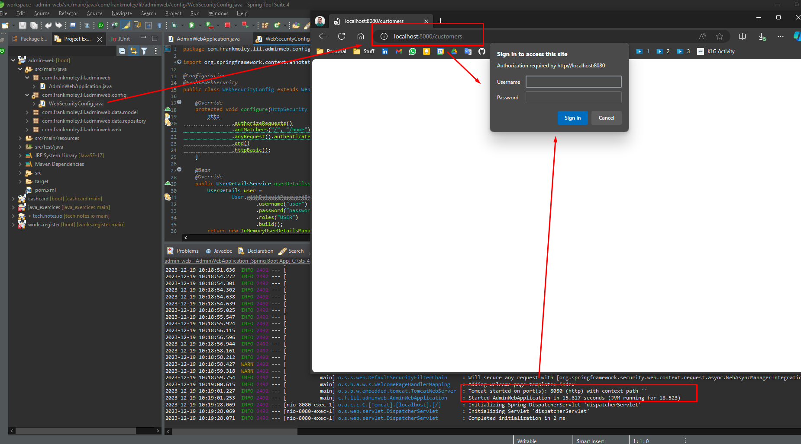


## JDBC User Authentication

Spring Security’s `JdbcDaoImpl` implements [`UserDetailsService`](https://docs.spring.io/spring-security/reference/servlet/authentication/passwords/user-details-service.html#servlet-authentication-userdetailsservice) to provide support for username-and-password-based authentication that is retrieved by using JDBC. `JdbcUserDetailsManager` extends `JdbcDaoImpl` to provide management of `UserDetails` through the `UserDetailsManager` interface. `UserDetails`-based authentication is used by Spring Security when it is configured to [accept a username/password](https://docs.spring.io/spring-security/reference/servlet/authentication/passwords/index.html#servlet-authentication-unpwd-input) for authentication.


Documentation: [JDBC Authentication :: Spring Security](https://docs.spring.io/spring-security/reference/servlet/authentication/passwords/jdbc.html)

## BCrypt (password encryption)

By default Spring will use BCrypt encryption/decryption mechanism and IMPORTANT: never store passwords in plain text and even, using algorithm like SHA-256 are no longer considered secure because can be decoded using Brutal Force attack.

Documentation: [Password Storage :: Spring Security](https://docs.spring.io/spring-security/reference/features/authentication/password-storage.html)

## Applying Authorization

<mark style="background: #FFF3A3A6;">Authorization is the process of determining what users are allowed to do</mark>. In this example, the application is only allowing users with the "user" role to view the "customers" and "/customers/**" pages. Users with the "admin" role are allowed to view all pages, including the "orders" page.

**Key concepts:**

- **GrantedAuthoritiesMapper:** This bean is used to map the roles from the database to the roles that Spring Security uses.
- **antMatchers:** This method is used to specify which URLs should be protected by authorization.
- **hasRole:** This method is used to check if the current user has the specified role.
- **Thymeleaf extras, spring security 5:** This dependency is used to protect Thymeleaf pages from unauthorized users.
- **sec:** This XML namespace is used to apply Spring Security tags to Thymeleaf pages.
- **UnauthorizedException:** This exception is thrown when a user tries to access a page that they are not authorized to view.
- **ForbiddenException:** This exception is thrown when a user tries to access a page that they do not have the required permissions for.

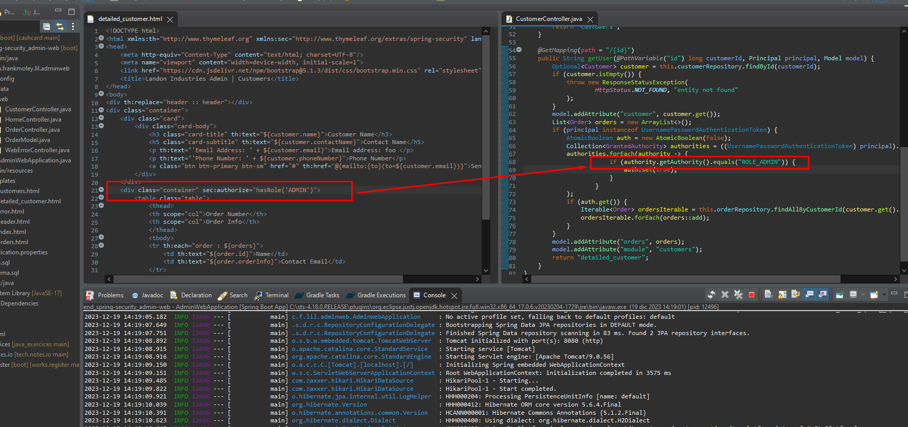

Documentation: [15. Expression-Based Access Control (spring.io)](https://docs.spring.io/spring-security/site/docs/3.0.x/reference/el-access.html)

## Form-Based Authentication

Forms-based authentication (FBA) offers several advantages over basic authentication, including:

- **Standardized login form:** FBA uses a standard HTML form to collect user credentials, which allows for more consistent and customizable login experiences.
- **Ability to log out:** FBA provides a standard mechanism for users to log out of the application, which is not possible with basic authentication.
- **Support for remember me:** FBA can store user credentials in a secure manner, allowing users to opt in to a "remember me" feature.
- **Greater control:** FBA gives developers more control over the login experience, including the ability to customize the login form and define a custom logout page.

**Key concepts:**

- **Basic authentication:** A simple authentication method that sends user credentials in clear text over the wire.
- **Forms-based authentication:** A more secure authentication method that uses a standard HTML form to collect user credentials.
- **Remember me:** A feature that allows users to remain logged in without having to enter their credentials every time they visit the application.

**Conclusion:** FBA is a more secure and versatile authentication method than basic authentication. It is recommended for use in web applications that require a more user-friendly and customizable login experience.

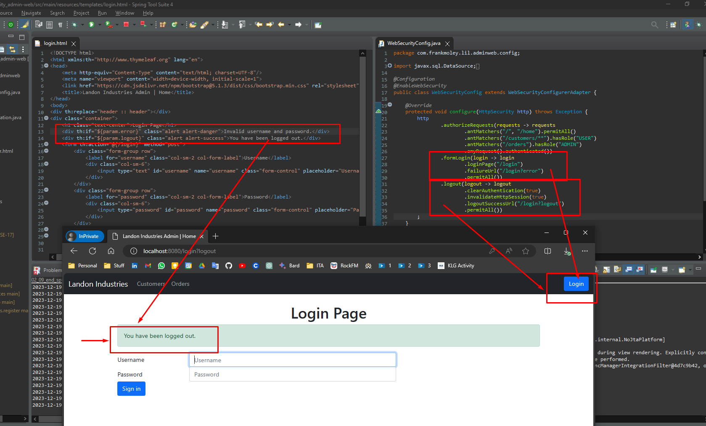

## LDAP Authentication

**LDAP (Lightweight Directory Access Protocol)** is a common authentication method for enterprise applications. It is lightweight, interoperable, and highly scalable. Spring Security LDAP provides full support for all native LDAP operations, including authentication and password-hashing.

**Highlight:**

- **LDAP** is a lightweight, interoperable, and highly scalable authentication method for enterprise applications.
- **Spring Security LDAP** provides full support for all native LDAP operations, including authentication and password-hashing.

**<mark style="background: #FFF3A3A6;">Spring LDAP Core</mark>** is a project that extends Spring Security to work with LDAP for purposes other than authentication. It provides a template pattern for LDAP, which allows you to query, search, create, update, and delete LDAP entries. It can be used for a variety of purposes, such as employee onboarding, HR management, physical security, learning systems, and asset management.

## Active Directory <> LDAP

Active Directory and LDAP are both directory services, but they are not the same thing. <mark style="background: #FFF3A3A6;">Active Directory is a more comprehensive service that provides a wider range of features, </mark>while LDAP is a lightweight directory access protocol that is used to access and manage directory services.

**Highlight:**

- Active Directory is not LDAP, but it implements an LDAP API.
- Active Directory provides many more services than LDAP.
- Active Directory is a popular enterprise solution for managing directory services.
- Spring Security can be used to integrate with Active Directory using the Active Directory LDAP authentication provider.
- There is a known issue with nested groups in Active Directory and Spring Security. You can find a solution for this on the Spring Security ticket tracker.

## OAuth 2 and Spring Security

**OAuth** 2 is an authorization framework, not an authentication framework. It allows applications to access user data without having direct access to user credentials.
    
**OAuth 2 involves multiple components:** <mark style="background: #FFF3A3A6;">Resource owner</mark> (user), <mark style="background: #FFF3A3A6;">Client</mark> (application),<mark style="background: #FFF3A3A6;"> Resource Server</mark> (website with protected data),<mark style="background: #FFF3A3A6;"> Authorization Server </mark>(grants access tokens), <mark style="background: #FFF3A3A6;">Access Token</mark> (temporary token for access), <mark style="background: #FFF3A3A6;">Refresh Token</mark> (long-lived token for renewing access), <mark style="background: #FFF3A3A6;">Scopes</mark> (define the level of access granted).

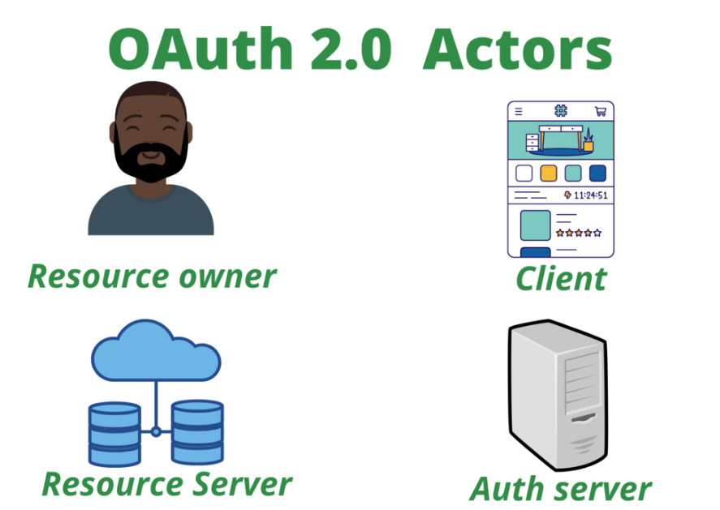

**Common use cases for OAuth 2:** Third-party access (e.g., granting access to a Facebook profile), System-to-system communication, Securing web services between client and server.
    
**Types of OAuth 2 grants:** Authorization Code Grant (most common, used by social media), Implicit Grant (web and mobile apps), Client Credential Grant (system-to-system communication).

Documentation: [Workflow of OAuth 2.0 - GeeksforGeeks](https://www.geeksforgeeks.org/workflow-of-oauth-2-0/)

## WebFlux Security (for Reactive spring)

WebFlux Security is an extension of the Spring Security framework specifically designed for reactive applications built using Spring WebFlux. It provides a comprehensive set of features for securing reactive web applications, including authentication, authorization, and more.

**Authentication**: WebFlux Security supports various authentication mechanisms, such as form-based authentication, basic authentication, and OpenID Connect. It also integrates with Spring Security's built-in user details services for managing user accounts and authentication credentials.

**Authorization**: WebFlux Security enables fine-grained authorization control based on user roles, permissions, and access control lists (ACLs). It supports various authorization strategies, including URL-based authorization, method-level authorization, and reactive-style annotations.

**Security Filters**: WebFlux Security employs a chain of security filters to intercept and protect incoming requests. These filters handle tasks like authentication, authorization, CSRF protection, and header configuration.

**Integration with Spring Security**: WebFlux Security seamlessly integrates with the existing Spring Security infrastructure, enabling developers to reuse existing authentication and authorization configurations. It also integrates with other Spring Security features, such as session management, password encoding, and logging.

**Key Features**

- **Reactive-first design:** It is specifically designed for reactive applications, leveraging asynchronous processing and non-blocking I/O.
    
- **Fine-grained authorization:** It provides comprehensive authorization capabilities, including role-based access control (RBAC), method-level security, and reactive-style annotations.
    
- **Flexible authentication:** It supports various authentication mechanisms, including form-based, Basic, and OpenID Connect.
    
- **Integration with Spring Security:** It integrates seamlessly with the existing Spring Security infrastructure, enabling reuse of configurations and features.

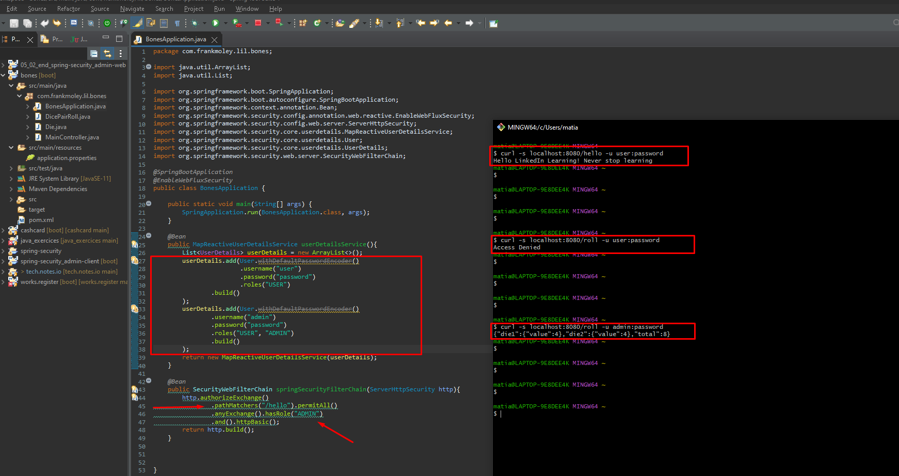


---
<a name="06"></a>
# 06. Building Full-Stack Apps with React and Spring

## Introduction

1. Introduction to Spring and SpringBoot
2. Introduction to REACT:

Official Landing Page: [React](https://react.dev/)

3. Introduction to REDUX (state management): 

Official Landing Page: [Redux - A predictable state container for JavaScript apps. | Redux](https://redux.js.org/)

4. Introduction to JEST for testing purpose

Official Landing Page: [Jest · 🃏 Delightful JavaScript Testing (jestjs.io)](https://jestjs.io/)


## MVC: Model-View-Controller pattern

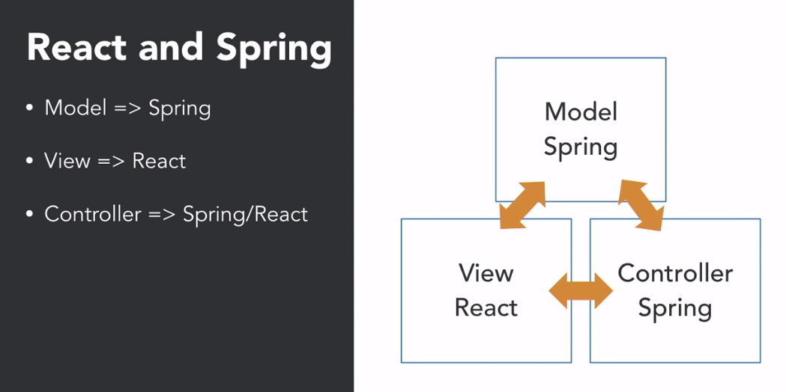

The Model-View-Controller (MVC) pattern is a widely used software design pattern that separates the application into three interconnected parts:

- **Model:** The model represents the data of the application, including data structures, business logic, and rules. It encapsulates the data and manages its integrity.
    
- **View:** The view is responsible for presenting the data to the user in a user-friendly and interactive way. It handles the rendering of the user interface (UI) and user interactions.
    
- **Controller:** The controller acts as the intermediary between the model and the view. It receives user requests, communicates with the model to retrieve or modify data, and updates the view to reflect the changes.
    

In a Spring and React application, the MVC pattern is implemented as follows:

- **Model:** Spring's data access components, such as repositories and service classes, act as the model. These components handle data retrieval, manipulation, and validation.
    
- **View:** React components form the view layer. They render HTML elements, handle user interactions, and communicate with the controller to fetch data or perform actions.
    
- **Controller:** Spring MVC controllers act as the controller layer. They handle incoming HTTP requests, extract relevant data from the request, interact with the model to perform operations, and send responses back to the view.
    

The MVC pattern promotes code modularity and reusability, making it a popular choice for developing large-scale web applications. It separates concerns between the business logic, UI presentation, and user interactions, leading to maintainable and testable code.

In a Spring and React application, the separation between the MVC layers is achieved through well-defined communication mechanisms:

- **Model to Controller:** The model exposes data through APIs or data access objects (DAOs) that are consumed by controllers.
    
- **Controller to View:** Controllers render view components using the React render API or by passing data to view components as props.
    
- **User Input to Controller:** User interactions, such as form submissions or button clicks, trigger HTTP requests that are handled by controllers.
    
- **Controller to Model:** Controllers send requests to the model for data retrieval, manipulation, or validation.
    
- **Model to View:** The model updates the view by sending events to the controller, which then updates the relevant React component state.
    

This separation of concerns and well-defined communication between the MVC layers make Spring and React applications highly maintainable and testable.

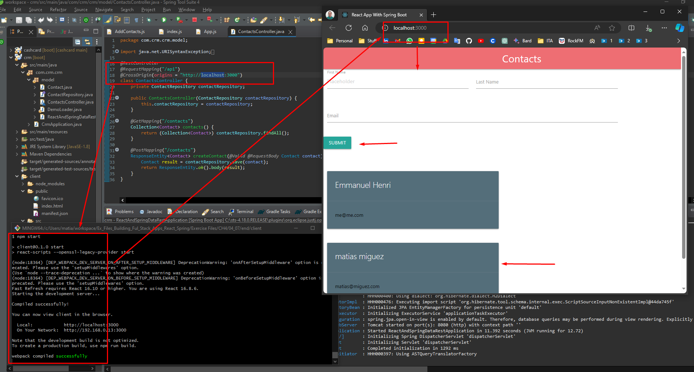

The tools used in this project are:

Materialize: [Documentation - Materialize (materializecss.com)](https://materializecss.com/)

Adding components to the "client" side is straightforward, just select the component that you need, copy the code and customise as you need.


<a name="07"></a>
# 07 Example project: Card Cash Application Spring training

[https://github.com/matiaspakua/cashCardSpringBoot](https://github.com/matiaspakua/cashCardSpringBoot)


## Introduction to Spring

Spring is an open-source application framework for Java. It provides comprehensive infrastructure support for developing Java applications, simplifying the development process and increasing productivity. Spring is based on the principle of inversion of control (IoC), which means that the framework takes control of the flow of the application, leaving developers to focus on writing business logic.

Spring provides a wide range of modules to address various aspects of modern enterprise application development such as database connectivity, transaction management, web applications, security, messaging, and much more. It also provides integration with other popular technologies such as Hibernate, JPA, and Struts.

## Inversion of Control (IoC)

The principle of Inversion of Control (IoC), also known as Dependency Injection, originated in the field of software engineering as part of the Inversion of Control design principle. This principle states that the control flow of a program is inverted or reversed compared to traditional programming, where the program explicitly calls and controls the flow of libraries and frameworks. Instead, in IoC, the flow of control is reversed, and the framework or container controls the flow by calling the program's code through callbacks, interfaces, or annotations.

The IoC principle was first introduced by Martin Fowler and has since become a widely adopted design pattern in software engineering. The idea behind IoC is to remove the tight coupling between different components of a software system by allowing them to interact through interfaces instead of concrete implementations. This allows for greater flexibility, scalability, and maintainability in software systems. The Spring Framework is a popular implementation of the IoC principle in Java

## IoC and Dependency Injection (DI)

Dependency Injection (DI) is a design pattern that allows objects to have their dependencies (i.e., objects they depend on) injected or provided to them by a third party, rather than creating and managing those dependencies themselves.

In other words, DI is a technique for achieving Inversion of Control (IoC) in software development, where the control of object creation and management is delegated to a separate object or framework. DI helps in achieving separation of concerns by ensuring that an object's dependencies are provided externally and thus promoting modularity, testability, and flexibility in the application.

Instead of creating a dependency object inside a class, the dependency is provided to the class through a constructor or a setter method. This makes the code more modular and less coupled, as the dependency can be easily swapped out for a different implementation or mock object during testing.


## Spring Architecture 

The Spring Framework architecture follows a layered architecture and consists of the following modules:

1. **Core Container**: This module provides the fundamental parts of the framework, including the IoC container and the Dependency Injection(DI) features.

2. **AOP (Aspect Oriented Programming)**: This module provides support for implementing cross-cutting concerns.

3. **Data Access/Integration**: This module provides support for JDBC, ORM, OXM, JMS, and Transaction Management.

4. **Web**: This module provides support for web applications, including Spring MVC and WebSocket.

5. **Test**: This module provides support for testing Spring applications with JUnit or TestNG.

6. **Messaging**: This module provides support for messaging protocols such as STOMP, MQTT, and WebSocket.

7. **Security**: This module provides support for securing Spring applications.

8. **Spring Boot**: This module provides a set of tools for developing and deploying Spring applications quickly and easily.

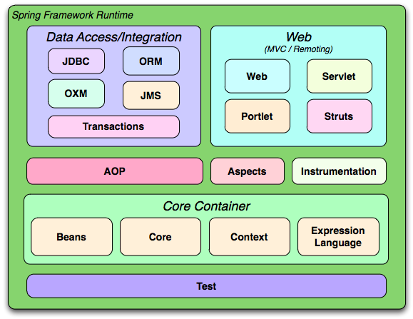

## Spring vs SpringBoot

### Spring

Spring is a comprehensive framework that provides various modules for building different types of applications. It's like having a giant toolbox with every tool you could possibly need to build anything you want. As we build our Family Cash Card API we will use Spring MVC for the web application, Spring Data for data access, and Spring Security for authentication and authorization.

This versatility comes at a cost. Setting up a Spring application requires a lot of configuration, and developers need to manually configure various components of the framework to get an application up and running.

### SpringBoot

Spring Boot is like a more opinionated version of Spring. It comes with a many pre-configured settings and dependencies that are commonly used in Spring applications. This makes it really easy to get started quickly, without having to worry about setting up everything from scratch. Plus, Spring Boot comes with an embedded web server, so you can easily create and deploy web applications without needing an external server.

## Spring’s Inversion of Control Container

Spring Boot takes advantage of Spring Core’s Inversion of Control (IoC) container. Spring Boot allows you to configure how and when dependencies are provided to your application at runtime. This puts you in control of how your application operates in different scenarios.


For example, you might want to use a different database for local development than for your live, public-facing application. Your application code shouldn't care about this distinction; if it did, you’d have to hard-code every possible scenario into your application logic. Instead, Spring Boot allows you to provide an external configuration that specifies how and when such dependencies are used.


## API Contracts & JSON

The software industry has adopted several patterns for capturing agreed upon API behavior in documentation and code. These agreements are often called "contracts". Two examples include Consumer Driven Contracts and Provider Driven Contracts. 

We define an API contract as a formal agreement between a software provider and a consumer that abstractly communicates how to interact with each other. This contract defines how API providers and consumers interact, what data exchanges looks like, and how to communicate success and failure cases.

The provider and consumers do not have to share the same programming language, only the same API contracts. 

 ```bash
 
Request
  URI: /cashcards/{id}
  HTTP Verb: GET
  Body: None

Response:
  HTTP Status:
    200 OK if the user is authorized and the Cash Card was successfully retrieved
    401 UNAUTHORIZED if the user is unauthenticated or unauthorized
    404 NOT FOUND if the user is authenticated and authorized but the Cash Card cannot be found
  Response Body Type: JSON
  Example Response Body:
    {
      "id": 99,
      "amount": 123.45
    }
```


## What is unit testing

The idea of "unit testing" is to test individual units or components of software to ensure that they are working correctly and meeting their intended functionality. Unit testing involves writing and running automated tests that isolate a specific piece of code, such as a function or method, and verify its behaviour under different scenarios or inputs. By catching errors early and ensuring that each unit works as intended, unit testing can help improve the quality and reliability of software, while also reducing the time and cost of debugging and fixing issues later in the development cycle.

## The Testing Pyramid

Different tests can be written at different levels of the system. At each level, there is a balance between the speed of execution, the “cost” to maintain the test, and the confidence it brings to system correctness. This hierarchy is often represented as a “testing pyramid”.


**Unit Tests**: A Unit Test exercises a small “unit” of the system that is isolated from the rest of the system. They should be simple and speedy. You want a high ratio of Unit Tests in your testing pyramid as they’re key to designing highly cohesive, loosely coupled software.

**Integration Tests**: Integration Tests exercise a subset of the system and may exercise groups of units in one test. They are more complicated to write and maintain, and run slower than unit tests.

**End-to-End Tests**: An End-to-End Test exercises the system using the same interface that a user would, such as a web browser. While extremely thorough, End-to-End Tests can be very slow and fragile because they use simulated user interactions in potentially complicated UIs. Implement the smallest number of these tests.

## TDD. Testing First

What is Test Driven Development? It’s common for software development teams to author automated test suites to guard against regressions. Often these tests are written after the application feature code is authored. We'll take an alternative approach: we'll write tests before implementing the application code. This is called test driven development (TDD).

Why apply TDD? By asserting expected behaviour before implementing the desired functionality, we’re designing the system based on what we want it to do, rather than what the system already does.

Another benefit of “test-driving” the application code is that the tests guide you to write the minimum code needed to satisfy the implementation. When the tests pass, you have a working implementation (the application code), and a guard against introducing errors in the future (the tests).

## The Red, Green, Refactor Loop

Software development teams love to move fast. So how do you go fast forever? By continuously improving and simplifying your code–refactoring. One of the only ways you can safely refactor is when you have a trustworthy test suite. Thus, the best time to refactor the code you're currently focusing on is during the TDD cycle. This is called the Red, Green, Refactor development loop:


1. **Red**: Write a failing test for the desired functionality.
2. **Green**: Implement the simplest thing that can work to make the test pass.
3. **Refactor**: Look for opportunities to simplify, reduce duplication, or otherwise improve the code without changing any behavior—to refactor.
4. Repeat!

## REST, CRUD, and HTTP

Let’s start with a concise definition of REST: Representational State Transfer. In a RESTful system, data objects are called Resource Representations. The purpose of a RESTful API (Application Programming Interface) is to manage the state of these Resources.

Said another way, you can think of “state” being “value” and “Resource Representation” being an “object” or "thing". Therefore, REST is just a way to manage the values of things. Those things might be accessed via an API, and are often stored in a persistent data store, such as a database.


A frequently mentioned concept when speaking about REST is CRUD. 

CRUD stands for “Create, Read, Update, and Delete”. These are the four basic operations that can be performed on objects in a data store. We’ll learn that REST has specific guidelines for implementing each one.

Another common concept associated with REST is the Hypertext Transfer Protocol. In HTTP, a caller sends a Request to a URI. A web server receives the request, and routes it to a request handler. The handler creates a Response, which is then sent back to the caller.

The components of the Request and Response are:

Request

```bash
Method (also called Verb)
URI (also called Endpoint)
Body
```

Response

```bash
Status Code
Body
```

The power of REST lies in the way it references a Resource, and what the Request and Response look like for each CRUD operation. Let’s take a look at what our API will look like when we're done with this course:

 * For CREATE: use HTTP method POST.
 * For READ: use HTTP method GET.
 * For UPDATE: use HTTP method PUT.
 * For DELETE: use HTTP method DELETE.


## REST in SpringBoot

### Spring Annotations and Component Scan

One of the main things Spring does is to configure and instantiate objects. These objects are called Spring Beans, and are usually created by Spring (as opposed to using the Java new keyword). You can direct Spring to create Beans in several ways.

This happens at application startup. The Bean is stored in Spring’s IoC container. From here, the bean can be injected into any code that requests it.

### Spring Web Controllers

In Spring Web, Requests are handled by Controllers. 

```java
@RestController
	public class CashCardController {
}

```

That’s all it takes to tell Spring: “create a REST Controller”. The Controller gets injected into Spring Web, which routes API requests (handled by the Controller) to the correct method.

A Controller method can be designated a handler method, to be called when a request that the method knows how to handle (called a “matching request”) is received.


---
## Java Records

Commonly, we write classes to simply hold data, such as database results, query results, or information from a service.

In many cases, this data is immutable, since immutability ensures the validity of the data without synchronization. 

To accomplish this, we create data classes with the following:

 * private, final field for each piece of data
 * getter for each field
 * public constructor with a corresponding argument for each field
 * equals method that returns true for objects of the same class when all fields match
 * hashCode method that returns the same value when all fields match
 * toString method that includes the name of the class and the name of each field and its corresponding value

As of JDK 14, we can replace our repetitious data classes with records. Records are immutable data classes that require only the type and name of fields.

The equals, hashCode, and toString methods, as well as the private, final fields and public constructor, are generated by the Java compiler.

## References

 - [Official Spring Framework website](https://spring.io/why-spring)
 - [Spring Introduction docs](https://docs.spring.io/spring-framework/docs/3.0.x/spring-framework-reference/html/overview.html)
 - [Spring: Framework in Depth](https://www.linkedin.com/learning/spring-framework-in-depth-2)
 - [Extending, Securing, and Dockerizing Spring Boot Microservices](https://www.linkedin.com/learning/extending-securing-and-dockerizing-spring-boot-microservices/elevate-a-microservice)
 - [Creating Your First Spring Boot Microservice](https://www.linkedin.com/learning/creating-your-first-spring-boot-microservice/build-a-microservice-with-spring-boot)
 - [Spring: Spring MVC](https://www.linkedin.com/learning/spring-spring-mvc-2/spring-mvc-for-robust-applications)
 - [Spring: Test-Driven Development with JUnit](https://www.linkedin.com/learning/spring-test-driven-development-with-junit/welcome)
 - [Curso de Java Spring](https://platzi.com/cursos/java-spring/)
 - [ Spring: Spring Data 2 ](https://www.linkedin.com/learning/spring-spring-data-2-2017/welcome)
 - [Java Records](https://www.baeldung.com/java-record-keyword)
