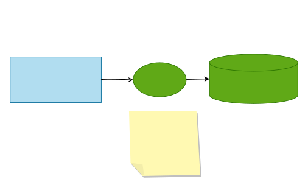

# Getting Started In Spring Development

<button class="back-button" onclick="window.location.href='https://matiaspakua.github.io/tech.notes.io'">All notes</button>

## Introduction to Spring

The Spring framework is built and designed such that it provides <mark style="background: #FFF3A3A6;">comprehensive support</mark> for developing applications for the JVM, including abstractions for some of the most powerful and common enterprise systems integrations, specifically around common infrastructure. 

<mark style="background: #FFF3A3A6;">Spring essentially is designed to provide the plumbing</mark> for using these enterprise offerings and common components used in both internet and enterprise application development. This plumbing allows you to easily consume these offerings while focusing on your business logic, instead of the copy paste scaffolding code to use these integrations that many developers rely on. 

Spring is designed using solid Object Oriented Programming practices and its style promotes you to do the same thing when consuming the framework. Things like <mark style="background: #FFF3A3A6;">coding to an interface</mark>, instead of an implementation are paramount in Spring. 

Now, back to the plumbing idea, Spring promotes <mark style="background: #FFF3A3A6;">Don't Repeat Yourself or DRY principles</mark> by leveraging the powerful abstractions of the framework instead of rebuilding the scaffolding over and over again, you reduce your risk of copy paste errors, and instead focus on the actual needs of your application. 

**POJO or Plain old Java Object**. In Spring, this is any class file that contains both attributes and methods. And those methods are not just getters and setters. This is a common deviation for many Java developers who often concern the concept of POJO with Java Beans. In the Spring world we take the more correct definition of a POJO. 

**Java Beans**. These two are POJOs in practice, but they're only methods are accessor methods, often called getters and setters. This definition is heavily used when using EJBs, for instance. Spring Beans, however, are POJOs that are configured and managed by the application context. 

**DTOs, or Data Transfer Objects** are Java Beans with the specific purpose of moving state between logical layers of your application. There are times when you don't want to expose the details of your working classes and instead translate to a DTO, which often is written as an immutable object before setting the state data out of the logical layer. 

**Inversion of Control** is a central pattern to the Spring framework and, in fact, much of Spring is built around the central design pattern. It can be said that if you fully understand how Spring utilizes IoC, you understand Spring fully. Inversion of Control provides a mechanism for dependency injection, however, it's more than just dependency injection because with Spring's use of Inversion of Control, the framework itself controls all operations of the lifecycle of those dependencies, not just the injection. 

**The Application Context** <mark style="background: #FFF3A3A6;">wraps the Bean Factory</mark>, which is the Inversion of Control container itself. The Bean Factory serves the Beans during runtime of your application. Now we, as users and developers, never really interact with the IoC container itself. Instead we interact with its wrapper or the application context. There are several implementations of the application context itself.

One of the most powerful aspects of Spring Boot is that it provides <mark style="background: #FFF3A3A6;">auto-configuration</mark> of the application context so that you, as the developer, can leverage simple properties and conventions to configure the Beans loaded into the Bean Factory and used by the IoC container. 

More information in: [spring_framework_notes](spring_framework_notes.md)

# Spring DATA

# Repository Code

Link: [This repo is for the Linkedin Learning course: Spring: Spring Data 2](https://github.com/LinkedInLearning/spring-spring-data-2-2508603)

## Mission and modules

Hibernate eliminated manually mapping logical objects to physical databases, asynchronous JavaScript and XML. Also known as Ajax. Websites

More than an inversion of control framework, Spring now comprises a vast collection of enterprise solutions. One of the solutions is the Spring Data Project. <mark style="background: #FFF3A3A6;">Spring Data's mission is to provide a familiar, and consistent Spring-based programming model for data access while still retaining the special traits of the underlying data store</mark>. 

**Spring Data** is actually an umbrella of several sub-projects. There are several modules, and they all specialize in various data sources, but they all depend on commons. <mark style="background: #FFF3A3A6;">Commons</mark> abstracts away from any particular data source. No matter which data source, the goal is always the same. Have a way to convert Java object entities into target data source records and persist them, as well as convert the records back to entities. It can create entities which are then persisted as records to the data store. It can look up data source records by citing the entity attributes. It can update data source records by updating the entity and finally, delete the data source records by deleting the entity. 

**The repository pattern** is an abstraction that is used by Spring Data Commons to accomplish these goals. It is followed throughout the Spring Data Project for creating, reading, updating, and deleting records by citing entities. A module for a particular data source has a repository that extends from the base one. So for example, Spring Data JPA, has a JPA repository. Spring Data MongoDB has a Mongo repository. Spring Data GemFire has a GemFire repository, and so on. Spring Data JPA is the most popular module. Therefore, our deep dive into coding with Spring Data common repositories will be in that chapter, as well as the querying chapter. Lessons learned from these chapters will be leveraged in Spring Data, MongoDB, and hence any other spring data module.