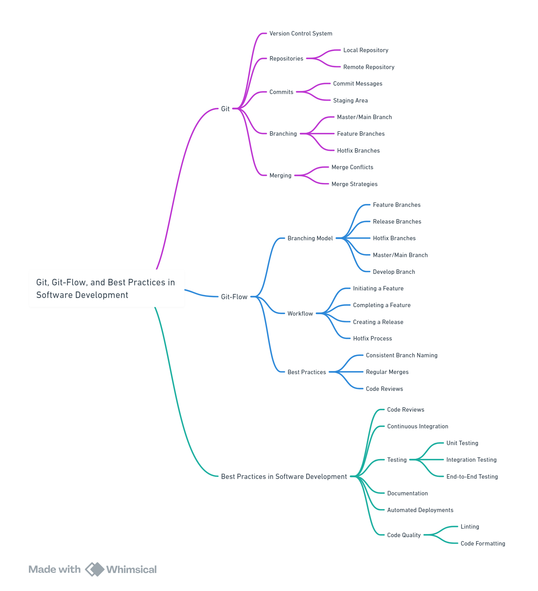

# Git, GitFlow and trunk based development.

<button class="back-button" onclick="window.location.href='https://matiaspakua.github.io/tech.notes.io'">All notes</button>

## Introduction

Git is a [free and open source](https://git-scm.com/about/free-and-open-source) distributed version control system designed to handle everything from small to very large projects with speed and efficiency.

## GitFlow

The model introduces a set of procedures for a managed software development process. It uses a central “truth” repository, referred to as origin. Each developer pulls and pushes to origin. Besides the centralized push-pull relationships, each developer may also pull changes from other peers to form sub-teams.

The central repository holds two main branches with an infinite lifetime: master and develop. The master branch at origin should be familiar to every Git user.

However, Driessen notes that if your team is doing continuous delivery of software, he would suggest adopting a much simpler workflow (like GitHub flow) instead of trying to shoehorn git-flow into your team. But if you are building software that is explicitly versioned, or if you need to support multiple versions of your software in the wild, then git-flow may still be a good fit.

The most important elements of the Git Flow approach are:

- **Central Repository**: The model uses a central “truth” repository, referred to as origin.
- **Pull and Push to Origin**: Each developer pulls and pushes to origin.
- **Sub-teams**: Besides the centralized push-pull relationships, each developer may also pull changes from other peers to form sub-teams.
- **Master and Develop Branches**: The central repository holds two main branches with an infinite lifetime: master and develop.
- **Master Branch**: The master branch at origin should be familiar to every Git user.
- **Develop Branch**: This is where developers can add new features without disturbing the master branch.
- **Feature Branches**: These are used to develop new features for the upcoming or a distant future release.
- **Release Branches**: These support preparation of a new production release.
- **Hotfix Branches**: These are very much like release branches in that they are also meant to prepare for a new production release, albeit unplanned.

### GitFlow original diagram

## Trunk-Based Development

Trunk-based development has its roots in the early days of software development, when programmers didn't have the luxury of modern version control systems. They developed two versions of their software concurrently as a means of tracking changes and reversing them if necessary. Over time, this process proved to be labor-intensive, costly, and inefficient.

As version control systems matured, various development styles emerged, enabling programmers to find bugs more easily, code in parallel with their colleagues, and accelerate release cadence. Trunk-based development is one such model that emerged.

In the era of source-control where "only one person can edit a file at a time", merging was always a factor. It didn't matter if you were merging to working copy, or to/from a branch, merging was in your tool-chain. The advances at the end of the 90's were more effective three-way merges, and better and better merge point tracking. At some level, if a merge is buggy as it was in the early days, you're forced into a trunk model.

Everyone in a team would sync (pull) to (from) the head revision of the single branch many times a day, make small changes, and check them back in. That way the pain from co-workers would be minimized. Good merging and branching allowed you to step away from that model, but a minority of experienced developers wonder if you should.

The pioneers of trunk-based development were trying to track down what their rationale and influences were. CVS came before Subversion. The Wikipedia page says a handful of scripts created in 1986 were fashioned into an initial release in 1990, with the last release being in 2008. It was created to overcome deficiencies in RCS (1982 to date).

When CVS's limitations were determined to be unsurmountable, the Subversion project kicked off (the initial 0.x release was in 2000). Subversion took influences from other commercial packages like Perforce too.

## References
 
* Git: [About - Git (git-scm.com)](https://git-scm.com/about)
* Vinvent Driessen Original idea: https://nvie.com/posts/a-successful-git-branching-model/
* Trunk-Based Development: [Introduction (trunkbaseddevelopment.com)](https://trunkbaseddevelopment.com/)