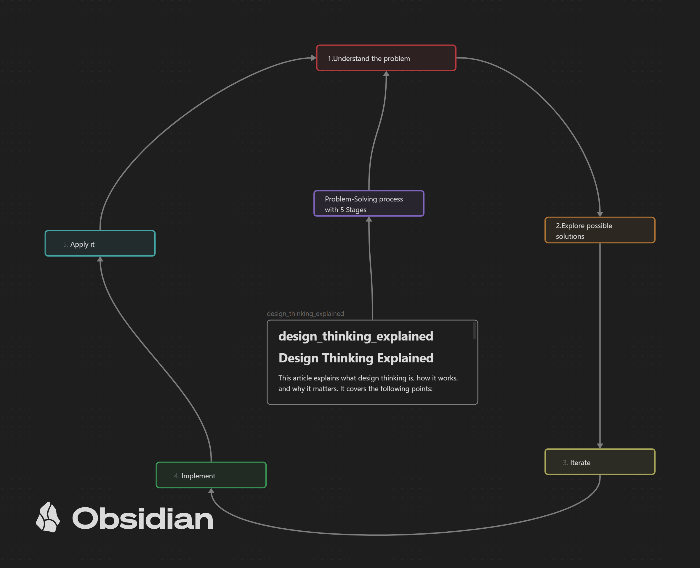

# Design Thinking Explained

<button class="back-button" onclick="window.location.href='https://matiaspakua.github.io/tech.notes.io'">All notes</button>

This article explains what design thinking is, how it works, and why it matters. It covers the following points:

- Design thinking is an innovative **problem-solving process** that begins with understanding unmet customer needs and involves concept development, applied creativity, prototyping, and testing.
- Design thinking can be applied to any problem that needs a creative solution, not only to physical products, but also to services, business models, and social issues.
- Design thinking has five main steps: 
1. understand the problem, 
2. explore possible solutions, 
3. iterate through prototyping and testing, 
4. implement the design, and 
5. apply it to different domains.
- Design thinking requires a set of skills that can be learned and practised, such as empathy, brainstorming, modelling, analysis, and feedback.
- Design thinking can help executives across industries rethink their product offerings, grow their markets, offer greater value to customers, or innovate and stay relevant.

## Example: global plattfom

Applying Design Thinking to standardize various software platforms into a global one involves a structured and iterative approach to problem-solving. Here's a step-by-step example:

### Step 1: Empathize

1. **Understand Stakeholder Needs:**
    
    - Conduct interviews, surveys, or workshops with stakeholders from different regions and departments.
    - Gather insights on their pain points, preferences, and expectations related to software platforms.
2. **User Personas:**
    - Create user personas to represent different types of users across the organization.

### Step 2: Define

1. **Define the Problem:**
    
    - Synthesize the gathered information to define the core problems and challenges.
    - Clearly articulate the goal of standardizing software platforms globally.
2. **Establish Criteria:**
    
    - Identify criteria for success, considering factors like user satisfaction, efficiency, cost reduction, and scalability.

### Step 3: Ideate

1. **Brainstorming Sessions:**
    
    - Organize cross-functional brainstorming sessions to generate ideas for standardization.
    - Encourage creative thinking without judgment.
2. **Idea Prioritization:**
    
    - Use methods like dot voting or affinity mapping to prioritize and refine the most promising ideas.

### Step 4: Prototype

1. **Concept Prototyping:**
    
    - Develop low-fidelity prototypes or wireframes to visualize how the standardized platform might look and function.
2. **Feedback Loops:**
    
    - Collect feedback from stakeholders and iterate on the prototypes accordingly.

### Step 5: Test

1. **Pilot Programs:**
    
    - Implement pilot programs in specific regions or departments to test the standardized platform.
    - Gather user feedback and performance data.
2. **Iterative Testing:**
    
    - Iterate on the design based on real-world feedback and experiences.

### Step 6: Implement

1. **Rollout Strategy:**
    
    - Develop a phased rollout strategy to implement the standardized platform across the entire organization.
2. **Training and Support:**
    
    - Provide training and support resources to help users transition smoothly to the new platform.

### Step 7: Evaluate

1. **Key Performance Indicators (KPIs):**
    
    - Define KPIs to measure the success of the standardized platform.
    - Monitor metrics such as user adoption rates, system performance, and cost savings.
2. **Continuous Improvement:**
    
    - Establish mechanisms for continuous improvement based on ongoing feedback and changing organizational needs.

### Step 8: Iterate

1. **Feedback and Adaptation:**
    - Continuously gather feedback from users and stakeholders.
    - Iterate on the standardized platform to address emerging needs and challenges.

### Additional Considerations:

- **Cross-Functional Collaboration:** Encourage collaboration between IT, operations, and end-users throughout the process.
    
- **Change Management:** Implement change management strategies to address resistance and facilitate a smooth transition.
    
- **Flexibility:** Design the standardized platform with flexibility to accommodate diverse regional requirements.
    
- **Communication:** Maintain transparent communication to keep stakeholders informed about the progress and benefits.
## Reference

 * [Design thinking, explained MIT Sloan](http://mitsloan.mit.edu/ideas-made-to-matter/design-thinking-explained?utm_source=mitsloanlinkedin&utm_medium=social&utm_campaign=designthinkingexplainer)