<style>
  .back-button {
    background-color: #4CAF50; /* Green */
    border: none;
    color: white;
    padding: 15px 32px;
    text-align: center;
    text-decoration: none;
    display: inline-block;
    font-size: 16px;
    margin: 4px 2px;
    cursor: pointer;
  }
</style>

<button class="back-button" onclick="window.location.href='https://matiaspakua.github.io/tech.notes.io'">All notes</button>

--- 
# Introduction

This is a very complete, hand-on, medium level specialization based on cloud computing. Goes from the basics to some advanced and very helpful examples. The examples show you the 3 main cloud vendors platform: AWS, Azure and GCP.


- **Link to the Specialization in Coursera**: [Building Cloud Computing Solutions at Scale Specialization - Duke University & Coursera](https://www.coursera.org/specializations/building-cloud-computing-solutions-at-scale)


- Link to the final project: [matiaspakua/ml-demo-project: Demostration project for the Specialization Building Cloud Computing Solutions at Scale](https://github.com/matiaspakua/ml-demo-project)

--- 

# Table of Contents

1. [01: Cloud Computing Foundations](#01)
2. [02: Cloud Virtualisation, Containers and APIs](#02)
3. [03: Cloud Data Engineering](#03)
4. [04: Cloud Machine Learning Engineering and MLOps](#04)

--- 
<a name="01"></a>
# Course 01: Cloud Computing Foundations

## Technical discussions

**The concept of Technical discussion**: use tools or capabilities in the same place where the project lives to communicate, for example, in a Git Repo like GitHub, using markdown file helps to detail a step-by-step process, with code snipped, diagrams, images, and so forth. AKA: **Technical notes**.

**Tools for tech notes**: Gist, Code Snippets.

**Critical Thinking**: key points:
 - **Intellectual Humility**: realise that you are NOT Right.
 - **Courage**: fight for what you believe
 - **Empathy**: go inside the mind of other.
 - **Autonomy**: go independently with your own ideas.
 - **Integrity**: be fair, be right, be sincere.
 - **Perseverance**: don't give up
 - **Confidence in reason**: faith in scientific facts,step-by-step
 - **Fair-mindedness**: accept criticism

**Effective Technical Triple Threat**
 - <mark style="background: #FFF3A3A6;">Don´t be focus only in one think, but in multiple capabilities (aspects)</mark>

## Effective Technical Teamwork

1. **Clear, elevating goal**. Something that motivate.
2. **Result-driven** structure.
3. **Competent** team-members
4. **Unified commitment** (everyone on the same page)
5. **Collaborative climate** (share, colaborate, learn)
6. **Standard of excellence** (what is good?)
7. External support and **recognition**
8. **Principled leadership** (the leader need character)

<mark style="background: #FFB86CA6;">Talent is not the most important factor for an effective team. It is important to look at all of the factors, not just talent. Focus on hiring people who have the right character and who will work well with others.</mark>

## Technical Project Management

- **Weekly cadence:** One of the most important things is to have a weekly cadence of progress checks and demos. This helps to keep everyone on track and accountable. Build a Quarterly schedule (week-by-week), an high level estimation.
- **Continuous delivery:** Code should always be in a deployable state. This means that it is ready to be released at any time.
- **Automated testing:** Testing should be automated whenever possible. This frees up developers to focus on more creative tasks.
- **Four-hour to three-day tickets:** Break down tasks into small, manageable chunks. This makes it easier to track progress and to avoid surprises.
- **To-do, in progress, and done lists:** Use simple lists to track your progress. This will help to avoid meetings that are not necessary.
- **Don't create a hero-driven process:** Don't rely on a single person to save the day. Instead, build a process that is predictable and sustainable.
- **KaiZen:** Continuously improve your process. This will help you to build better projects faster.

The key takeaway is that effective technical project management is about making small, incremental changes that lead to a predictable outcome. 


## Project Management Anti-Patterns

1. **<mark style="background: #FFF3A3A6;">Hero Driven Development:</mark>**
    - Reliance on a hero who constantly saves the day.
    - Working nights and weekends, leading to burnout.
    - Indicates a lack of rigor in the development process.
2. **<mark style="background: #FFF3A3A6;">Crisis-Driven Development:</mark>**
    - Relying on crises to drive development.
    - Continuous firefighting and fixing mistakes.
    - Results in a chaotic and unsustainable work environment.
3. **<mark style="background: #FFF3A3A6;">HIPPO Driven Development:</mark>**
    - Decision-making driven by the "Highest-Paid Person's Opinion" (HIPPO).
    - Random changes based on executive input disrupt development.
    - Advocates for a more structured and pre-planned decision-making process.
4. **<mark style="background: #FFF3A3A6;">Heavy Scrum:</mark>**
    - Overreliance on mimicking successful processes.
    - Mimicking without understanding the underlying principles.
    - Emphasizes the importance of a lighter, more effective process.
5. **<mark style="background: #FFF3A3A6;">Faith in People vs. Process:</mark>**
    - Emphasizes the need for both faith in people and an effective process.
    - Caution against blind trust without incremental progress.
    - Advocates for a process where results are demonstrated incrementally.

The overall message encourages a balanced and structured approach to project management, avoiding extreme reliance on individuals, crisis-driven approaches, and overly complex processes. Incremental progress and a well-defined process are highlighted as essential components of successful software development.

## Introduction to AWS Cloud Development

 - Concept of Makefile (recipe)
 - Test (functional, integration, load). Verify, validate and save time.
 - Linting (check syntax)
 - Python Virtual Environment (isolate)
 - Github Action (SaaS build server), based on YAML.

## Introduction to Continuous Integration

**Continuous Integration** is a way of ensuring that your software is always in a known state, and it <mark style="background: #FFF3A3A6;">saves you time</mark>. It is a form of automated testing and safety mechanism that ensures that your software is working or not. It is similar to the <mark style="background: #FFF3A3A6;">safety mechanisms</mark> like smoke alarms, seat belts, and drug testing, which save lives. 


Once you understand the concepts of Continuous Integration, you can develop software much more quickly. It is a primary **DevOps best practice** that allows developers to frequently merge code changes into a central repository where builds and tests then run. 

Automated tools are used to assert the new code’s correctness before integration. A source code version control system is the crux of the Continuous Integration process. The version control system is also supplemented with other checks like automated code quality tests, syntax style review tools, and more.

## Project Scaffold example in Python

1. Creation of a basic scaffold
2. Configure a GitHub repository
3. Add GitHub Actions for CI

Repo: https://github.com/matiaspakua/python-scaffold


## Introduction to Testing

1. **Concepts of Testing**
• Testing is a critical tool in ensuring the functionality of software systems.
• It can help in identifying and resolving problems, such as those in a film company.

2. **Testing Strategies**
• Replicating production and running a simulation can help in resolving problems.
• Instrumentation and monitoring, such as logging and dashboards, can help in verifying and addressing critical failure points.
• The combination of these steps is critical for identifying and addressing critical failure points.

3. **The Importance of Testing Strategy**
• Testing should be selectively chosen to solve problems.
• Automating testing is key to a successful testing strategy.
• Over-reliance on testing techniques can lead to project halt due to excessive testing.
• A balanced approach, balancing extremes and just-righting, is the best way to handle testing.

## Introduction to Continuous Delivery

1. **Understanding Continuous Delivery**
• Continuous delivery refers to the continuous deployment of code in a<mark style="background: #FFF3A3A6;"> deployable state</mark>, including the application software and infrastructure needed to run the code.
• It's a modern best practice for code that needs to be deployed in the cloud, where everything is virtualized.

2. **Infrastructure as Code**
• Infrastructure as code allows for the <mark style="background: #FFF3A3A6;">automation and creation of infinite new environments</mark>.
• The build server listens to the source control repository, undergoing a series of actions including a test phase, lint phase, and load testing.
• The infrastructure's code checks the infrastructure and ensures it's set up properly before deploying the code.

3. **User Experience**
• The user checks their code into a source control repository, typically the master branch in GitHub.
• The build server links the code, tests it, and deploys it by checking the branch the job is assigned to listen to.
• The infrastructure as code, such as Terraform or cloud formation, allows for dynamic updates or creation of new environments.

4. **Breakdown of Environments**
• Each branch in the source control can automatically create a parallel environment.
• The code can be pushed into a development branch, then merged into the staging branch for testing and deployment.
• The code can then undergo extensive load testing before being merged to production.

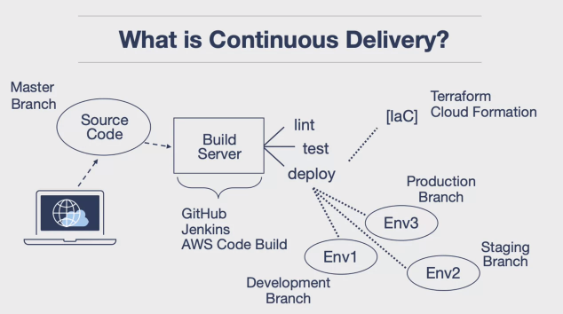


## Cloud Computing Introduction

1. **Near-Infinite Computing**
• Cloud computing offers near-infinite storage, compute, and CPU storage, making it powerful.
• It can handle more traffic than a physical data center can handle.

2. **Elimination of Upfront Costs**
• Cloud computing eliminates the need for global-scale infrastructure, allowing startups to leverage available resources.
• This eliminates the need for upfront costs, enabling creation of many modern applications.

3. **Use of Resources**
• Efficient use of resources can reduce costs, treating them more like utilities.
• Companies that use cloud computing efficiently treat resources like utilities.

4. **Comparative Advantage**
• Comparative advantage refers to focusing on what you're best at, allowing you to focus on what you do best.
• This concept is similar to Michael Jordan's decision to focus on training instead of training.
• Cloud computing eliminates the need for physical data centers and hardware installation, allowing companies to focus on their core business.

## Cloud Computing Service Models

1. **Software as a Service:**
• Examples include Gmail, Splunk, and data dog.
• These services eliminate the need for hosting a dedicated web server.


2. **Platform as a Service:**
• Platform as a service abstracts away the infrastructure, allowing developers to focus on application development.
• Examples include Heroku, Google's GAE, and Amazon's Beanstalk.


3. **Infrastructure as a Service:**
• Extensive offerings like Amazon's EC2 allow for bulk rental of virtual machines at low costs.
• This service requires the software engineer to spin up and set up the networking layer, but offers significant cost savings.


4. **Metal as a Service:**
• Provides the ability to spin up and provision machines yourself.
• This service is suited for virtualization and can be used to control physical hardware like GPUs.

5. **Serverless:**
• Similar to Platform as a Service, Serverless FaaS or function as a service.


## Economics of cloud computing

* ***Elasticity:** Cloud computing allows businesses to scale their IT resources up or down based on demand. This can save money by avoiding the need to purchase and maintain excess capacity.
    
- **Availability:** Cloud providers offer high levels of availability, ensuring that businesses can access their applications and data even in the event of outages.
    
- **Self-service:** Cloud computing enables businesses to provision and manage resources without the need for extensive IT expertise.
    
- **Reduced complexity:** Cloud providers handle many of the complexities of IT infrastructure, allowing businesses to focus on their core competencies.
    
- **Total cost of ownership (TCO):** Over time, cloud computing can be a more cost-effective solution than traditional on-premises IT.
    
- **Operational resilience:** Cloud providers offer global reach and redundancy, ensuring that businesses can continue to operate even in the event of natural disasters or other disruptions.
    
- **Business agility:** Cloud computing allows businesses to quickly adapt to changing market conditions and customer demands.

## Introduction to DevOps

1. **DevOps**: The union of people, process, and products to enable continuous delivery of value to end users. It involves essential practices such as agile planning, continuous integration, continuous delivery, and monitoring of applications.
2. **Cycle Time**: The time it takes to complete one cycle of the OODA loop, which consists of observation, orientation, decision, and action. It determines how quickly a team can gather feedback and learn from their deployments.
3. **Validated Learning**: The feedback that a team gathers with each cycle, based on real, actionable data. It helps the team to pivot or persevere, and to optimize their value delivery.
4. **Release Pipeline**: The process of deploying a change of code or configuration to the production environment. It should be automated, hardened, and fast to shorten the cycle time and enable frequent deployments.


 * Documentation: [What-is-DevOps](https://d3c33hcgiwev3.cloudfront.net/ET0s4ZgmRIW9LOGYJrSFcg_476f7cfa77384d068aaf116839eec296_What-is-DevOps_.pdf?Expires=1703289600&Signature=NagV8XO8vnPbTcEYLtpv96Vrj-vJjmuI47Bm-7SFFXc~NbynExjmH4-3t-rSWXj0I1WTKwB39~sC~~QYtCDBML3dArX2qEVXpemlMJ~ruPSIcEL5zusa77o~fbjc1mGaLxEfYp4YWNdiiuS-u6-qo-WAkAKbNcnWAR3FEBgE0WQ_&Key-Pair-Id=APKAJLTNE6QMUY6HBC5A)

## Benefits of DevOps:

- **Speed**: DevOps improves the velocity of your team, enabling faster software development and deployment. This leads to quicker delivery of features and bug fixes to customers.
    
- **Delivery**: Improved delivery encapsulates all the benefits of DevOps. Faster development cycles can prevent your company from falling behind in competitiveness.
    
- **Reliability**: Automation, continuous testing, monitoring, and logging under DevOps make your system more reliable. These practices ensure a high degree of system reliability.
    
- **Scale**: DevOps allows for operation at scale through Infrastructure as Code and micro-services. The simpler and smaller the services, the easier it is to scale.
    
- **Collaboration**: DevOps promotes shared ownership and accountability, reducing inefficiencies and saving time.
    
- **Security**: Implementing policy as code under DevOps can increase security levels and help define and track compliance at scale. This could be a primary reason for an organization to choose DevOps.

## DevOps Best Practices

- **Continuous Integration**: This is the process of automatically testing bugs to improve software quality and reduce the time to validate or release a new software update.
    
- **Continuous Delivery**: An extension of continuous integration, it involves automatic building and testing of code changes, readying them for release into production.
    
- **Microservices**: A critical component of DevOps, it involves building a single application as a set of small services, each operating independently. This simplification adds a lot of scalability.
    
- **Infrastructure as Code**: This practice allows for continuous delivery by checking in the infrastructure into a repository like git, enabling the development of automated and repeatable ways of orchestrating the infrastructure.
    
- **Monitoring and Logging**: Often misunderstood, these are crucial for maintaining system reliability and performance.

## Infrastructure as Code (IaC)

1. **Infrastructure as Code (IaC)**: <mark style="background: #FFF3A3A6;">A DevOps practice that manages infrastructure in a descriptive model, using the same versioning as source code.</mark>
2. **Benefits of IaC**: IaC solves the problem of environment drift, enables consistent and repeatable deployments, and supports testing in production-like environments.
3. **Idempotence**: A principle of IaC that ensures a deployment command always sets the target environment into the same configuration, regardless of the starting state.


### Example of a Terraform scripts

```yaml
# Configure the AWS Provider
provider "aws" {
  region = "us-west-2"
}

# Create an AWS instance
resource "aws_instance" "example" {
  ami           = "ami-0c94855ba95c574c8"
  instance_type = "t2.micro"

  tags = {
    Name = "example-instance"
  }
}
```

- **Repeatability and Consistency**: IaC allows for the creation of a repeatable and consistent environment. This is achieved by defining the infrastructure in code and storing this code in a source control repository. This approach avoids the “snowflake” deployments where each deployment is unique and hard to replicate.
    
- **Multiple Environments**: With IaC, you can create multiple environments such as staging, production, etc., by using the same infrastructure template. This ensures consistency across all environments.
    
- **Event-Driven Updates**: Changes to the infrastructure are typically triggered by events such as a push to a specific branch in the source control repository. This includes not only application code but also the underlying infrastructure.
    
- **Best Practice for Cloud-Based Deployments**: IaC is considered a best practice for cloud-based deployments. It solves problems related to repeatability, consistency, and business continuity. If you’re not using IaC, you’re not following the modern way of doing deployments.
    
- **Business Continuity**: IaC is crucial for business continuity. Without it, the departure of a key employee who knows the deployment process could cause significant problems. With IaC, the infrastructure setup is documented in code, making it easier for any team member to understand and manage.

## Introduction to Continuous Pipelines

- **Continuous Delivery**: It’s a set of quality control gates that allows for continuous improvement of the production environment. This process is automated, ensuring that source control is checked and verified in a staging environment before going to production.
    
- **Kaizen**: A continuous improvement process originating from the Japanese automobile industry. It involves making small, incremental changes to improve the system continuously.
    
- **Importance**: Continuous delivery is crucial in modern software engineering infrastructure. Without it, there’s a risk of making things worse over time due to lack of systematic improvement. 
    
- **Outcome**: Continuous delivery is not optional; it’s a necessity. It ensures you’re continuously making things better rather than worse. It’s a systematic way of continually improving your source control and overall system.

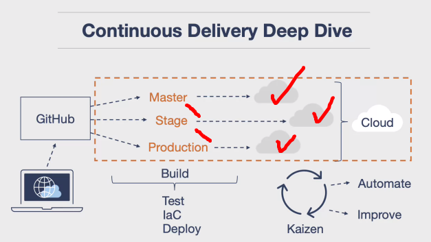


---
<a name="02"></a>
# Course 02: Cloud Virtualisation, Containers and APIs

## Introduction

- **Cloud Building Blocks**: introduction to virtualization and containers.
- **Virtualization and Containers**: how to launch a spot instance, a cost-effective version of a virtual machine, and how to use Docker format containers to deploy applications to Kubernetes.
- **Microservices**: A critical component of DevOps best practices, microservices are functions that perform one task very well. The course will teach how to build effective and simple microservices.
- **Operational Characteristics of the Cloud**:  introduction to monitoring and logging, and the importance of having a dashboard for visibility.

## Virtual Machines

- **Virtual Machines**: VMs are crucial to cloud computing, allowing a guest operating system to run inside a host. They are still widely used in the cloud, especially for monolithic applications that have been running for a long time.
    
- **Containers vs VMs**: containers VS VMs, containers can launch in milliseconds, making them more suitable for certain use cases. Containers, a DevOps best practice, allow you to build cloud-native applications and include the runtime with your code.
    
- **Time** the launch time for VMs can range from seconds to minutes, unlike containers. This difference is crucial when deciding between containers and VMs.

## Containers vs VMs

- **Virtual Machines**: VMs have a host and a guest operating system. They are suitable for monolithic applications and are great for ‘lift and shift’ or legacy applications. They involve cloning a full operating system to run an application.
    
- **Containers**: Unlike VMs, containers have a host and a runtime, which is a subset of the operating system. They are more like a process than an operating system. Only the files necessary for the application to run are packaged in the container, making them lightweight, smaller, and faster. They are DevOps best practice compliant and fit well with continuous integration and microservices.

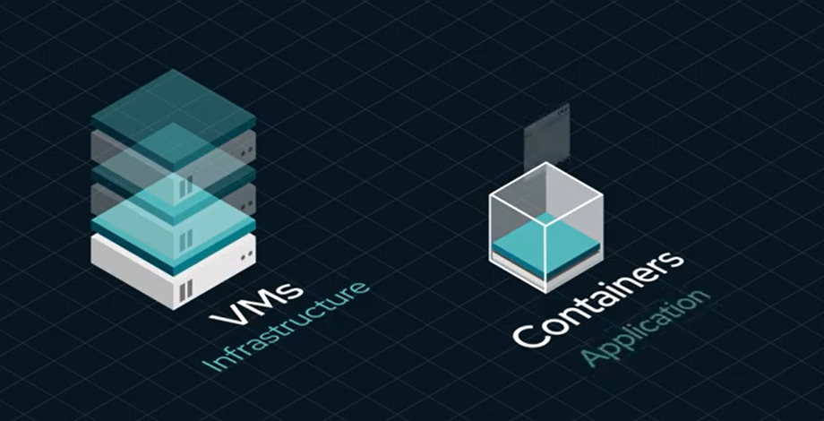


Reference: [Containers vs VMs (redhat.com)](https://www.redhat.com/en/topics/containers/containers-vs-vms)

## How Do Spot Instances Work?

 - The key components of launching a spot instance are the <mark style="background: #FFF3A3A6;">size</mark> of the virtual machine, the <mark style="background: #FFF3A3A6;">security group</mark>, and the <mark style="background: #FFF3A3A6;">rules in the SSH</mark> key PEM file. 
 - The security group is important because it determines which port you can talk to when you launch the machine. Another component of the SSH mechanism is that you’ll have to use a PEM file and this will be the SSH key that will allow you to connect to that spot instance. 
 - Finally, if you wanted to do a separate API call, you would have to assign a role to the spot instance so that it had the ability to make those connections.


## Containers

### When to use containers?

1. **Cloud Native Environment**: Containers are excellent for building a cloud native environment due to advancements in managed Container Services and Kubernetes services.
2. **Microservices**: Containers work well with the microservice workflow, where one service does one thing. They allow you to build something that’s reproducible.
3. **DevOps**: Containers fit well into DevOps workflows. They allow you to programmatically build the Container and the source code, and deploy them using infrastructure as code.
4. **Job Management**: Containers are useful in job management, especially when building and reproducing jobs repeatedly.
5. **Portability and Usability**: Containers offer portability, which is particularly beneficial in DevOps and Data Sciences. They allow the runtime to be included with your project, making it completely reproducible. This is a key tenant of science.

## Docker

Docker is a product composed of Docker Desktop and Docker Hub. Docker Desktop is an application installed on your computer for local development. It includes a <mark style="background: #FFF3A3A6;">container runtime, developer tools, and a GUI</mark>. 

It can interface with<mark style="background: #FFF3A3A6;"> Kubernetes to launch and control clusters</mark>. Docker Hub allows you to check things into a public or private repository, automate container builds via GitHub, and pull and use certified images. 

Docker Desktop is more of a development environment, while Docker Hub is a collaborative environment. When using Docker, you can leverage the knowledge of core developers by pulling base images for your projects.


Using DockerHub and Docker locally example:

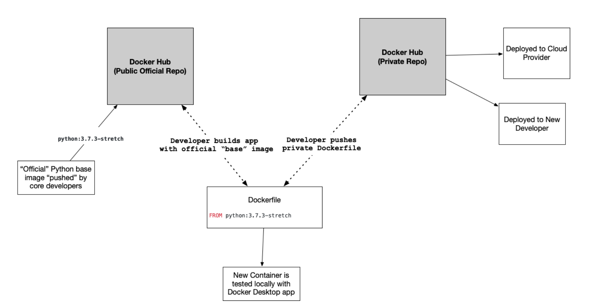

## Container Registry

A container registry is a <mark style="background: #FFF3A3A6;">repository of container images</mark>. It is used to store and access these images for cloud-native applications³. Container registries can be public or private, and they play a crucial role in the deployment and scaling of applications that use microservices³.

Microsoft Azure, for example, offers the Azure Container Registry, a fully managed, geo-replicated service that supports Docker and OCI images and artifacts¹. It provides features such as security, compliance, scalability, and automation for building, storing, and deploying container images and Helm charts¹. It also supports Azure Container Registry Tasks, a suite of services to build, manage, and patch container images².

In summary, a container registry is an essential tool for <mark style="background: #FFF3A3A6;">managing the lifecycle of containers, from development to deployment</mark>¹²³.

(1) What is a container registry? - Red Hat. https://www.redhat.com/en/topics/cloud-native-apps/what-is-a-container-registry.
(2) Azure Container Registry | Microsoft Azure. https://azure.microsoft.com/en-us/products/container-registry/.
(3) Azure Container Registry documentation | Microsoft Learn. https://learn.microsoft.com/en-us/azure/container-registry/.

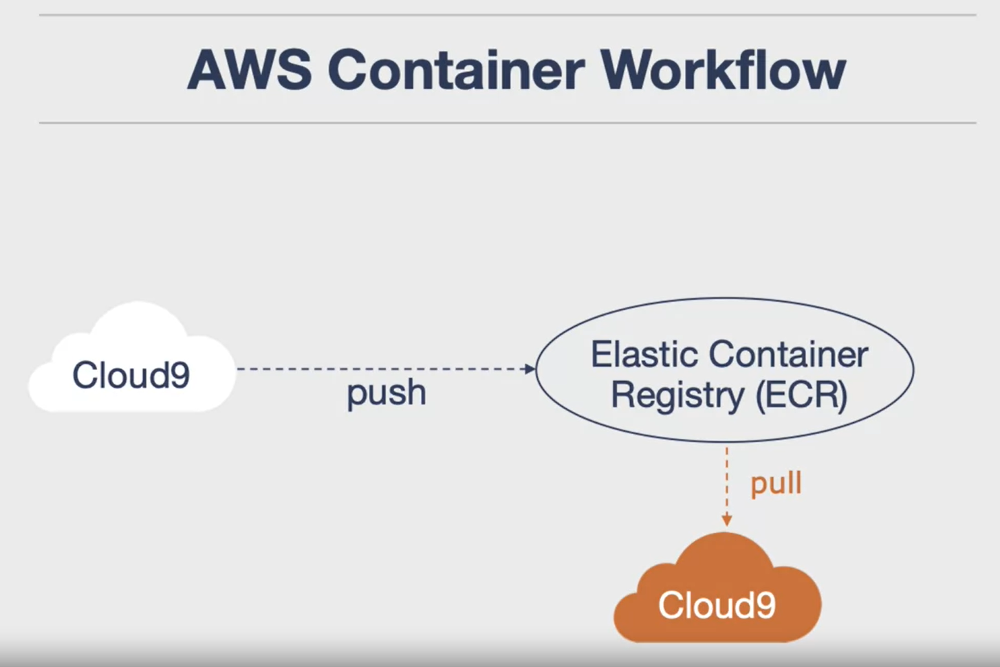

## Introduction to Kubernetes

- **What is Kubernetes**: Kubernetes is an orchestration layer for containers, developed by Google in 2014. It's a useful tool for managing containerized applications.
- **Installation**: It can be installed via Docker Desktop on Windows or Mac, or for more advanced users, using "Kubectl" and "Curl" commands.
- **Key Features**: Kubernetes offers highly available architecture, auto-scaling, a rich ecosystem, service discovery, health management, and secrets and configuration management.
- **Workflow**: The basic workflow involves creating a Kubernetes cluster, deploying your application into the cluster, exposing the port for external access, and auto-scaling based on traffic demands.
- **Cluster Architecture**: A Kubernetes cluster consists of multiple nodes, each containing multiple pods, which in turn can contain multiple containers.


## Autoscaling Kubernetes 

One of the “killer” features of Kubernetes is the ability to set up auto-scaling via the Horizontal Pod Autoscaler. How does this work? The <mark style="background: #FFF3A3A6;">Kubernetes HPA</mark> (Horizontal Pod Autoscaler) will automatically scale the number of pods (remember they can contain multiple containers) in a replication controller, deployment or replica set. Thee scaling uses CPU utilization, memory, or custom metrics defined in the Kubernetes Metrics Server.


## Introduction to Microservices

- **Microservice Architecture**: Microservices are small, specialized, and autonomous services that are a significant part of new Cloud-native architectures. They are a part of a larger DevOps practice which includes continuous delivery, continuous integration, and best practices around monitoring and alerting.
- **Types of Microservice Architectures**: The text discusses different types of microservice architectures, including event-driven web services. The success or failure of a project can depend on the chosen architecture.
- **Serverless Computing**: Serverless is a paradigm where you can run code without provisioning servers, eliminating the need to worry about low-level details of provisioning machines. AWS Lambda, Google Cloud Functions, and Azure functions are examples of this, where they can map to different events. This is considered one of the best advancements in modern computing.

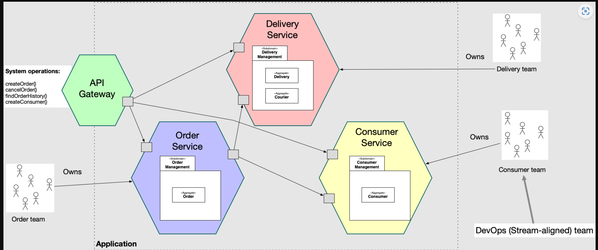

 - **Reference**:  [What are microservices?](https://microservices.io/)

## Microservices characterictics

- **Characteristics**: Microservices are small, autonomous, and specialized. They do one task very well and can independently interact with systems like databases or authentication services.
- **Benefits**: Microservices offer speed in application development and simplicity due to their small size. They allow for easy isolation of services like authentication, database, or business logic.
- **Functionality**: At its core, a microservice is a function that maps to a URL or an event. This provides a high degree of reliability.

## Where to Run Microservices

- **Containers**: Microservices can be run in containers, such as Google Cloud’s Cloud Run service, which allows you to deploy a microservice without managing anything.
- **Kubernetes**: Alternatively, microservices can be deployed to more complex systems like Kubernetes.
- **Cloud Native Capabilities**: Microservices can also be run using cloud native capabilities. All cloud platforms now allow you to write a function that maps to an event, such as AWS Lambda, Google Cloud Functions, or Azure Functions.
- **Holistic Platforms**: Another option is to develop a microservice on a holistic platform, such as Elastic Beanstalk or Google App Engine, which can map together authentication and other services. These platforms could be places where you could run microservices.


## Operationalizing microservices


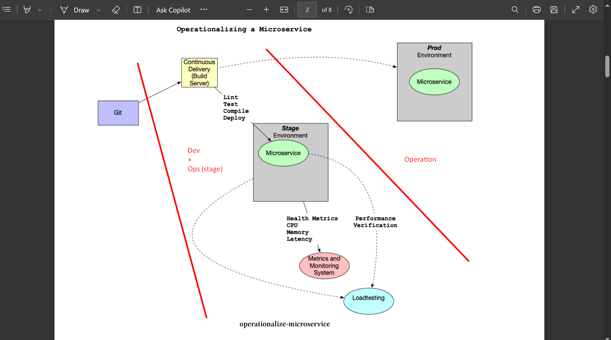

A critical factor in developing a microservice is to think about the feedbaࢤ loop. In this diagram, a GitOps style workflow implements. • 

-  Application stored in Git
 - Changes in Git trigger the continuous delivery server, which tests and deploys it to a new environment. This environment configures as code Infrastructure as Code (IaC).
 - The microservice, which could be a containerized service. It runs in Kubernetes or a FaaS (Function as a Service) running on AWS Lambda. This microservice has logging, metrics, and instrumentation included.
 - A load test using a tool like locust
 - When the performance and auto-scaling is verified, the code is merged to production and deployed

Metrics can be deployed and viewed in Prometheus: [Advance Your Spring Development Skills | Tech-Notes (matiaspakua.github.io)](https://matiaspakua.github.io/tech.notes.io/pages/development/advance_your_spring_development_skills.html#02)


## Five-Why’s and Kaizen 

One way our troubled company could have swapped Voodoo for a sane alert process was to use the Five Why’s method. In a nutshell, it originated from Kaizen, a process of continuous improvement, from the Japanese Automobile industry post-WWII. The Five Why’s strategy is to keep asking questions until the root cause appears. 

Learn about the Five Whys in the following screencast. 
[Video Link](https://www.youtube.com/watߴ?v=9jS3cwjIJEo)
[Learn about Continuous Improvement in the following screencast](https://www.youtube.com/watߴ?v=mZVbUbYwFQo)

## Introduction to Flask

**Official Documentation**: [Welcome to Flask — Flask Documentation](https://flask.palletsprojects.com/en/3.0.x/)

This lesson focuses on **Flask**, a popular lightweight web framework in Python. It’s widely used for building microservices and mapping Python code to web URL routes.

**APIs**, which define interactions between services, and **JSON** (JavaScript Object Notation), a common data-interchange format used with APIs. When building a microservice, the core components are a Flask application, an API, and JSON. These elements work together to form a microservice.

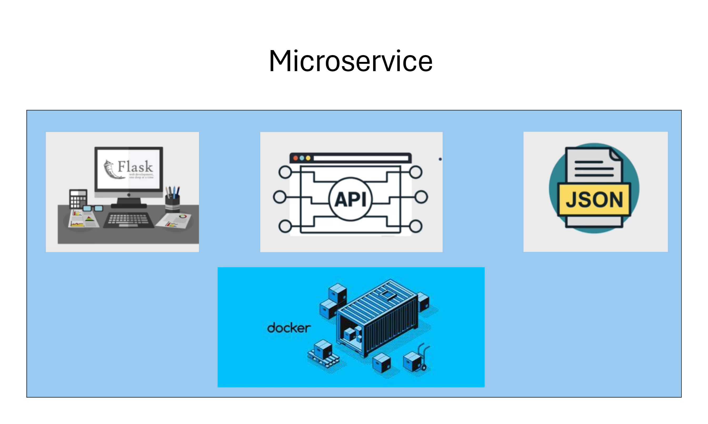

## Introduction to Serverless Microservices

**Serverless Architecture** is an application delivery model where cloud providers automatically intercept user requests and computing events to dynamically allocate and scale compute resources. This allows you to run applications without having to provision, configure, manage, or maintain server infrastructure. 

**A Serverless REST API**

Assuming AWS as the cloud vendor, a Serverless REST API consists of three main components:

1. **API Gateway**: This is responsible for receiving HTTP requests. It acts as the entry point for the client to interact with the serverless application.

2. **Lambda Functions**: These are the functions that are triggered by the API Gateway. They receive these requests and execute upon them. The code for these functions is written by developers and can be in any language supported by AWS Lambda.

3. **DynamoDB**: This is a NoSQL database service provided by AWS, which is used to store and retrieve data. The Lambda functions interact with DynamoDB to fetch or store data as per the request.

In this architecture, when a client sends an HTTP request, the API Gateway receives it and triggers the corresponding Lambda function. The Lambda function then processes the request, interacts with DynamoDB if necessary, and sends the response back to the client via the API Gateway.

 - A Guide to Serverless Architecture. https://www.serverless.com/blog/serverless-architecture.
 - What is Serverless Architecture | Google Cloud. https://cloud.google.com/discover/what-is-serverless-architecture.
 - serverless/examples: Serverless Examples - GitHub. https://github.com/serverless/examples.


## AWS Step function

 - **Official Documentation**: [What is AWS Step Functions? - AWS Step Functions](https://docs.aws.amazon.com/step-functions/latest/dg/welcome.html)

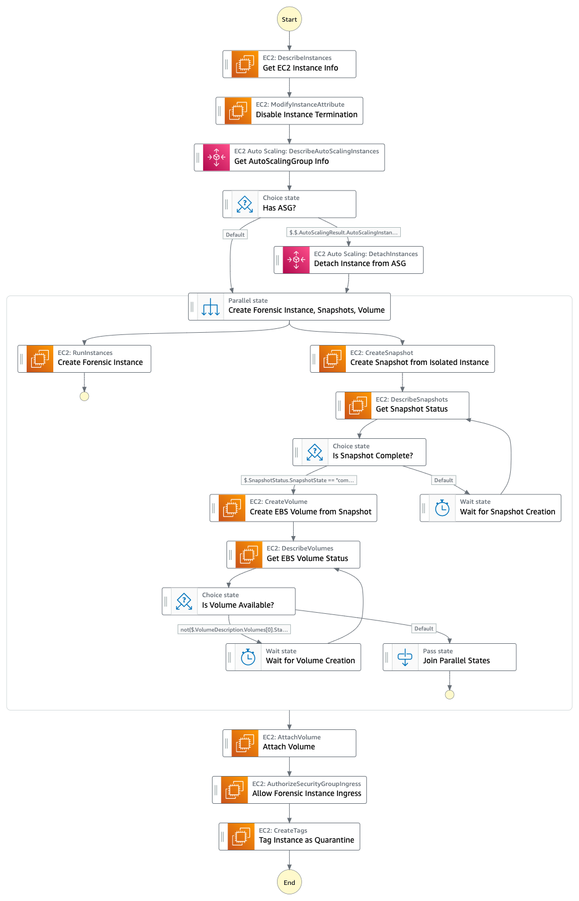


## AWS S3 trigger

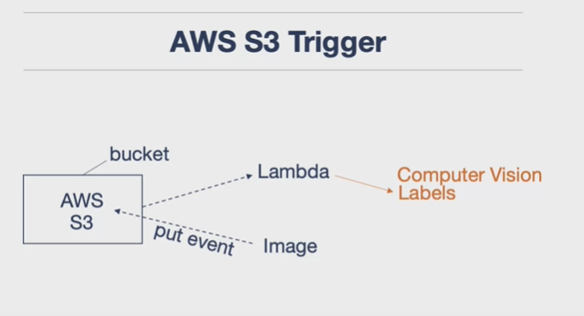

## AWS Serverless Application Model (SAM)

The AWS Serverless Application Model (AWS SAM) is a toolkit designed to enhance the developer experience of building and running serverless applications on AWS. It consists of two main components:

- **AWS SAM template specification**: This is an open-source framework that allows you to define your serverless application infrastructure on AWS. It's built on AWS CloudFormation, meaning you can use the AWS CloudFormation syntax directly within your AWS SAM template. It also offers its own unique syntax that focuses specifically on speeding up serverless development. The AWS SAM syntax is abstract, short-hand, and transformational, allowing you to define your infrastructure quickly, in fewer lines of code, and with a lower chance of errors.

- **AWS SAM command line interface (AWS SAM CLI)**: This is a command line tool that you can use with AWS SAM templates and supported third-party integrations to build and run your serverless applications. It allows you to select from starter templates or choose a custom template location to begin a new project, package your function dependencies, simulate events, test APIs, invoke functions, configure your application's deployment settings, create secure continuous integration and delivery (CI/CD) pipelines, view important information about your deployed resources, gather logs, and utilize built-in monitoring tools such as AWS X-Ray.

In essence, AWS SAM helps you manage your serverless application through the authoring, building, deploying, testing, and monitoring phases of your development lifecycle. It also enables you to define permissions between your AWS resources and automatically sync local changes to the cloud, speeding up your development and cloud testing workflows. It's best utilized when used with AWS SAM and AWS CloudFormation templates, but it also works with third-party products such as Terraform.


## Event-Driven vs. Polling

A key advantage of serverless programming is the ability to write code that reacts to events, rather than continuously checking for results.

**Event-Driven Programming**: This is a programming paradigm where the flow of the program is determined by events such as user actions, sensor outputs, or messages from other programs. In serverless architectures, functions are triggered by events.

**Polling**: This is a coding technique where your program continually checks for conditions to be met. It’s like repeatedly asking, “Is the data ready yet?” until the answer is yes. While polling can be simple to implement, it can lead to inefficiencies. 

The key difference between the two lies in how they handle waiting for something to happen. 

In the context of serverless programming, event-driven architectures are often preferred because they allow the system to be more responsive and efficient. Instead of continuously checking for changes (polling), the system can sit idle and react when an event occurs. 

## Introduction to Monitoring and Alerts

- **Alerting Importance**: Alerting plays a crucial role in organizations, especially in SaaS companies. It helps identify issues and fix them promptly.
- **Alerting Challenges**:  As the software products faced more problems and the team didn’t have time to fix them due to a rapid development cycle, the alerts became disruptive, often waking the team up at odd hours.
- **Alerting Evaluation**: evaluate the alerts and try to find discernible pattern.
- **Alerting Experiment**: in a experiment a company turn off the alerts for a month as an experiment, and nothing adverse happened. This led to the realization that they had been caught in a “cargo cult” way of thinking about alerts, which was more damaging than helpful.
- **Key Takeaway**: having too many alerts can be counterproductive. It’s essential to ensure that alerts are meaningful and actionable.

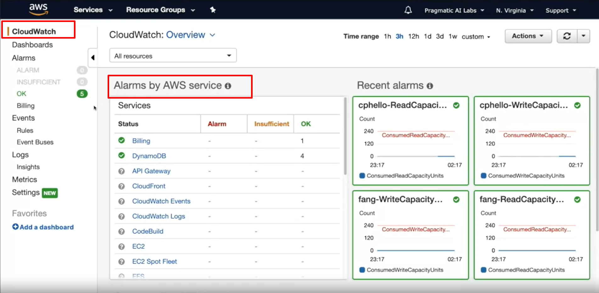

## Load Testing

- **Effective Load Testing**: is a type of performance testing that simulates realistic user traffic and workload on a system or application.
- **Load Testing Tools**:  such as JMeter, LoadRunner, Gatling, and Locust.
- **Load Testing Process**:  defining the test objectives, designing the test scenarios, executing the test, and analyzing the results.
- **Load Testing Metrics**: response time, throughput, error rate, and resource utilization.

Tool: [Locust - A modern load testing framework](https://locust.io/)


An excelent tools for monitoring is prometheus: 

## Introduction to Kaizen


- **Continuous Improvement in Sports and Software**: Just as athletes strive to enhance their performance, continuous improvement applies to source code or cloud-based projects. The goal is to constantly seek ways to make things better, more visible, and reliable.
    
- **Learning from Past Failures**: The failure was attributed to the lack of a continuous improvement process.
    
- **Systematic Improvement**: The solution to past-failures involved identifying how to make things better systematically, not fixing everything at once, but piece-by-piece, finding bugs, and making it continuously tested and improved.
    
- **Daily Choice**: Continuous improvement is a daily choice that your team or company can make. It involves trying to do just a little bit at a time to fix a problem, get to the root cause, and ultimately have a reliable product.
    
- <mark style="background: #FFF3A3A6;">**Risk of Degradation**: While you can continuously improve, you can also continuously degrade. Even successful projects need daily improvements to prevent degradation. The expression “you’re either getting better or you’re getting worse” is emphasized.</mark>

## What are the 'Five Whys'?

- **Five Whys Method**: This interactive technique iteratively questions the cause of a problem, and is often used in conjunction with kaizen for continuous improvement.
    
- **Hypothetical Scenario**:  The Five Whys method is applied to this scenario to identify the root cause.
    
- **Root Cause Identification**: Through a series of “why” questions, it’s revealed that the root cause of the delay is a miscommunication issue where the CEO was unaware of the proper procedure for making feature requests.
    
- **Solution**: The Five Whys method helps to uncover these subtle miscommunications, leading to a permanent solution. It’s applicable not just for late features, but also for software bugs and misinformation.

<mark style="background: #FFF3A3A6;">This method emphasizes the importance of understanding the root cause of a problem for effective problem-solving and continuous improvement.</mark>

Reference: [Five whys - Wikipedia](https://en.wikipedia.org/wiki/Five_whys)


---
<a name="03"></a>
# Course 03: Cloud Data Engineering

## The Problem with Concurrency in Python

- **Python and Concurrency**: the challenges of concurrency in Python, which originated from the early days of the internet when multi-core machines were not common. Python uses a mechanism called the Global Interpreter Lock (GIL) that locks Python threads to one core.
    
- **Limitations of GIL**: While GIL is not a problem for single-core machines, it becomes a bottleneck when dealing with multi-core systems as it prevents Python from fully utilizing all cores. This makes Python less suitable for certain server problems that require high levels of concurrency.
    
- **Alternative Solutions**: cloud-based solutions like AWS Lambda and SQS to achieve high levels of concurrency, effectively treating the cloud as an operating system. Take care for using Python for building servers due to its concurrency limitations.

## Introduction to the End of Moore's Law


- **End of Moore’s Law**:  states that the speed of single programs has stopped growing. This is attributed to the inefficiencies introduced by multi-core machines and the diminishing returns of parallel code execution.

**Moore's Law** is an observation made by Gordon Moore, co-founder of Intel, in 1965. <mark style="background: #FFF3A3A6;">He noticed that the number of transistors that could fit on a microchip was doubling approximately every two years</mark>². This led to an increase in computing power and a decrease in cost over time².

<mark style="background: #FFF3A3A6;">However, experts predict that Moore's Law will end sometime in the 2020s.</mark> This is because as transistors become smaller, they will reach a physical limit where they can't be made any smaller. Additionally, as circuits get smaller, they generate more heat, which can cause them to fail.

The end of Moore's Law doesn't mean the end of technological progress. <mark style="background: #FFF3A3A6;">Instead, it signifies a shift in focus from miniaturization of existing technologies to the introduction of new devices, integration technologies, and computing </mark>architectures. For example, the industry is moving towards Application Specific Integrated Circuits (ASICs) like GPUs and Tensor Processing Units (TPUs), which are designed for specific tasks and offer high levels of parallel processing.

<mark style="background: #BBFABBA6;">So, the end of Moore's Law is not a dead-end, but rather a new beginning for information technology.</mark>

- **Shift to ASICS**: As a response to this challenge, the industry is shifting towards Application Specific Integrated Circuits (ASICS), such as GPUs. These devices, like NVIDIA GPUs, are designed for parallel coding and are supported by toolkits like CUDA.
    
- **Emergence of TPUs**: Tensor Processing Units (TPUs), designed to work with machine learning frameworks like TensorFlow, are emerging as a new player. Google, for instance, has been using TPUs since 2015 for various applications including search and translation.
    
- **CPU vs ASICs**: While CPUs are designed for general-purpose processing, ASICs like GPUs and TPUs are tailored for specific tasks, offering a potential solution to the challenges posed by the end of Moore’s law.

## CUDA

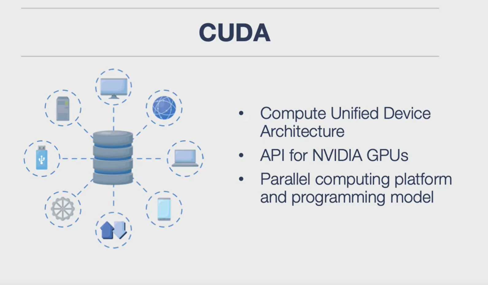

## ASIC


---
<a name="04"></a>
# Course 04: Cloud Machine Learning Engineering and MLOps

## MLOps

### Definition

Machine learning + DepOps (Development and operations.)

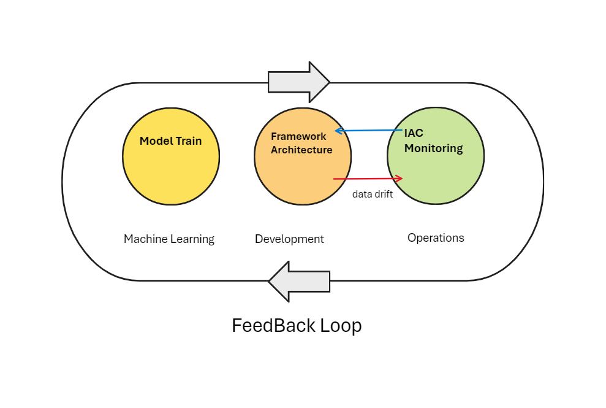

### Edge Machine Learning

Edge-based machine learning is the process of <mark style="background: #FFF3A3A6;">running machine learning models on an edge device to collect, process, and recognize patterns within datasets</mark>. The device itself has everything it needs, and in many cases, the hardware is optimized to be able to do it at low power. Edge-based processing allows you to do things on the device, and there are many examples of edge-based devices such as Coral TPU, AWS DeepLens, DeepRacer, and Intel neural compute stick. These devices can run without needing to talk to the internet, and there are a lot of applications in the future.

### Edge ML and 5G

The proliferation of edge-based devices, which can do prediction on the physical device and are more powerful than your laptop at specific tasks is in the near future. 
  
These devices can have a camera and hardware that can do the prediction and then go into a cloud environment. One of the interesting things about 5G is that it could<mark style="background: #FFF3A3A6;"> potentially get rid of fiber networks</mark>. Additionally, these devices could be put in locations where they’re able to also have this fiber speed. It’s opening up a new opportunity. The offline aspects of edge-based machine learning are also interesting, especially in situations like self-driving cars or drones where it’s making life or death decisions. If it can’t talk to the network, that’s a big problem.

5G is the fifth generation of cellular technology, designed to increase speed, reduce latency, and improve flexibility of wireless services. <mark style="background: #FFF3A3A6;">It has a theoretical peak speed of **20 Gbps**, which is **20 times faster** than 4G</mark> . 5G also promises lower latency, which can improve the performance of business applications as well as other digital experiences such as online gaming, videoconferencing, and self-driving cars. 

5G networks are virtualized and software-driven, and they <mark style="background: #FFF3A3A6;">exploit cloud technologies</mark>. The 5G network will also simplify mobility, with seamless open roaming capabilities between cellular and Wi-Fi access. The new Wi-Fi 6 wireless standard (also known as 802.11ax) shares traits with 5G, including improved performance. 

5G technology works by <mark style="background: #FFF3A3A6;">using higher radio frequencies that are less cluttered, called 'millimeter waves' (mmwaves)</mark>. These waves allow for it to carry more information at a much faster rate. 5G New Radio, the global standard for a more capable 5G wireless air interface, will cover spectrums not used in 4G. New antennas will incorporate technology known as massive MIMO (multiple input, multiple output), which enables multiple transmitters and receivers to transfer more data at the same time. 

<mark style="background: #FFF3A3A6;">5G networks can create software-defined subnetwork</mark> constructs known as network slices. These slices enable network administrators to dictate network functionality based on users and devices. 5G also enhances digital experiences through machine-learning (ML)-enabled automation.

**References:**
- What Is 5G? - How Does 5G Network Technology Work - Cisco. [link](https://www.cisco.com/c/en/us/solutions/what-is-5g.html)
- What is 5G Technology and How Does it Work? - [TWI](https://www.twi-global.com/technical-knowledge/faqs/What-is-5G)
- How 5G Works - HowStuffWorks [link](https://electronics.howstuffworks.com/5g.htm)


### Using AI API

The Boto 3 library is a Python-based library that can do many things on AWS. 

Documentation: [AWS SDK for Python (amazon.com)](https://aws.amazon.com/sdk-for-python/)

You can talk to any service in this case, including the AWS comprehensive service. You can write a script or function in Python that allows you to give it an image and then it can find what is in that image. You can also recognize text and put that into a fully server-less application like AWS Elastic Beanstalk. 

The advantage of using an <mark style="background: #FFF3A3A6;">AI API is that you can really focus on the ML component and its engineering</mark>. You’re not focused on training a model that will probably do a worse job than the API that you can call from AWS comprehend. This is really a concept called <mark style="background: #FFB86CA6;">comparative advantage or CA</mark> and it says do the things that you’re the best at, let other people that are better at a specific thing do that. It’s the same concept when you’re using these AI APIs as focus on the building of the software and then call out to these other APIs and let them do the heavy lifting.

# References

Course #01: https://www.coursera.org/learn/cloud-computing-foundations-duke/home/welcome

Notes from pragmatic IA Lab: https://paiml.com/docs/home/books/cloud-computing-for-data/chapter01-getting-started/

Repo with example: [noahgift/gcp-flask-ml-deploy: This is a project to auto-deploy with an ML payload (github.com)](https://github.com/noahgift/gcp-flask-ml-deploy)

