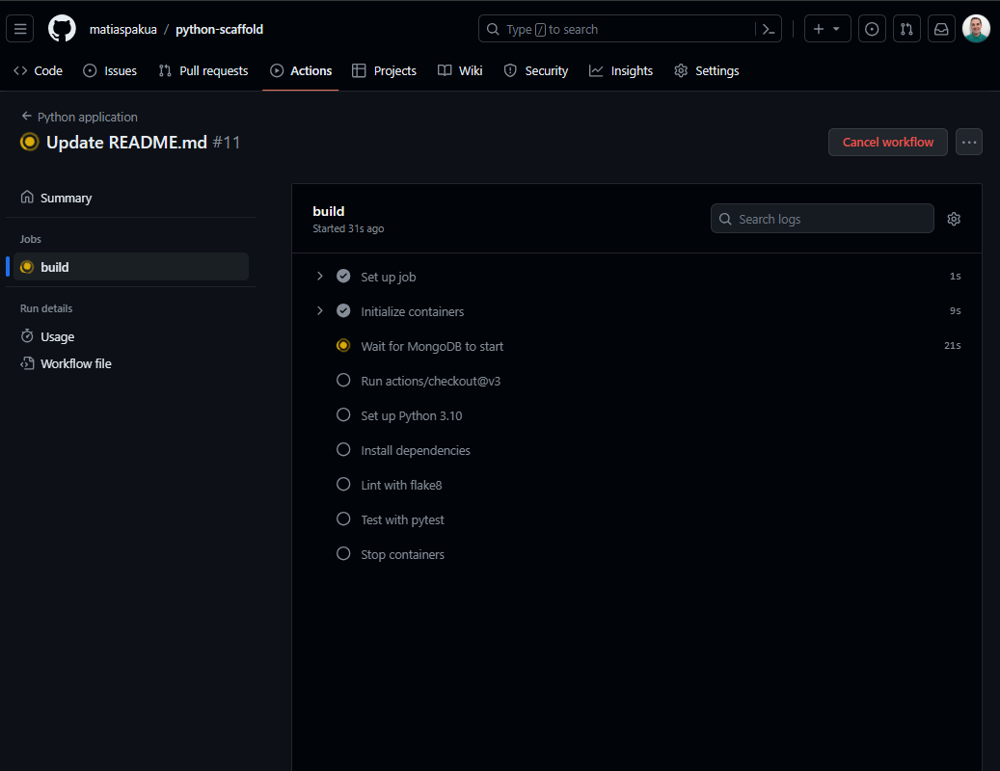
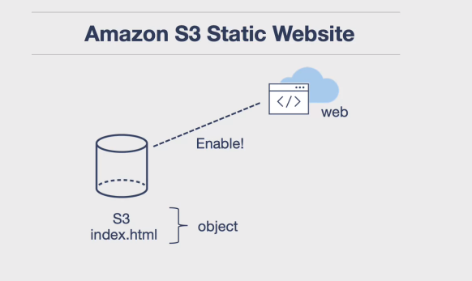
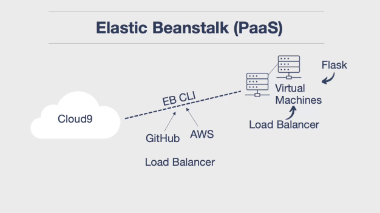
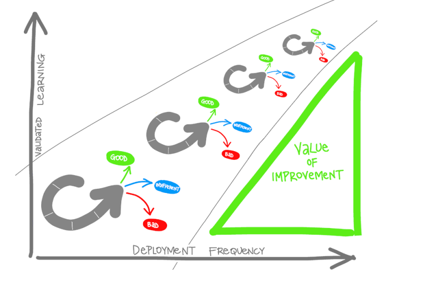

<style>
  .back-button {
    background-color: #4CAF50; /* Green */
    border: none;
    color: white;
    padding: 15px 32px;
    text-align: center;
    text-decoration: none;
    display: inline-block;
    font-size: 16px;
    margin: 4px 2px;
    cursor: pointer;
  }
</style>

<button class="back-button" onclick="window.location.href='https://matiaspakua.github.io/tech.notes.io'">All notes</button>

# Introduction

This is a very complete, hand-on, medium level specialization based on cloud computing. Goes from the basics to some advanced and very helpful examples. The examples show you the 3 main cloud vendors platform: AWS, Azure and GCP.


# Table of Contents

1. [01: Cloud Computing Foundations](#01)
2. [02: Cloud Virtualisation, Containers and APIs](#02)
3. [03: Cloud Data Engineering](#03)
4. [04: Cloud Machine Learning Engineering and MLOps](#04)


<a name="01"></a>
# Course 01: Cloud Computing Foundations

## Technical discussions

**The concept of Technical discussion**: use tools or capabilities in the same place where the project lives to communicate, for example, in a Git Repo like GitHub, using markdown file helps to detail a step-by-step process, with code snipped, diagrams, images, and so forth. AKA: **Technical notes**.

**Tools for tech notes**: Gist, Code Snippets.

**Critical Thinking**: key points:
 - **Intellectual Humility**: realise that you are NOT Right.
 - **Courage**: fight for what you belive
 - **Empathy**: go inside the mind of other.
 - **Autonomy**: go independently with your own ideas.
 - **Integrity**: be fair, be right, be sincere.
 - **Perseverance**: don't give up
 - **Confidence in reason**: faith in scientific facts,step-by-step
 - **Fair-mindedness**: accept criticism

**Effective Technical Triple Threat**
 - <mark style="background: #FFF3A3A6;">Don´t be focus only in one think, but in multiple capabilities (aspects)</mark>

## Effective Technical Teamwork

1. **Clear, elevating goal**. Something that motivate.
2. **Result-driven** structure.
3. **Competent** team-members
4. **Unified commitment** (everyone on the same page)
5. **Collaborative climate** (share, colaborate, learn)
6. **Standard of excellence** (what is good?)
7. External support and **recognition**
8. **Principled leadership** (the leader need character)

<mark style="background: #FFB86CA6;">Talent is not the most important factor for an effective team. It is important to look at all of the factors, not just talent. Focus on hiring people who have the right character and who will work well with others.</mark>

## Technical Project Management

- **Weekly cadence:** One of the most important things is to have a weekly cadence of progress checks and demos. This helps to keep everyone on track and accountable. Build a Quarterly schedule (week-by-week), an high level estimation.
- **Continuous delivery:** Code should always be in a deployable state. This means that it is ready to be released at any time.
- **Automated testing:** Testing should be automated whenever possible. This frees up developers to focus on more creative tasks.
- **Four-hour to three-day tickets:** Break down tasks into small, manageable chunks. This makes it easier to track progress and to avoid surprises.
- **To-do, in progress, and done lists:** Use simple lists to track your progress. This will help to avoid meetings that are not necessary.
- **Don't create a hero-driven process:** Don't rely on a single person to save the day. Instead, build a process that is predictable and sustainable.
- **KaiZen:** Continuously improve your process. This will help you to build better projects faster.

The key takeaway is that effective technical project management is about making small, incremental changes that lead to a predictable outcome. 


## Project Management Anti-Patterns

1. **Hero Driven Development:**
    - Reliance on a hero who constantly saves the day.
    - Working nights and weekends, leading to burnout.
    - Indicates a lack of rigor in the development process.
2. **Crisis-Driven Development:**
    - Relying on crises to drive development.
    - Continuous firefighting and fixing mistakes.
    - Results in a chaotic and unsustainable work environment.
3. **HIPPO Driven Development:**
    - Decision-making driven by the "Highest-Paid Person's Opinion" (HIPPO).
    - Random changes based on executive input disrupt development.
    - Advocates for a more structured and pre-planned decision-making process.
4. **Heavy Scrum:**
    - Overreliance on mimicking successful processes.
    - Mimicking without understanding the underlying principles.
    - Emphasizes the importance of a lighter, more effective process.
5. **Faith in People vs. Process:**
    - Emphasizes the need for both faith in people and an effective process.
    - Caution against blind trust without incremental progress.
    - Advocates for a process where results are demonstrated incrementally.

The overall message encourages a balanced and structured approach to project management, avoiding extreme reliance on individuals, crisis-driven approaches, and overly complex processes. Incremental progress and a well-defined process are highlighted as essential components of successful software development.

## Introduction to AWS Cloud Development

 - Concept of Makefile (recipe)
 - Test (functional, integration, load). Verify, validate and save time.
 - Linting (check syntax)
 - Python Virtual Environment (isolate)
 - Github Action (SaaS build server), based on YAML.

## Introduction to Continuous Integration

**Continuous Integration** is a way of ensuring that your software is always in a known state, and it <mark style="background: #FFF3A3A6;">saves you time</mark>. It is a form of automated testing and safety mechanism that ensures that your software is working or not. It is similar to the <mark style="background: #FFF3A3A6;">safety mechanisms</mark> like smoke alarms, seat belts, and drug testing, which save lives. 


Once you understand the concepts of Continuous Integration, you can develop software much more quickly. It is a primary **DevOps best practice** that allows developers to frequently merge code changes into a central repository where builds and tests then run. 

Automated tools are used to assert the new code’s correctness before integration. A source code version control system is the crux of the Continuous Integration process. The version control system is also supplemented with other checks like automated code quality tests, syntax style review tools, and more.

## Project Scaffold example in Python

1. Creation of a basic scaffold
2. Configure a GitHub repository
3. Add GitHub Actions for CI

Repo: https://github.com/matiaspakua/python-scaffold



## Introduction to Testing

1. **Concepts of Testing**
• Testing is a critical tool in ensuring the functionality of software systems.
• It can help in identifying and resolving problems, such as those in a film company.

2. **Testing Strategies**
• Replicating production and running a simulation can help in resolving problems.
• Instrumentation and monitoring, such as logging and dashboards, can help in verifying and addressing critical failure points.
• The combination of these steps is critical for identifying and addressing critical failure points.

3. **The Importance of Testing Strategy**
• Testing should be selectively chosen to solve problems.
• Automating testing is key to a successful testing strategy.
• Over-reliance on testing techniques can lead to project halt due to excessive testing.
• A balanced approach, balancing extremes and just-righting, is the best way to handle testing.

## Introduction to Continuous Delivery

1. **Understanding Continuous Delivery**
• Continuous delivery refers to the continuous deployment of code in a<mark style="background: #FFF3A3A6;"> deployable state</mark>, including the application software and infrastructure needed to run the code.
• It's a modern best practice for code that needs to be deployed in the cloud, where everything is virtualized.

2. **Infrastructure as Code**
• Infrastructure as code allows for the <mark style="background: #FFF3A3A6;">automation and creation of infinite new environments</mark>.
• The build server listens to the source control repository, undergoing a series of actions including a test phase, lint phase, and load testing.
• The infrastructure's code checks the infrastructure and ensures it's set up properly before deploying the code.

3. **User Experience**
• The user checks their code into a source control repository, typically the master branch in GitHub.
• The build server links the code, tests it, and deploys it by checking the branch the job is assigned to listen to.
• The infrastructure as code, such as Terraform or cloud formation, allows for dynamic updates or creation of new environments.

4. **Breakdown of Environments**
• Each branch in the source control can automatically create a parallel environment.
• The code can be pushed into a development branch, then merged into the staging branch for testing and deployment.
• The code can then undergo extensive load testing before being merged to production.


## Cloud Computing Introduction

1. **Near-Infinite Computing**
• Cloud computing offers near-infinite storage, compute, and CPU storage, making it powerful.
• It can handle more traffic than a physical data center can handle.

2. **Elimination of Upfront Costs**
• Cloud computing eliminates the need for global-scale infrastructure, allowing startups to leverage available resources.
• This eliminates the need for upfront costs, enabling creation of many modern applications.

3. **Use of Resources**
• Efficient use of resources can reduce costs, treating them more like utilities.
• Companies that use cloud computing efficiently treat resources like utilities.

4. **Comparative Advantage**
• Comparative advantage refers to focusing on what you're best at, allowing you to focus on what you do best.
• This concept is similar to Michael Jordan's decision to focus on training instead of training.
• Cloud computing eliminates the need for physical data centers and hardware installation, allowing companies to focus on their core business.

## Cloud Computing Service Models

1. **Software as a Service:**
• Examples include Gmail, Splunk, and data dog.
• These services eliminate the need for hosting a dedicated web server.



2. **Platform as a Service:**
• Platform as a service abstracts away the infrastructure, allowing developers to focus on application development.
• Examples include Heroku, Google's GAE, and Amazon's Beanstalk.



3. **Infrastructure as a Service:**
• Extensive offerings like Amazon's EC2 allow for bulk rental of virtual machines at low costs.
• This service requires the software engineer to spin up and set up the networking layer, but offers significant cost savings.


4. **Metal as a Service:**
• Provides the ability to spin up and provision machines yourself.
• This service is suited for virtualization and can be used to control physical hardware like GPUs.

5. **Serverless:**
• Similar to Platform as a Service, Serverless FaaS or function as a service.


## Economics of cloud computing

* ***Elasticity:** Cloud computing allows businesses to scale their IT resources up or down based on demand. This can save money by avoiding the need to purchase and maintain excess capacity.
    
- **Availability:** Cloud providers offer high levels of availability, ensuring that businesses can access their applications and data even in the event of outages.
    
- **Self-service:** Cloud computing enables businesses to provision and manage resources without the need for extensive IT expertise.
    
- **Reduced complexity:** Cloud providers handle many of the complexities of IT infrastructure, allowing businesses to focus on their core competencies.
    
- **Total cost of ownership (TCO):** Over time, cloud computing can be a more cost-effective solution than traditional on-premises IT.
    
- **Operational resilience:** Cloud providers offer global reach and redundancy, ensuring that businesses can continue to operate even in the event of natural disasters or other disruptions.
    
- **Business agility:** Cloud computing allows businesses to quickly adapt to changing market conditions and customer demands.

## Introduction to DevOps

1. **DevOps**: The union of people, process, and products to enable continuous delivery of value to end users. It involves essential practices such as agile planning, continuous integration, continuous delivery, and monitoring of applications.
2. **Cycle Time**: The time it takes to complete one cycle of the OODA loop, which consists of observation, orientation, decision, and action. It determines how quickly a team can gather feedback and learn from their deployments.
3. **Validated Learning**: The feedback that a team gathers with each cycle, based on real, actionable data. It helps the team to pivot or persevere, and to optimize their value delivery.
4. **Release Pipeline**: The process of deploying a change of code or configuration to the production environment. It should be automated, hardened, and fast to shorten the cycle time and enable frequent deployments.



 * Documentation: [What-is-DevOps](https://d3c33hcgiwev3.cloudfront.net/ET0s4ZgmRIW9LOGYJrSFcg_476f7cfa77384d068aaf116839eec296_What-is-DevOps_.pdf?Expires=1703289600&Signature=NagV8XO8vnPbTcEYLtpv96Vrj-vJjmuI47Bm-7SFFXc~NbynExjmH4-3t-rSWXj0I1WTKwB39~sC~~QYtCDBML3dArX2qEVXpemlMJ~ruPSIcEL5zusa77o~fbjc1mGaLxEfYp4YWNdiiuS-u6-qo-WAkAKbNcnWAR3FEBgE0WQ_&Key-Pair-Id=APKAJLTNE6QMUY6HBC5A)

## Benefits of DevOps:

- **Speed**: DevOps improves the velocity of your team, enabling faster software development and deployment. This leads to quicker delivery of features and bug fixes to customers.
    
- **Delivery**: Improved delivery encapsulates all the benefits of DevOps. Faster development cycles can prevent your company from falling behind in competitiveness.
    
- **Reliability**: Automation, continuous testing, monitoring, and logging under DevOps make your system more reliable. These practices ensure a high degree of system reliability.
    
- **Scale**: DevOps allows for operation at scale through Infrastructure as Code and micro-services. The simpler and smaller the services, the easier it is to scale.
    
- **Collaboration**: DevOps promotes shared ownership and accountability, reducing inefficiencies and saving time.
    
- **Security**: Implementing policy as code under DevOps can increase security levels and help define and track compliance at scale. This could be a primary reason for an organization to choose DevOps.

## DevOps Best Practices

- **Continuous Integration**: This is the process of automatically testing bugs to improve software quality and reduce the time to validate or release a new software update.
    
- **Continuous Delivery**: An extension of continuous integration, it involves automatic building and testing of code changes, readying them for release into production.
    
- **Microservices**: A critical component of DevOps, it involves building a single application as a set of small services, each operating independently. This simplification adds a lot of scalability.
    
- **Infrastructure as Code**: This practice allows for continuous delivery by checking in the infrastructure into a repository like git, enabling the development of automated and repeatable ways of orchestrating the infrastructure.
    
- **Monitoring and Logging**: Often misunderstood, these are crucial for maintaining system reliability and performance.

## Infrastructure as Code (IaC)

1. **Infrastructure as Code (IaC)**: A DevOps practice that manages infrastructure in a descriptive model, using the same versioning as source code.
2. **Benefits of IaC**: IaC solves the problem of environment drift, enables consistent and repeatable deployments, and supports testing in production-like environments.
3. **Idempotence**: A principle of IaC that ensures a deployment command always sets the target environment into the same configuration, regardless of the starting state.


### Example of a Terraform scripts

```yaml
# Configure the AWS Provider
provider "aws" {
  region = "us-west-2"
}

# Create an AWS instance
resource "aws_instance" "example" {
  ami           = "ami-0c94855ba95c574c8"
  instance_type = "t2.micro"

  tags = {
    Name = "example-instance"
  }
}
```

- **Repeatability and Consistency**: IaC allows for the creation of a repeatable and consistent environment. This is achieved by defining the infrastructure in code and storing this code in a source control repository. This approach avoids the “snowflake” deployments where each deployment is unique and hard to replicate.
    
- **Multiple Environments**: With IaC, you can create multiple environments such as staging, production, etc., by using the same infrastructure template. This ensures consistency across all environments.
    
- **Event-Driven Updates**: Changes to the infrastructure are typically triggered by events such as a push to a specific branch in the source control repository. This includes not only application code but also the underlying infrastructure.
    
- **Best Practice for Cloud-Based Deployments**: IaC is considered a best practice for cloud-based deployments. It solves problems related to repeatability, consistency, and business continuity. If you’re not using IaC, you’re not following the modern way of doing deployments.
    
- **Business Continuity**: IaC is crucial for business continuity. Without it, the departure of a key employee who knows the deployment process could cause significant problems. With IaC, the infrastructure setup is documented in code, making it easier for any team member to understand and manage.

## Introduction to Continuous Pipelines

- **Continuous Delivery**: It’s a set of quality control gates that allows for continuous improvement of the production environment. This process is automated, ensuring that source control is checked and verified in a staging environment before going to production.
    
- **Kaizen**: A continuous improvement process originating from the Japanese automobile industry. It involves making small, incremental changes to improve the system continuously.
    
- **Importance**: Continuous delivery is crucial in modern software engineering infrastructure. Without it, there’s a risk of making things worse over time due to lack of systematic improvement. 
    
- **Outcome**: Continuous delivery is not optional; it’s a necessity. It ensures you’re continuously making things better rather than worse. It’s a systematic way of continually improving your source control and overall system.


<a name="02"></a>
# Course 02: Cloud Virtualisation, Containers and APIs


<a name="03"></a>
# Course 03: Cloud Data Engineering


<a name="04"></a>
# Course 04: Cloud Machine Learning Engineering and MLOps

# References

Course #01: https://www.coursera.org/learn/cloud-computing-foundations-duke/home/welcome

Notes from pragmatic IA Lab: https://paiml.com/docs/home/books/cloud-computing-for-data/chapter01-getting-started/

Repo with example: [noahgift/gcp-flask-ml-deploy: This is a project to auto-deploy with an ML payload (github.com)](https://github.com/noahgift/gcp-flask-ml-deploy)

