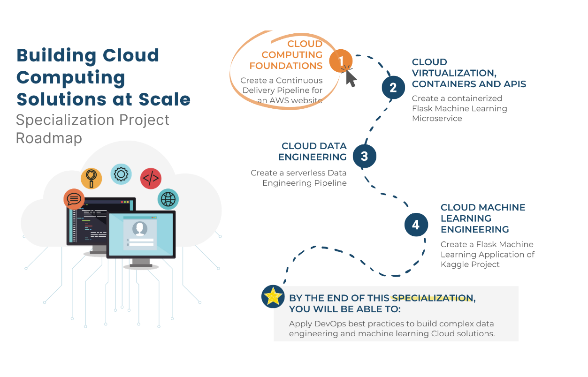
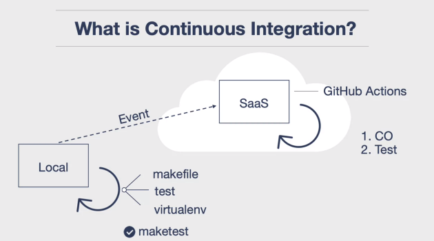

<button class="back-button" onclick="window.location.href='https://matiaspakua.github.io/tech.notes.io'">All notes</button>

## Introduction

This is a very complete, hand-on, medium level specialization based on cloud computing. Goes from the basics to some advanced and very helpful examples. The examples show you the 3 main cloud vendors platform: AWS, Azure and GCP.

## Highlights

**Courses list**:

- 01: Cloud Computing Foundations
- 02: Cloud Virtualisation, Containers and APIs
- 03: Cloud Data Engineering
- 04: Cloud Machine Learning Engineering and MLOps

## 01: Cloud Computing Foundations

### Technical discussions

**The concept of Technical discussion**: use tools or capabilities in the same place where the project lives to communicate, for example, in a Git Repo like GitHub, using markdown file helps to detail a step-by-step process, with code snipped, diagrams, images, and so forth. AKA: **Technical notes**.

**Tools for tech notes**: Gist, Code Snippets.

**Critical Thinking**: key points:
 - **Intellectual Humility**: realise that you are NOT Right.
 - **Courage**: fight for what you belive
 - **Empathy**: go inside the mind of other.
 - **Autonomy**: go independently with your own ideas.
 - **Integrity**: be fair, be right, be sincere.
 - **Perseverance**: don't give up
 - **Confidence in reason**: faith in scientific facts,step-by-step
 - **Fair-mindedness**: accept criticism

**Effective Technical Triple Threat**
 - <mark style="background: #FFF3A3A6;">Don´t be focus only in one think, but in multiple capabilities (aspects)</mark>

### Effective Technical Teamwork

1. **Clear, elevating goal**. Something that motivate.
2. **Result-driven** structure.
3. **Competent** team-members
4. **Unified commitment** (everyone on the same page)
5. **Collaborative climate** (share, colaborate, learn)
6. **Standard of excellence** (what is good?)
7. External support and **recognition**
8. **Principled leadership** (the leader need character)

<mark style="background: #FFB86CA6;">Talent is not the most important factor for an effective team. It is important to look at all of the factors, not just talent. Focus on hiring people who have the right character and who will work well with others.</mark>

### Technical Project Management

- **Weekly cadence:** One of the most important things is to have a weekly cadence of progress checks and demos. This helps to keep everyone on track and accountable. Build a Quarterly schedule (week-by-week), an high level estimation.
- **Continuous delivery:** Code should always be in a deployable state. This means that it is ready to be released at any time.
- **Automated testing:** Testing should be automated whenever possible. This frees up developers to focus on more creative tasks.
- **Four-hour to three-day tickets:** Break down tasks into small, manageable chunks. This makes it easier to track progress and to avoid surprises.
- **To-do, in progress, and done lists:** Use simple lists to track your progress. This will help to avoid meetings that are not necessary.
- **Don't create a hero-driven process:** Don't rely on a single person to save the day. Instead, build a process that is predictable and sustainable.
- **KaiZen:** Continuously improve your process. This will help you to build better projects faster.

The key takeaway is that effective technical project management is about making small, incremental changes that lead to a predictable outcome. 

### Project Management Anti-Patterns

1. **Hero Driven Development:**
    - Reliance on a hero who constantly saves the day.
    - Working nights and weekends, leading to burnout.
    - Indicates a lack of rigor in the development process.
2. **Crisis-Driven Development:**
    - Relying on crises to drive development.
    - Continuous firefighting and fixing mistakes.
    - Results in a chaotic and unsustainable work environment.
3. **HIPPO Driven Development:**
    - Decision-making driven by the "Highest-Paid Person's Opinion" (HIPPO).
    - Random changes based on executive input disrupt development.
    - Advocates for a more structured and pre-planned decision-making process.
4. **Heavy Scrum:**
    - Overreliance on mimicking successful processes.
    - Mimicking without understanding the underlying principles.
    - Emphasizes the importance of a lighter, more effective process.
5. **Faith in People vs. Process:**
    - Emphasizes the need for both faith in people and an effective process.
    - Caution against blind trust without incremental progress.
    - Advocates for a process where results are demonstrated incrementally.

The overall message encourages a balanced and structured approach to project management, avoiding extreme reliance on individuals, crisis-driven approaches, and overly complex processes. Incremental progress and a well-defined process are highlighted as essential components of successful software development.

### Introduction to AWS Cloud Development
 - Concept of Makefile (recipe)
 - Test (functional, integration, load). Verify, validate and save time.
 - Linting (check syntax)
 - Python Virtual Environment (isolate)
 - Github Action (SaaS build server), based on YAML.

### Introduction to Continuous Integration

**Continuous Integration** is a way of ensuring that your software is always in a known state, and it <mark style="background: #FFF3A3A6;">saves you time</mark>. It is a form of automated testing and safety mechanism that ensures that your software is working or not. It is similar to the <mark style="background: #FFF3A3A6;">safety mechanisms</mark> like smoke alarms, seat belts, and drug testing, which save lives. 

Once you understand the concepts of Continuous Integration, you can develop software much more quickly. It is a primary **DevOps best practice** that allows developers to frequently merge code changes into a central repository where builds and tests then run. 

Automated tools are used to assert the new code’s correctness before integration. A source code version control system is the crux of the Continuous Integration process. The version control system is also supplemented with other checks like automated code quality tests, syntax style review tools, and more.

### Project Scaffold example in Python

1. Creation of a basic scaffold
2. Configure a GitHub repository
3. Add GitHub Actions for CI

Repo: https://github.com/matiaspakua/python-scaffold

## References

Course #01: https://www.coursera.org/learn/cloud-computing-foundations-duke/home/welcome

Notes from pragmatic IA Lab: https://paiml.com/docs/home/books/cloud-computing-for-data/chapter01-getting-started/
