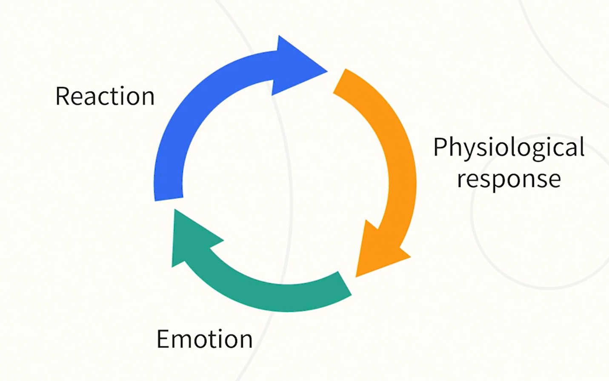

# Emotional Intelligence

## Introduction

Emotional intelligence, or EQ, is the ability to be aware of your emotions and triggers, manage your emotional responses positively, understand what's going on around you, and use that information to build strong relationships.

- **Benefits of EQ**: Enhancing your EQ can improve personal performance, support wellbeing, build strong networks, foster meaningful relationships, reduce stress or anxiety, better manage responses to challenges, and help in achieving professional goals.

- **Changeability of EQ**: Unlike general intelligence or personality traits, levels of emotional intelligence can change over time, providing an opportunity to develop EQ to achieve desired results.

- **Four Quadrants of EQ**: The four quadrants of emotional intelligence are self-awareness, self-management, social awareness, and relationship management.

## Emotions

- **Nature of Emotions**: Emotions are complex constructs in our brain that guide our responses to events. They can vary in intensity and can be pleasant or unpleasant.
- **Individual Variation**: There is significant variation in emotional responses among individuals, and even within the same individual at different times.
- **Impact of Emotions**: Emotions can affect our behavior and relationships, and play a role in how we interpret the world.
- **Building Emotional Awareness**: The text suggests a practice of self-reflection, especially after challenging situations, to better understand and manage emotions.