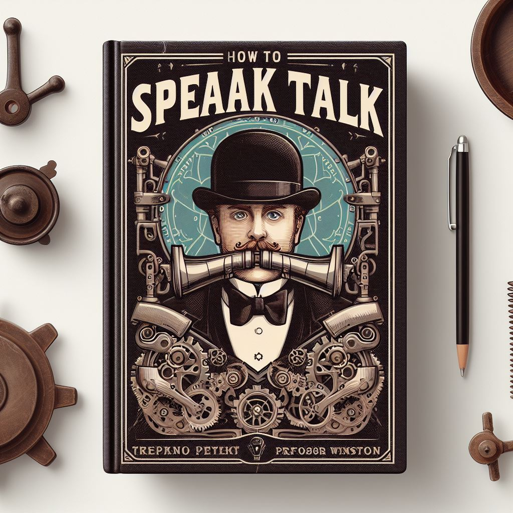

# How To Speak by Patrick Winston

<button class="back-button" onclick="window.location.href='https://matiaspakua.github.io/tech.notes.io'">All notes</button>

## Introduction

Patrick Henry Winston was an American computer scientist, professor, and director of the Artificial Intelligence Laboratory at the Massachusetts Institute of Technology (MIT). He was known for his research and contributions in the field of artificial intelligence (AI), particularly in areas such as computer vision, knowledge representation, and machine learning. He authored several books on AI and was a recipient of numerous awards and honors throughout his career. Winston passed away on July 19, 2019, at the age of 76.

In MIT talk "How To Speak" are lots of useful insight to improve the way of speak.

## Highlights

 - Introduction
 - Rules of Engagement
 - How to Start
 - Four Sample Heuristics
 - The Tools: Time and Place
 - The Tools: Boards, Props, and Slides
 - Informing: Promise, Inspiration, How to Think
 - Persuading: Oral Exams, Job Talks, Getting Famous
 - How to Stop: Final Slide, Final Words
 - Final Words: Joke, Thank You, Examples

## Personal Notes
I use a lot of tips in slides mainly, trying to make clean, concise and useful slides to present new topics, ideas and other subjects.

Some of the main recommendations are: 

- **Have something to say**: It is important to have a clear message or idea to convey. Without a clear message, the audience will not be able to follow or engage with the speaker.

- **Get to the point**: Speakers should get to the point quickly and avoid unnecessary details. This keeps the audience engaged and helps them remember the main message.

- **Use simple language**: Using simple language helps ensure that the audience understands the message. Jargon or technical language should be avoided unless the audience is familiar with it.

- **Tell a story**: Stories help make information more interesting and easier to remember. Speakers should use stories or examples to illustrate their points.

- **Practice**: Practice is essential for effective communication. Speakers should practice their delivery and make sure they can convey their message clearly and confidently.

- **Be passionate**: Speakers should be passionate about their message. This helps engage the audience and makes the message more memorable.

- **Connect with the audience**: Speakers should make an effort to connect with the audience. This can be done by asking questions, using humor, and making eye contact.

Overall, the talk emphasizes the importance of clear and effective communication in all areas of life, from academic presentations to everyday conversations.

## References
 - https://ocw.mit.edu/courses/res-tll-005-how-to-speak-january-iap-2018/pages/how-to-speak/