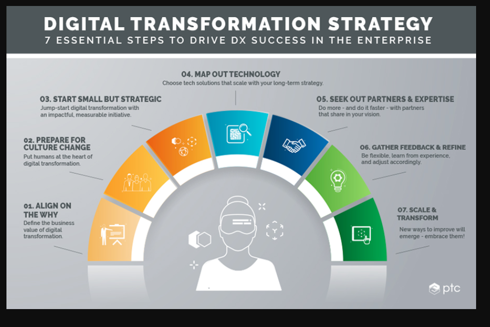

# TEMA 4: Plan estratégico de Transformación Digital

Link: [7 Key Principles of Digital Transformation Strategy | PTC](https://www.ptc.com/en/blogs/corporate/digital-transformation-strategy#technology_implementation)

La estrategia debe centrarse en los objetivos comerciales antes de la implementación de tecnología.

### 7 Aspectos Claves de la Estrategia de Transformación Digital

1. **Alineación con Objetivos Empresariales**: La transformación digital debe estar directamente vinculada a los objetivos comerciales de la organización para asegurar que el esfuerzo tenga un impacto real. => <mark style="background: #ADCCFFA6;">el PORQUE?</mark>

2. **Preparación para el Cambio Cultural**: Es fundamental gestionar el cambio cultural dentro de la organización, fomentando una mentalidad abierta hacia la innovación y la adopción de nuevas tecnologías.

3. **Proyectos Pequeños y Estratégicos**: Comenzar con iniciativas pequeñas que sean fácilmente escalables y que muestren resultados rápidos ayuda a ganar confianza y a demostrar el valor de la transformación. => <mark style="background: #FFF3A3A6;">QUICK Wins</mark>.

4. **Colaboración Multifuncional**: Crear equipos de trabajo que incluyan miembros de diferentes departamentos promueve la colaboración y asegura que todas las perspectivas sean consideradas. => <mark style="background: #BBFABBA6;">MAPA de la tecnología.</mark>

5. **Inversión en Tecnología**: La implementación de tecnología debe ser considerada como un medio para alcanzar los objetivos comerciales, no como el fin en sí mismo. Buscar <mark style="background: #FFF3A3A6;">partners y expertise</mark> que acompañen la inversión.

6. **Evaluación Continua**: Es esencial realizar un seguimiento y evaluación constante del progreso de las iniciativas para adaptarse rápidamente a los cambios y optimizar los resultados.

7. **Involucrar a la Alta Dirección**: El apoyo y la participación de la alta dirección son cruciales para el éxito de la transformación, asegurando que se otorgue la prioridad adecuada a las iniciativas digitales.

### 4 Tendencias a Futuro

1. **Adopción de la Inteligencia Artificial (IA)**: La IA seguirá revolucionando procesos y toma de decisiones, permitiendo a las empresas operar de manera más eficiente y efectiva.

2. **Automatización de Procesos con AI y ML**: Se espera un aumento en la automatización de tareas y procesos, lo que permitirá a las organizaciones optimizar su productividad y reducir costos.

1. Foco en los procesos y no tanto en las tecnologías.

2. **Integración de Tecnología en Todos los Sectores**: La transformación digital no se limitará a la tecnología de la información, sino que se integrará en todos los aspectos de las operaciones comerciales, afectando a cada departamento y sobre todos los objetivos de Sostenibilidad.