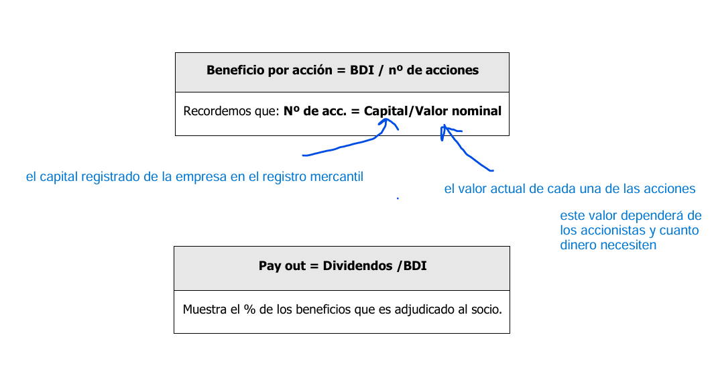

# Sesión 4: Análisis de la Cuenta de Resultados**

#### **1. Nomenclatura Utilizada sobre las Tipologías de los Beneficios y Principales Ratios Simples**

En esta sección, se abordaron las definiciones clave relacionadas con los beneficios y cómo se calculan, proporcionando claridad sobre los términos más relevantes en la gestión financiera:

- **BAII (Beneficio Antes de Intereses e Impuestos)**: Similar al resultado de explotación en la cuenta de pérdidas y ganancias.
- **BAID (Beneficio Antes de Intereses y Después de Impuestos)**: Se calcula restando los impuestos al BAII.
- **BDI (Beneficio Después de Impuestos)**: Representa el beneficio neto final disponible para los accionistas.
- **EBITDA**: Beneficio antes de intereses, impuestos, depreciaciones y amortizaciones. Indicador clave de rentabilidad operativa.

Además, se introdujeron ratios esenciales como:

## **Beneficio por acción (BPA)**.

- **Pay-out**: Proporción de beneficios destinados a dividendos.
- **PER**: Relación entre el precio de la acción y el BPA, útil para valorar la empresa desde la perspectiva del mercado.

---

#### **2. El Apalancamiento Financiero**

Se explicó cómo el uso de la deuda puede influir en la rentabilidad de los accionistas y los riesgos asociados:

- **Apalancamiento Operativo**: Derivado de los costos fijos en la estructura operativa.
- **Apalancamiento Financiero**: Relacionado con el uso de deuda para financiar inversiones.

El análisis del **Índice de Apalancamiento Financiero (IAF)** permite entender si el uso de la deuda es positivo, neutro o negativo:

- **IAF > 1**: Apalancamiento positivo, la rentabilidad para los accionistas (ROE) supera la rentabilidad de los activos (ROA).
- **IAF = 1**: Neutro, la empresa no depende de deuda.
- **IAF < 1**: Apalancamiento negativo, la deuda genera un costo mayor que su rentabilidad.

## ROA

El<mark style="background: #FFF3A3A6;"> ROA (Return on Assets),</mark> o **Rentabilidad sobre Activos**, es un indicador financiero que mide la capacidad de una empresa para <mark style="background: #ADCCFFA6;">generar beneficios a partir de los activos que posee</mark>. En otras palabras, el ROA indica cuán eficiente es la empresa utilizando sus activos para generar ingresos.

> [!abstract]
> ROA = Beneficio Neto % Activos Totales

- **Beneficio Neto**: El resultado final después de restar todos los costos, incluidos intereses e impuestos.
- **Activos Totales**: Representan todos los recursos que posee la empresa, incluyendo tanto el activo corriente como el no corriente.

El ROA generalmente se expresa en porcentaje, indicando cuántas unidades monetarias de beneficio se generan por cada unidad invertida en activos.

### **Interpretación del ROA**

1. **Alta Rentabilidad**: Un ROA alto indica que la empresa utiliza eficientemente sus activos para generar beneficios.
2. **Baja Rentabilidad**: Un ROA bajo puede significar que la empresa no está utilizando sus recursos de manera óptima o que sus márgenes de beneficios son reducidos.
3. **Comparación con el Sector**: La interpretación del ROA depende del tipo de industria. Por ejemplo, en sectores con alta intensidad de capital (como manufactura o energía), un ROA más bajo es normal. En cambio, en sectores con menor intensidad de capital (como tecnología o servicios), se esperan valores más altos.

## ROE

---

#### **3. EVA (Economic Value Added)**

El EVA, traducido como **Valor Económico Añadido**, mide la capacidad de la empresa para generar valor más allá de cubrir todos sus costos, incluyendo el costo del capital.

La fórmula básica es:

EVA=BAIDI−(Coste Medio del Pasivo×Activo)\text{EVA} = \text{BAIDI} - (\text{Coste Medio del Pasivo} \times \text{Activo})

- Este concepto resalta la importancia de generar excedentes tras remunerar tanto a los socios como a los acreedores.
- Un EVA positivo refleja que la empresa está creando valor adicional, mientras que un EVA negativo indica destrucción de valor.

---

#### **4. Análisis del Coste de las Ventas y el Margen Bruto**

En esta sección, se profundizó en la estructura de costos de la empresa y su relación con los ingresos:

- **Costos Fijos**: Permanecen constantes independientemente del nivel de actividad (infraestructura, salarios fijos, etc.).
- **Costos Variables**: Cambian proporcionalmente con el nivel de producción o ventas (materias primas, comisiones, etc.).
- **Punto Muerto**: Nivel de ingresos necesarios para cubrir costos totales y alcanzar un beneficio cero.
- **Margen Bruto**: Margen Bruto=Beneficio BrutoVentas Netas\text{Margen Bruto} = \frac{\text{Beneficio Bruto}}{\text{Ventas Netas}} Este ratio mide la proporción de las ventas que se convierte en beneficios antes de deducir gastos operativos y financieros.

---

### **Conclusión**

Esta sesión sentó las bases para un análisis profundo de los resultados financieros, combinando indicadores operativos y estratégicos. FILAB puede usar estas herramientas para evaluar su rentabilidad, su eficiencia operativa y su capacidad para crear valor, elementos cruciales para tomar decisiones informadas y mejorar su desempeño financiero.

