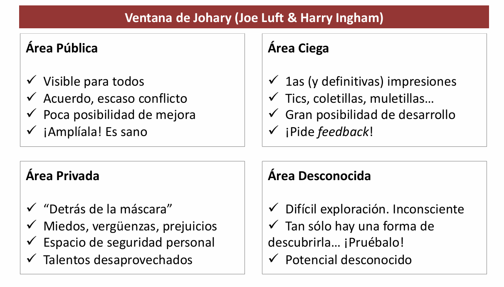
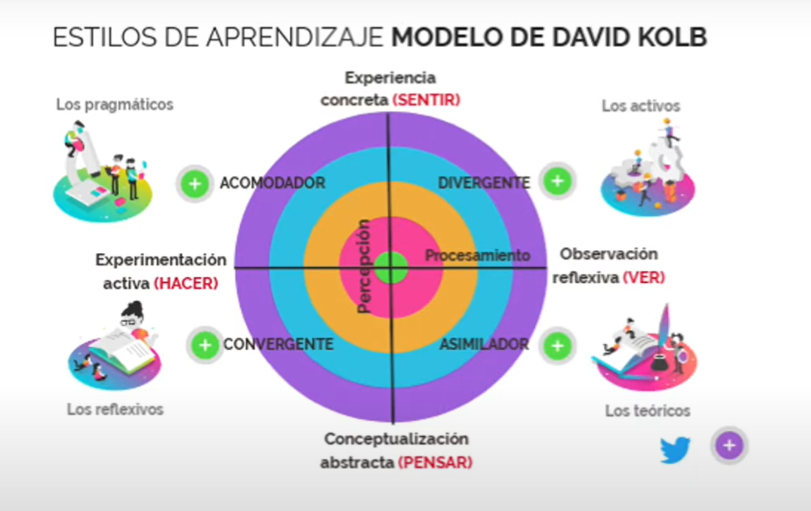
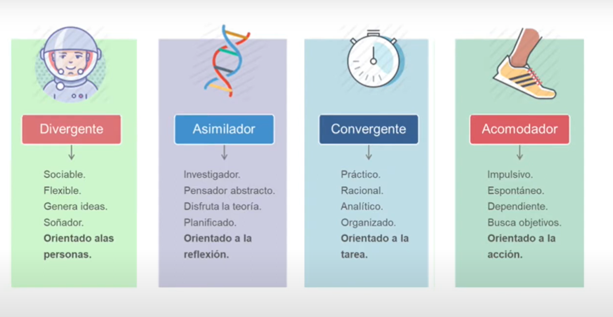
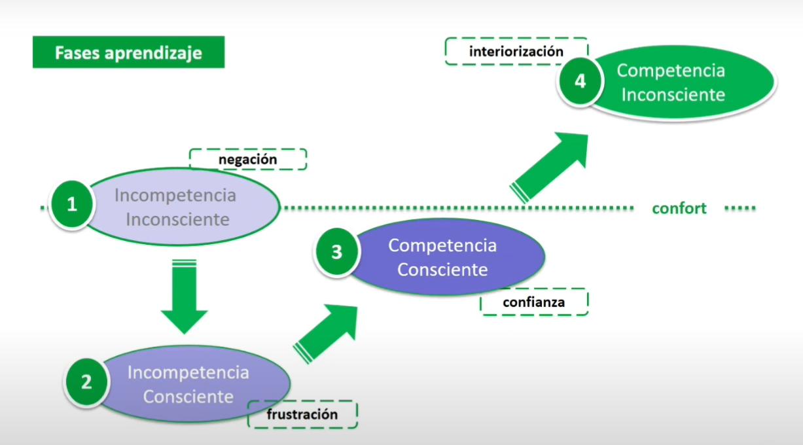

# Sesión 1 · Introducción & Liderazgo Personal

Esta sesión profundiza en el concepto de autoconocimiento, un elemento clave del 
Desarrollo Profesional presentado en la primera sesión. Pretende sentar las bases para la posterior adquisición de habilidades de comunicación, persuasión, influencia, negociación, liderazgo o trabajo en equipo, entre otras. Se centra en identificar y desarrollar el potencial para mejorar, aprender, evolucionar y adaptarse al entorno, tanto a nivel personal como profesional. Incluye los elementos de automotivación y flexibilidad para gestionar tanto el propio cambio, como el de las organizaciones y equipos humanos. 

## La Ventana de Johari

<iframe width="560" height="315" src="https://www.youtube.com/embed/lEZx5hIXSS4?si=y2EY3HV7PQbCmor0" title="YouTube video player" frameborder="0" allow="accelerometer; autoplay; clipboard-write; encrypted-media; gyroscope; picture-in-picture; web-share" referrerpolicy="strict-origin-when-cross-origin" allowfullscreen></iframe>

La "Ventana de Johari" es un modelo <mark style="background: #FFF3A3A6;">conceptual que facilita el proceso de "dar y recibir feedback"</mark> en las relaciones interpersonales, ayudando a expandir el autoconocimiento y mejorar la comunicación entre individuos. <mark style="background: #ADCCFFA6;">Está estructurada en cuatro cuadrantes </mark>que representan diferentes aspectos del conocimiento propio y del conocimiento que los demás tienen de uno: el área libre (conocido por uno mismo y los demás), el área ciega (conocido por los demás, pero no por uno mismo), el área oculta (conocido por uno mismo, pero no por los demás) y el área desconocida (ni uno mismo ni los demás lo conocen). El objetivo del modelo es ampliar el área libre mediante el feedback y la comunicación, favoreciendo así relaciones más transparentes y efectivas.

## Circulo de Influencia

El "Círculo de Influencia" es una herramienta conceptual que ayuda a distinguir entre lo <mark style="background: #BBFABBA6;">que podemos controlar directamente y lo que está fuera de nuestro alcance. </mark>Este modelo se divide en dos áreas principales:

1. **Círculo de Preocupación**: Incluye aspectos que nos afectan pero que no podemos controlar, como las acciones de otras personas, eventos globales o circunstancias externas.

2. **Círculo de Influencia**: Comprende elementos sobre los cuales tenemos control directo, como nuestras decisiones, actitudes y comportamientos.

Al enfocarnos en nuestro Círculo de Influencia, podemos ser más proactivos y efectivos en la gestión de nuestras vidas, en lugar de gastar energía en preocupaciones sobre lo que no podemos cambiar. Este enfoque promueve una mayor sensación de empoderamiento y bienestar.

Para profundizar en este tema, puedes consultar el siguiente video que resume el concepto del Círculo de Influencia:

<iframe width="560" height="315" src="https://www.youtube.com/embed/2WNkxWqtINk?si=o-uQgKZ7y1x8JgGo" title="YouTube video player" frameborder="0" allow="accelerometer; autoplay; clipboard-write; encrypted-media; gyroscope; picture-in-picture; web-share" referrerpolicy="strict-origin-when-cross-origin" allowfullscreen></iframe>

## De inconscientemente incompetentes, a inconscientemente competentes

## Modelos de aprendizaje

<iframe width="560" height="315" src="https://www.youtube.com/embed/g6UO95hj3Rg?si=zgnbvKmixR4W_9Jb" title="YouTube video player" frameborder="0" allow="accelerometer; autoplay; clipboard-write; encrypted-media; gyroscope; picture-in-picture; web-share" referrerpolicy="strict-origin-when-cross-origin" allowfullscreen></iframe>

### Modelo de Aprendizaje de Kolb

El Modelo de Aprendizaje de Kolb, desarrollado por David Kolb en 1984, propone que el aprendizaje es un proceso cíclico que consta de cuatro etapas interrelacionadas:

1. **Experiencia Concreta**: Participación directa en una actividad o situación.
2. **Observación Reflexiva**: Reflexión sobre la experiencia vivida desde diversas perspectivas.
3. **Conceptualización Abstracta**: Formulación de teorías o conceptos basados en las reflexiones realizadas.
4. **Experimentación Activa**: Aplicación práctica de los conceptos desarrollados en nuevas situaciones.

Este ciclo se repite continuamente, permitiendo a los individuos adquirir y aplicar conocimientos de manera efectiva. Kolb también identificó cuatro estilos de aprendizaje basados en las preferencias individuales en las etapas del ciclo:

- **Convergente**: Prefiere la experimentación activa y la conceptualización abstracta; se destaca en la resolución de problemas prácticos.
- **Divergente**: Se enfoca en la experiencia concreta y la observación reflexiva; es creativo y capaz de ver las cosas desde múltiples perspectivas.
- **Asimilador**: Combina la observación reflexiva y la conceptualización abstracta; se interesa por teorías y modelos lógicos.
- **Acomodador**: Se basa en la experiencia concreta y la experimentación activa; es adaptable y orientado a la acción.

### Aprendizaje de habilidades: Noel Burch

