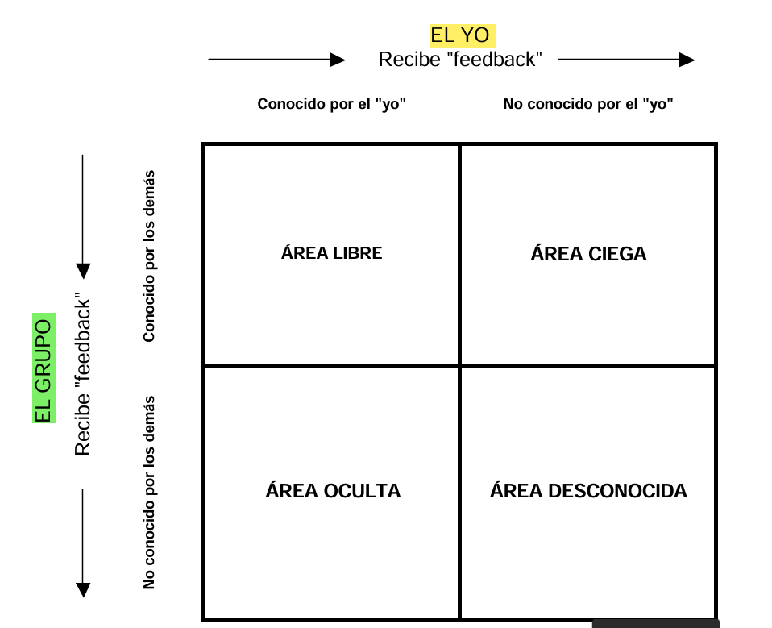

# Seminario Profesionalizante: Habilidades Directivas

## Sesión 1: Liderazgo Personal

Esta sesión profundiza en el concepto de autoconocimiento, un elemento clave del 
Desarrollo Profesional presentado en la primera sesión. Pretende sentar las bases para la 
posterior adquisición de habilidades de comunicación, persuasión, influencia, negociación, 
liderazgo o trabajo en equipo, entre otras. Se centra en identificar y desarrollar el potencial 
para mejorar, aprender, evolucionar y adaptarse al entorno, tanto a nivel personal como 
profesional. Incluye los elementos de automotivación y flexibilidad para gestionar tanto el 
propio cambio, como el de las organizaciones y equipos humanos. A partir de esta sesión, y 
hasta la 8ª (final de la asignatura), el/la alumno/a puede incorporar en su día a día los 
conocimientos, habilidades y competencias propuestas en la presente guía que luego puede 
resolver o comentaren clase. 

## La Ventana de Johari

La "Ventana de Johari" es un modelo conceptual que facilita el proceso de "dar y recibir feedback" en las relaciones interpersonales, ayudando a expandir el autoconocimiento y mejorar la comunicación entre individuos. Está estructurada en cuatro cuadrantes que representan diferentes aspectos del conocimiento propio y del conocimiento que los demás tienen de uno: el área libre (conocido por uno mismo y los demás), el área ciega (conocido por los demás, pero no por uno mismo), el área oculta (conocido por uno mismo, pero no por los demás) y el área desconocida (ni uno mismo ni los demás lo conocen). El objetivo del modelo es ampliar el área libre mediante el feedback y la comunicación, favoreciendo así relaciones más transparentes y efectivas.

## Circulo de Influencia

El "Círculo de Influencia" es una herramienta conceptual que ayuda a distinguir entre lo que podemos controlar directamente y lo que está fuera de nuestro alcance. Este modelo se divide en dos áreas principales:

1. **Círculo de Preocupación**: Incluye aspectos que nos afectan pero que no podemos controlar, como las acciones de otras personas, eventos globales o circunstancias externas.

2. **Círculo de Influencia**: Comprende elementos sobre los cuales tenemos control directo, como nuestras decisiones, actitudes y comportamientos.

Al enfocarnos en nuestro Círculo de Influencia, podemos ser más proactivos y efectivos en la gestión de nuestras vidas, en lugar de gastar energía en preocupaciones sobre lo que no podemos cambiar. Este enfoque promueve una mayor sensación de empoderamiento y bienestar.

Para profundizar en este tema, puedes consultar el siguiente video que resume el concepto del Círculo de Influencia:

<iframe width="560" height="315" src="https://www.youtube.com/embed/2WNkxWqtINk?si=o-uQgKZ7y1x8JgGo" title="YouTube video player" frameborder="0" allow="accelerometer; autoplay; clipboard-write; encrypted-media; gyroscope; picture-in-picture; web-share" referrerpolicy="strict-origin-when-cross-origin" allowfullscreen></iframe>

## De inconscientemente incompetentes, a inconscientemente competentes

