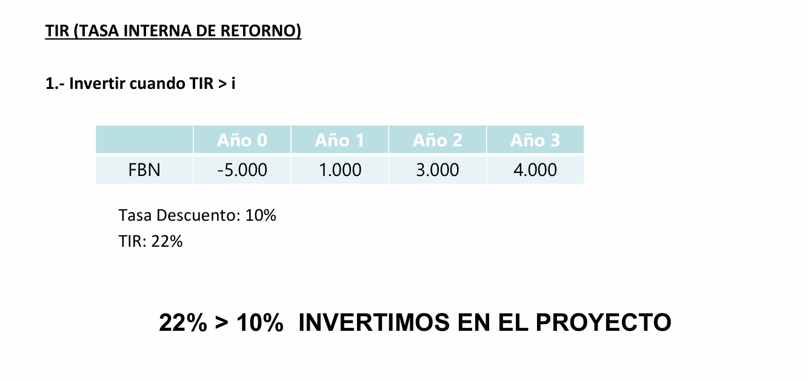

# Control de costes del departamento

Lectura: Relación entre la capacidad financiera de una empresa y su capacidad para ofrecer servicios
Link: [Administración TI](https://itpadmonti.blogspot.com/)}

Revisión del concepto del presupuesto y sus funciones 
Diferenciación gastos e inversión 
Preparación del presupuesto: 
	o Diferencia entre presupuesto asignado y presupuesto gestionado 
	o Presupuesto gasto 
	o Presupuesto inversión
	o Conceptos VAN, TIR, Payback

# Caso Práctico

>[!quote]
>El **Payback** es el tiempo necesario para recuperar la inversión inicial a partir de los flujos de caja

>[!quote]
> **flujo de caja** es la diferencia entre los ingresos y los egresos que una empresa recibe o paga en un período determinado.

Inversión inicial (Pago único)
1. nuevo equipos HW: 4918 €
2. Formación: 180 € (pago único)
Inversión inicial (por año)
1. Mantenimiento equipos viejos: 4932 €
2. Costo del Software: 720 € al año para 25 licencias
3. Costo de Mantenimiento: 520 €  al año
Ahorros Anuales:
1. 5000 € (viajes)
2. ADSL 1000 € (al año)

## Payback

Inversión Inicial: 4918 + 180 = **5098**
Flujo de caja anual: (Ahorros en mantenimiento antiguo+Ahorros en viajes+Ahorros en ADSL)−(Costo del SW+Costo de mantenimiento HW)

Flujo de caja anual: (4932 + 5000 + 1000) - (720 + 520) = 10932-1240 = **9692**

Payback = Inversión inicial / flujo anual
Payback = 0,52

>[!success]
> Un payback de 0.52 indica que se puede recuperar la inversión en medio año. Por lo tanto es rentable.

# VAN

# TIR

---

## Presupuesto

Es un plan de acción dirigido a cumplir una meta prevista, expresada en valores y términos financieros que, debe cumplirse en determinado tiempo y bajo ciertas condiciones  previstas, este concepto se aplica a cada centro de responsabilidad de la organización

Funciones:
 - Control Financiero
 - Minimizar riesgos
 - Plan de operaciones
 - Verificar logros
 - Tener un rol preventivo o correctivo
 - Sirve para la toma de decisiones
 - Evaluación de objetivos

Los presupuestos se armar por año fiscal. Generalmente se inician en Septiembre y para los meses que faltan se hacen proyecciones.
Los presupuestos se pueden especificar por:
	- Estacionalidad (eventos puntuales)
	- Prorrateado (servicios por mes)

## Tipos de Presupuestos

 - Gastos de Personal: RRHH
 - Gastos de explotación: gastos generales del desarrollo de la actividad.
 - Gastos de amortización: depende de las inversiones realizadas.

Existe además la subdivisión de:

 - **Presupuesto asignado**: es el presupuesto que se le asigna al departamento de IT y gestiona generalmente el CIO, o sea, ya viene asignado.
 - **Presupuesto gestionado**: generalmente el CIO tiene autoridad para definir este presupuesto.

La gran diferencia está en el gobierno que se tiene sobre el presupuesto y la capacidad de acción y decisiones que se tienen sobre él.

## Selección de proyectos - Factores

 • El capital es un factor escaso – máximo provecho posible
 • Elegir la mejor alternativa
 • Definir prioridades en relación con otros proyectos
 • Minimizar el riesgo de la inversión
 • Factibilidad  económica
 • Factibilidad técnica
 • Factibilidad financiera

## Proyectos mutuamente excluyentes

Dos proyectos son excluyentes cuando la realización de uno de los proyectos no  permite llevar a cabo el otro. Por ejemplo: Implantar CRM Siebel o Implantar CRM Salesforce. En el caso de proyectos sustitutos entre si, la regla de decisión es elegir la <mark style="background: #FFF3A3A6;">alternativa de mayor VAN</mark>.

## Criterio de selección por Payback

Ahora si el criterio de selección se basa en el payback, entonces el criterio de selección quizás esté sujeto al proyecto cuyo payback sea el más corto.

## Criterio de selección por TIR (Tasa interna de retorno)

Si un proyecto tiene flujos de fondos negativos al inicio (inversión) y positivos en los periodos siguientes, entonces la regla es: <mark style="background: #FFF3A3A6;">seleccionar proyectos que tengan una TIR > i</mark>.

