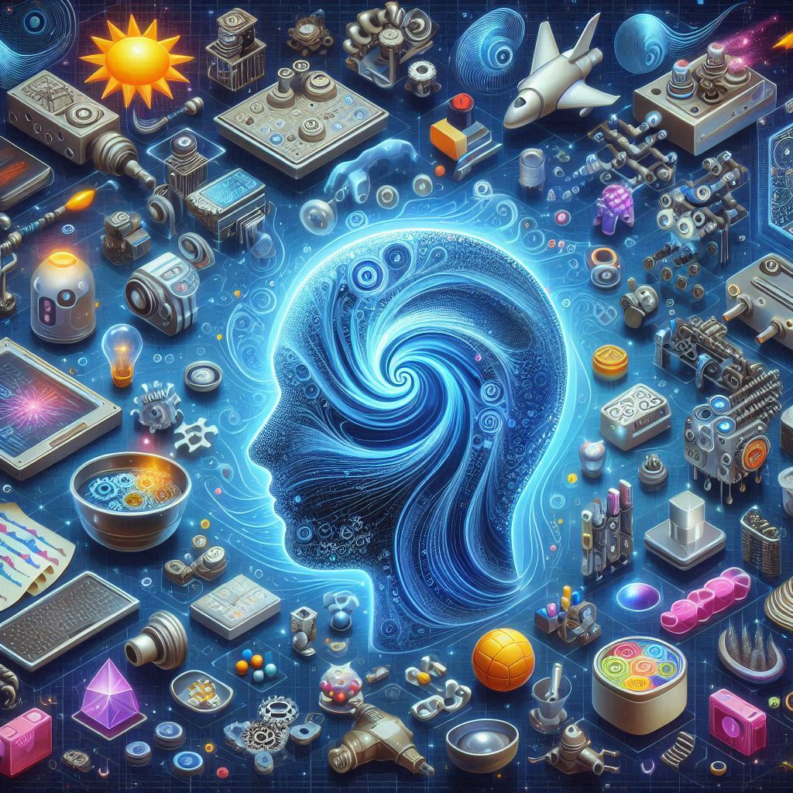
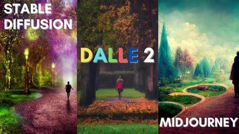

# Generative IA

## Introduction

**Concept**: Generative AI is a technology that can create new content, like images, text, or music, based on existing data.
**Impact**: Generative AI is revolutionizing how we work by automating repetitive tasks and allowing us to focus on more creative and strategic aspects. Here are some specific examples:
1. Easier content creation (text, music, images)
2. Faster access to information
3. Design assistance
4. Automation of repetitive tasks

### Differents types of generative IA

* **Generative AI**: A specific type of AI that focuses on creating new content (text, images, music) as its primary function.
* **Discriminative AI**: A broader category of AI that analyzes and categorizes existing data.
* **Subcategories of AI**: The text mentions various subcategories like reactive AI (self-driving cars), limited memory AI (weather forecasting), Theory of mind AI (customer service chatbots), and others.
* **Key Distinction**: Generative AI is specifically designed to create new content, while other AI subcategories might generate content as a secondary function.

### Understanding how Generative AI works

 * **Building Blocks of AI**: Similar to how we can identify objects based on past experiences, AI is trained on massive amounts of data to perform tasks.
 * **Generative AI vs Traditional AI**: Generative AI is a specific type of AI designed to create entirely new content, whereas traditional AI might generate content as a byproduct of its function.
 * **Generative AI Models**: These are the "engines" that power generative AI, built by specialists and funded by companies and universities. Examples include models from OpenAI, NVIDIA, Google, etc.
 * **Accessibility of Generative AI**: There are different levels of access depending on technical expertise:
 * **Business Leaders**: Partner with companies that have generative AI models or use open-source models for their projects.
 * **Creative Users**: Use pre-built generative AI models from repositories like GitHub and then combine them with AI notebooks (like Google Colab) to run the model.
 * **General Users**: Access generative AI through online services or apps like DALL-E, Midjourney, etc.

### Using Generative AI Models for Content Creation

**Generative AI Models**: The core element, a set of algorithms trained on specific data to create new content.

 - User Access Levels:
 * **Beginners**: Use pre-built applications with minimal customization (e.g., Midjourney, Lensa).
 * **Intermediate Users**: Utilize AI notebooks (e.g., Google Colab) with pre-existing generative AI models for more control.
 * **Advanced Users (Creative Technologists)**: Access generative AI models directly from code repositories (e.g., GitHub) and integrate them into notebooks for maximum customization.
 * **Programmers**: Create their own notebooks using model code from repositories.
 * **AI Notebooks (e.g., Google Colab)**: Platforms specifically designed to run generative AI model code, often offering customization options for the generated content.
 * **Creative Applications**: Pre-built interfaces that utilize generative AI models for specific creative tasks (e.g., avatar creation).
 * **Generated Outcome**: The final creative product produced by a user through a generative AI service or notebook.

## Main models

- **GPT Overview**: GPT (Generative Pre-trained Transformer) is a language model by OpenAI known for generating human-like text, using transformer architecture for widespread use in natural language processing
- **Industry Applications**: GitHub Copilot and Microsoft's Bing have integrated generative AI to enhance coding and search functionalities, respectively.
- **Rapid Adoption**: ChatGPT's public release saw 1 million users in a week, indicating quick adoption compared to other companies.
- **Limitations and Considerations**: GPT has limitations like lack of common sense and potential biases, requiring careful development and use, especially in creative writing.

###  Text to image applications

- **Rise of Services**: In 2022, there was a significant increase in commercial image generation services known as text to image, where users type descriptions and algorithms create images.
- **Main Tools**: The three primary services are Midjourney, DALL-E, and Stable Diffusion, each with unique characteristics akin to different operating systems.
- **Industrial Uses**: Examples include Cuebric for film backgrounds, Stitch Fix for fashion, and various marketing campaigns using generative AI for efficiency and a unique aesthetic.

 [Example comparison]

### Generative Adversarial Networks (GANs)

- **GAN Mechanics**: GANs consist of two parts, **The Generator** and **The Discriminator**, which work together in a competitive game to create realistic data. The Generator attempts to create data that is indistinguishable from real data, while The Discriminator tries to detect the difference.

- **Real-World Applications**: GANs have been used by **Audi** for wheel design inspiration, by **Beko** for creating a brand-funded AI film, and in **financial fraud detection** to generate synthetic transaction data for training fraud detection models.

- **Versatility of GANs**: The same GAN model can be applied to diverse fields, showcasing its versatility in creating new styles for automotive design, producing visual effects for films, and solving financial fraud detection problems.

### VAE and Anomaly Detection

- **Variational Autoencoders (VAE)**: A type of generative AI model used for anomaly detection by learning from a dataset of normal data.
- **Anomaly Detection Applications**: VAEs are applied in various fields such as fraud detection in financial transactions, manufacturing quality control, and network security
- **Real-World Examples**: Companies like Uber and Google use VAEs for detecting financial fraud and network intrusions, respectively.
- **Healthcare Utilization**: VAEs help in medical anomaly detection, like predicting sepsis risk from electronic health records at Children's National Hospital.

# Reference

[A Beginner's Guide to Generative AI | Pathmind](https://wiki.pathmind.com/generative-adversarial-network-gan)

