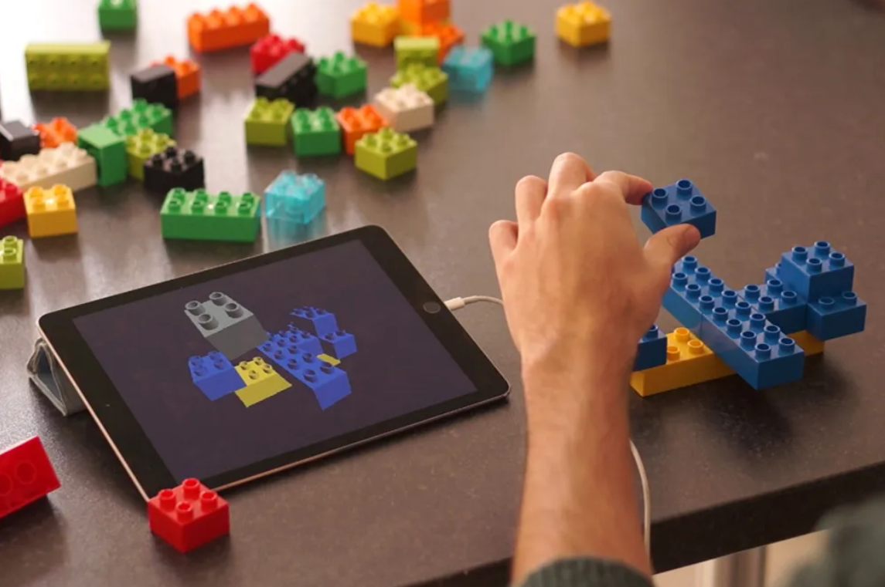
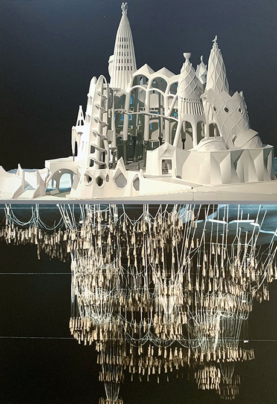
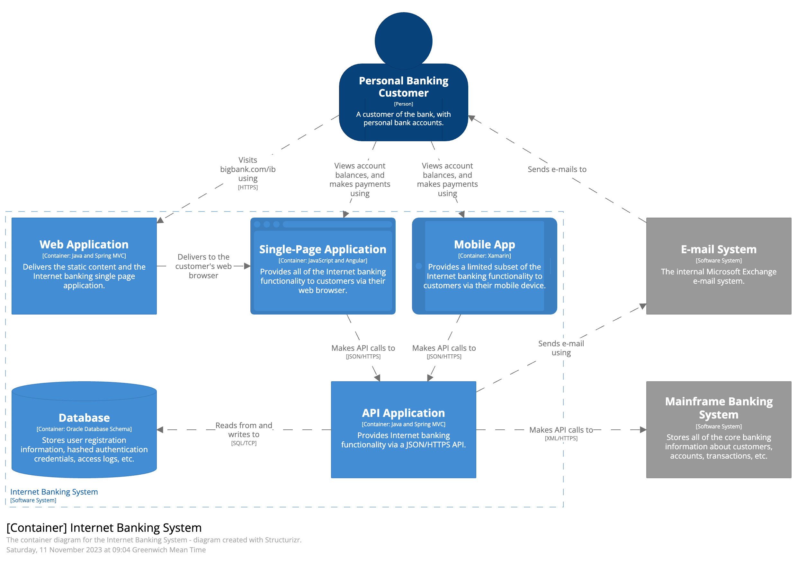
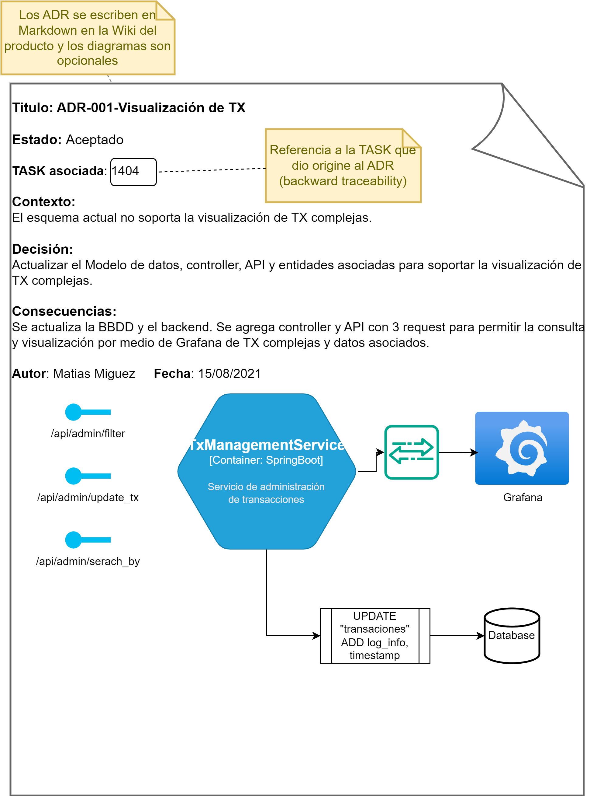
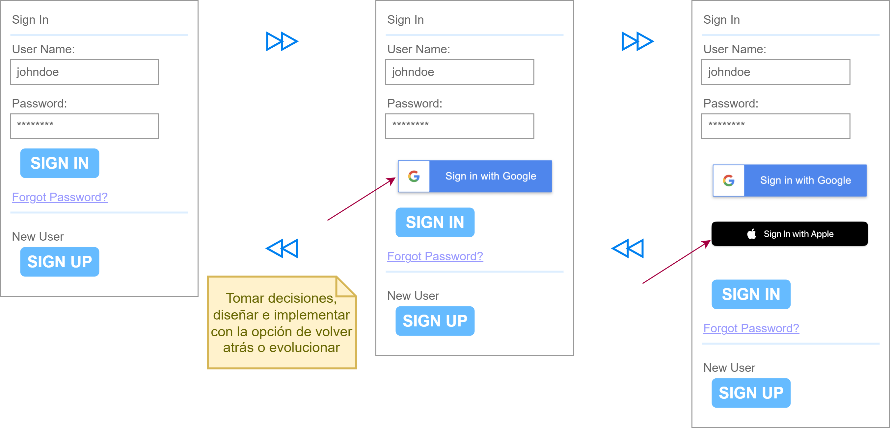

# Evolutionary Architecture: the art of making decisions

---

---
## Introducción

---

"Sagrada familia". la originalidad consiste en regresar a los orígenes. Gaudi Quote.

Que aprender de la arquitectura clásica? Tenemos más de 11.000 años de historia construyendo estructuras físicas.

---

Analogía con el juego de Legos => sirven para crear representaciones físicas de "ideas", el software es similar a los legos pero sin el aspecto físico.

---

## Arquitectura evolutiva 

El negocio siempre quiere cambios y los quiere ahora y baratos. => "**decisiones**". 

Las grandes preguntas de la ingeniería de software:

1. Como <mark style="background: #FFF3A3A6;">hacer planes a mediano/largo plazo</mark>, cuando las cosas cambian en el transcurso del tiempo.
2. Como puedo <mark style="background: #BBFABBA6;">prevenir que el producto se degrade</mark>, con el transcurso del tiempo.

Como responder a éstas preguntas?

---

## Framework para toma de decisiones

Del Libro: The software architecture elevator. Gregor Hohpe. 

--> **Poner foco en decisiones pertinentes**

1. Decisiones no triviales.
2. Deben tener un downside
3. Meaningful.

--> <mark style="background: #FFF3A3A6;">SIMPLICIDAD</mark> como el verdadero NORTE.
--> Hacer cosas complejas no siempre es la mejor opción.
--> Necesito ver la solución claramente. Entendiendo las restricciones del contexto.
--> Incertidumbre genera perdida de confianza, como eliminarla: <mark style="background: #FFF3A3A6;">EXPERIMENTANDO</mark>.

---

## Experimentar para eliminar la Complejidad

**Ejemplo**: Experimento de Gaudi con los pesos dados vueltas para modelar la física y pesos de la iglesia. Proof-of-concepts de las estatuas.

---

---

--> Necesitamos validar algo, y si falla, que falle rápidamente. Usar modelos, referencias, ejemplos.
--> POC hacerlo fuera de tu dominio de negocio. 
--> Evitar creatividad innecesaria, usar los elementos más básicos disponibles.
--> como hacer cosas complejas => <mark style="background: #FFF3A3A6;">DOCUMENTACIÓN</mark>.
--> Como documentar: <mark style="background: #FFF3A3A6;">DIAGRAMAS</mark>.

---

## Cómo Documentar? Diagramas

--> C4 model.

web -> [The C4 model for visualising software architecture](https://c4model.com/)

---
## C1 - System Context

---

## C2 - Contenedor

---

## C3 - Componente

---

## C4 - Código

---

## Cómo Documentar? ADR's

--> ADR or SAD -> lo más sencillo son ADR.

web: [adr.github.io](https://adr.github.io/)

Example: [monorepo-vs-multirepo](https://github.com/joelparkerhenderson/architecture-decision-record/tree/main/locales/en/examples/monorepo-vs-multirepo)

---

---

## Decisiones Anti-Patrones

* No mandarlas por e-mails.
* Hacer decisiones que sean fáciles de volver-atrás.
* Hacer algo, una parte y dejarla de base para el resto. Que esa decisión quede aislada en una parte.

---

--- 

## AI para acceder a la documentación

 - Juntar todos los ADR en un mismo lugar.
 - Documentar usando formatos sencillos (markdown)
 - Proveer un mecanismo de búsqueda / gestión ==> Modelo de AI para acceder a la información y poder hacer preguntas.