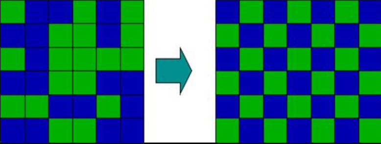

# Architecture Antipattern

---

## Que son los anti-patrones de arquitectura?

Consecuencias negativas de aplicar una solución, de la evolución de las arquitecturas, decisiones, contexto, negocio, la vida.

**Video**:  https://youtu.be/BNTt2aLB1tg

Stefan Tilkov, Goto conference. Achitecture antipatterns.

---

## Antipattern: Emotional Attachment

Preferencia de una tecnología, una misma solución que ya se conoce, un lenguaje de programación o estar "casado" con una tecnología en particular.

Estar en una zona de confort y querer solucionar todo con las herramientas que ya conoces. A veces es conveniente, pero no siempre y puede traer problemas.

---

Una empresa de desarrollo de software para seguros desarrolló su propio middleware tipo CORBA que integraba un ORB, servicios DCOM y muchas más funciones.

**Ventajas**: tecnología propia, conocer los detalles, implementar soluciones custom.

**Desventajas**: costo elevado (no es parte del negocio), obsolescencia de la tecnología, transferencia de conocimiento dificil.

Ejemplo: https://architecture-antipatterns.tech/case_studies/diy_middleware.html

---

---

## Misapplied Generecity

Una solución muy genérica para ser usada para todo!! Termina siendo tan flexible que es compleja de desarrollar, usar, mejorar o corregir. 

Para prevenir: KISS, hacerlo 3 veces antes.

---

## Caso de Estudio: APP financiera

-> hacer una app para todos los mercados, de varios paises, termino siendo un problema muy complejo debido a que cada pais tiene sus procesos y leyes. Una APP generica, no resulto.

Solución BASE para mercados simples.
Solución CUSTOR para mercados complejos.

---

## Never touch a Running System

Sistemas legacy, complejos, etc.

Solución: escribir TEST, documentar lo que se pueda, hacer cambios muy chicos, tener una estrategia de rollback previa a aplicar los cambios.

---

## Caso de Estudio: Document Management System BANK.

Para estos casos:
 -> Automatizar pruebas,
 -> Documentar
-> reducir librerias
-> tener días de PATCH (patchdays)

---

## Caso de Estudio: FAT client swing application

App vieja en java, 4 millones LOC, 15 años, etc.

Solución: hacer pequeños Refactorings.

---

## Tips

-> Test, importante
-> Experimentar.
-> documentar
-> CI/CD armar pipelines.
-> refactorings.
-> evolucionaty architecture.

---

## Cargo Culture

Usar conceptos sin conocer el porque y como?, por ejemplo, usar el modelo de spotify. Otro ejemplo usar microservicios para todo.

---

## Referencias:

https://github.com/innoq/architecture-antipatterns

https://architecture-antipatterns.tech/

