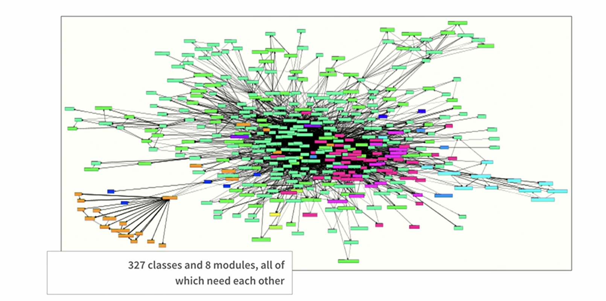

# Architecture Antipattern

---

## Que son los anti-patrones de arquitectura?

Consecuencias negativas de aplicar una solución, de la evolución de las arquitecturas, decisiones, contexto, negocio, la vida.

**Video**:  https://youtu.be/BNTt2aLB1tg

Stefan Tilkov, Goto conference. Achitecture antipatterns.

---

## Antipattern: Emotional Attachment

<mark style="background: #FFF3A3A6;">Preferencia de una tecnología,</mark> una misma solución que ya se conoce, un lenguaje de programación o estar "casado" con una tecnología en particular.

Estar en una <mark style="background: #FFF3A3A6;">zona de confort</mark> y querer solucionar todo con las herramientas que ya conoces. A veces es conveniente, pero no siempre y puede traer problemas.

---

Una empresa de desarrollo de software para seguros desarrolló su propio middleware tipo CORBA que integraba un ORB, servicios DCOM y muchas más funciones.

**Ventajas**: tecnología propia, conocer los detalles, implementar soluciones custom.

**Desventajas**: costo elevado (no es parte del negocio), obsolescencia de la tecnología, transferencia de conocimiento dificil.

Ejemplo: https://architecture-antipatterns.tech/case_studies/diy_middleware.html

---

---

## Anti-Patrón: Misapplied Genericity

Una solución muy genérica para ser usada para todo!! Termina siendo tan flexible que es compleja de desarrollar, usar, mejorar o corregir y a veces, no siendo utilizada por nadie.

---

---

## Como evitar el problema de soluciones genéricas

- **Diseña para Casos de Uso Específicos** 🎯
- **Mantén la Simplicidad - KIS** 🧩
- **Itera y Refina Basado en Feedback** 🔄

---

## Caso de Estudio: APP financiera

-> hacer una app para todos los mercados, de varios países, termino siendo un problema muy complejo debido a que cada pais tiene sus procesos y leyes. Una APP generica, no resulto.

->  Solución <mark style="background: #FFF3A3A6;">BASE</mark> para mercados simples.

-> Solución <mark style="background: #BBFABBA6;">CUSTOM</mark> para mercados complejos.

---

## Anti-Patrón: Never change a running system 🚧

---

 - Sistemas legacy, 
 - Algoritmos complejos, 
 - Librerías de terceros, etc.
 - Lógica de negocio compleja (y si, sin documentación y todos los que conocían el negocio, ya no están!!!!)

**Solución**: escribir TEST, documentar lo que se pueda, hacer cambios muy chicos, tener una estrategia de rollback previa a aplicar los cambios.

---

## Caso de Estudio: Document Management System BANCO.

Para estos casos:
 -> Automatizar pruebas,
 -> Documentar
 -> Reducir librerías
 -> Tener días de PATCH (patchdays)

---

## Caso de Estudio: FAT client swing application

App vieja en java, 4 millones LOC, 15 años, etc.

**Solución**: 

1. hacer pequeños Refactorings.
2. Actualizar librerias
3. Actualizar o armar "algo" de documentación
4. Test, test, test y si....TEST!!!

---

## Tips

-> Test, importante
-> Experimentar.
-> documentar
-> CI/CD armar pipelines.
-> refactorings.
-> evolucionaty architecture.

---

## Anti-Patrón: Cargo-Culting

Usar conceptos sin conocer el porque y como?

1. Usar el modelo de spotify. Si a ellos les funciona, seguro que aplica a todos!!!
2. Usar microservicios para todo (por que todos hablan de ello)
3. AI...y si, hay que usar AI, no importa para qué, usémoslo.

---

## Otros Anti-Patrones

1.  Domain Allergy. Enfocarse en la tecnología, el negocio es problema de otro.
2.  Horizontalism: sistemas divididos en capas, donde cada una es responsabilidad de un equipo diferente.
3. Infrastructure Ignorance: ignorar la infraestructura donde se va a deployar el sistemas.
4. Malignant Growth: crecimiento sin control del sistema.
5. Over-Engineering: hacer lo simple, realmente complejo.

---

## Referencias:

https://github.com/innoq/architecture-antipatterns

https://architecture-antipatterns.tech/