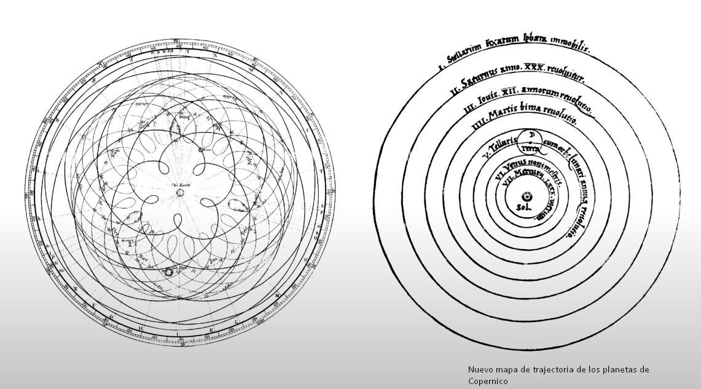

# Durable Execution: A revolutionary abstraction for building resilient applications

---

# Autor

Maxim Fateev
CTO/Cofounder @ Temporal.io

Linkedin: https://www.linkedin.com/in/fateev

---

# Introducción

Representación del sistema solar, trajectoria de los planetas:

---

## Abstracciones

Nosotros trabajamos con abstracciones, pero hay niveles de abstracción. El problema aparece cuando se modelas las abstracciones equivocadas o de manera equivocada.

---

## Complejidad de los sistemas

---

## Propiedad de un sistema monolito

---

## Concepto de Transaccionalidad

---

Un sistema monolítico es <mark style="background: #BBFABBA6;">transaccional</mark> y las transacciones no permiten <mark style="background: #FFF3A3A6;">"fallas parciales"</mark>.

Pero cuando el monolito es muy grande, la estrategia es separarlo en **microservicios**. Y cuando los pasos de un determinado proceso está separado y toma más tiempo completarlo, las transacciones no sirven. Entonces apare: <mark style="background: #FFF3A3A6;">Event-Driven.</mark>

---

## Event-Driven Architecture al rescate

 - <mark style="background: #FFF3A3A6;">Productores</mark>: produced => un EVENTO es generado
 - <mark style="background: #FFF3A3A6;">Canal</mark>: publica y propaga un mensaje (asociado un evento)
- <mark style="background: #FFF3A3A6;">Consumidores</mark>: detectan el mensaje del canal y consumen el mensaje, para luego actuar sobre el "evento"
- Arquitectura de mensajes <mark style="background: #FFF3A3A6;">"asincrónica" y distribuida</mark>.

Ref. https://en.wikipedia.org/wiki/Event-driven_architecture

---

---

## Abstracciones y sus complejidades

 - Microservices => complejidad distribuida
 - Monolitos => complejidad en un solo lugar
 - Arquitectura basada en eventos=> se pierde la lógica
 - Scatered Logs. => se distribuye la lógica de negocio
 - Error Handling => mal manejada, distribuida, que pasa con la lógica distribuida.
 - Visibilidad y Debugging => solo notifica que pasan cosas n algún lugar

<mark style="background: #FFF3A3A6;">Eventos</mark> => son variables globales en sistemas distribuidos. ATENCION.

---

## Durable Execution 

=><mark style="background: #FFF3A3A6;"> ejecución que no crashea por causas de fallas a nivel sistema</mark>.

---

## Caracteristicas:

1. Estado totalmente persistente.
2. Duración ilimitada
3. Duración ilimiatda de llamadas a API
4. Logica de Retry
5. Comunicación asincronica
6. Times Durables.

---

## implementación

Usando event-sourcring.
Ejemplo de un banco y transacciones, en un código se ejecuta una transferencia y en el evento donde se hace el deposito, el paso 5, justo falla. Usando un historial de eventos se puede recuperar la condicion inicial.

---

# Demo

<iframe width="560" height="315" src="https://www.youtube.com/embed/wIpz4ioK0gI?si=xS7z-_UsLxl0McCV" title="YouTube video player" frameborder="0" allow="accelerometer; autoplay; clipboard-write; encrypted-media; gyroscope; picture-in-picture; web-share" referrerpolicy="strict-origin-when-cross-origin" allowfullscreen></iframe>

---

## Durable Execution platform

temporal.io

