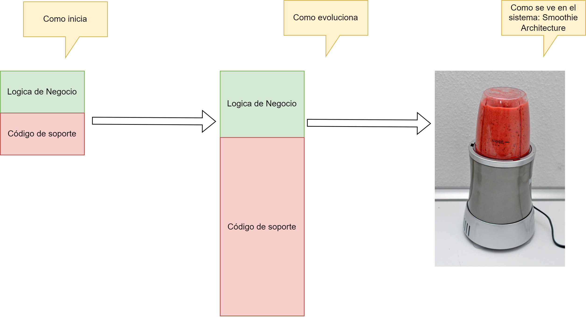

# Durable Execution: A revolutionary abstraction for building resilient applications

---

# Autor

---

# Introducción

Representación del sistema solar.
Nosotros trabajamos con abstracciones, pero hay niveles de abstracción. El problema aparece cuando se modelas las abstracciones equivocadas o de manera equivocada.

---

## Complejidad de los sistemas

---

## Propiedad de un sistema monolito

---

## Concepto de Transaccionalidad

---

## Abstracciones y sus complejidades

 - Microservices => complejidad distribuida
 - Monolitos => complejidad en un solo lugar
 - Arquitectura basada en eventos=> se pierde la lógica
 - Scatered Logs. => se distribuye la lógica de negocio
 - Error Handling => mal manejada, distribuida, que pasa con la lógica distribuida.
 - Visibilidad y Debugging => solo notifica que pasan cosas n algún lugar

<mark style="background: #FFF3A3A6;">Eventos</mark> => son variables globales en sistemas distribuidos. ATENCION.

---

## Durable Execution 

=><mark style="background: #FFF3A3A6;"> ejecución que no crashea por causas de fallas a nivel sistema</mark>.

---

## Caracteristicas:

1. Estado totalmente persistente.
2. Duración ilimitada
3. Duración ilimiatda de llamadas a API
4. Logica de Retry
5. Comunicación asincronica
6. Times Durables.

---

## implementación

Usando event-sourcring.
Ejemplo de un banco y transacciones, en un código se ejecuta una transferencia y en el evento donde se hace el deposito, el paso 5, justo falla. Usando un historial de eventos se puede recuperar la condicion inicial.

---

## Durable Execution platform

temporal.io

